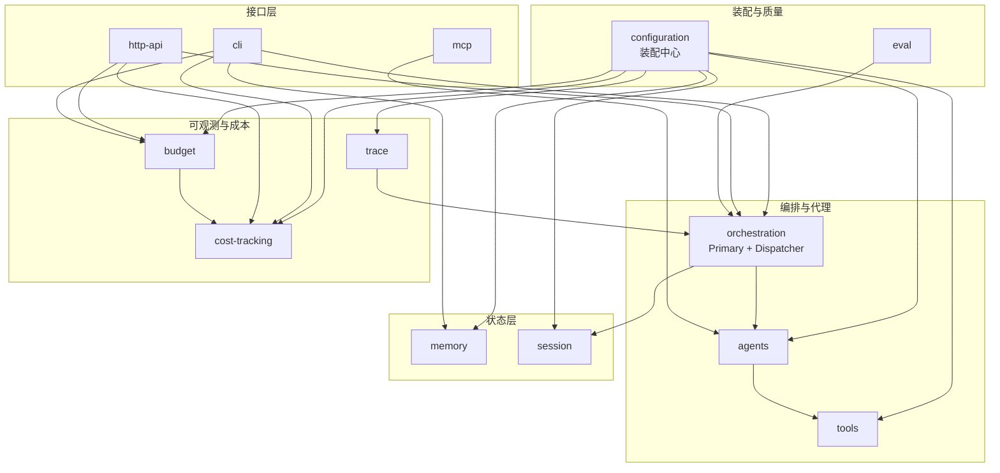

# 领域依赖图

vv 全部领域归于单一业务组 **core**。依赖为有向(A→B 表示 A 依赖 B)。

## 依赖说明

| 领域 | 依赖 | 理由 |
|------|------|------|
| **configuration** | (无) | 装配中心,所有子系统的构造点;被所有领域依赖 |
| **tools** | configuration | 工具注册表与安全边界由装配注入 |
| **agents** | tools, configuration | 代理按 ToolProfile 装配工具集 |
| **orchestration** | agents, session | Primary 委派专家;plan 镜像到 session tree |
| **memory** | configuration | 持久化后端与三层 manager 由装配构造 |
| **session** | configuration | Session/Workspace/Tree 共根目录,装配校验启用关系 |
| **cli** | orchestration, cost, memory, budget | TUI 调用分发器,展示成本,管理记忆 |
| **http-api** | orchestration, cost, budget | REST/SSE 调用分发器,预算错误→429 |
| **mcp** | agents | 把 dispatchable 代理暴露为 MCP 工具 |
| **cost-tracking** | (无,数据来自 LLM 中间件) | 被 budget / cli / http 消费 |
| **budget** | cost-tracking | 预算上限基于 token/cost 度量 |
| **trace** | orchestration(事件源) | 订阅事件总线落盘 |
| **eval** | orchestration | 跑 Dispatcher over 数据集 |

## 跨切面关注点(非领域,横跨多领域)

- **安全护栏**:工作区 allow-list、bash 分级、注入扫描、MCP 凭据过滤 —— 在 `tools` / `mcp` 领域实现,约束见 `non-functional/security.md`。
- **可观测**:事件总线旁路订阅 —— `trace` + `cost-tracking` + `budget` + debug 共享同一总线。
- **零成本默认**:贯穿所有可选子系统的装配策略,由 `configuration` 强制。
