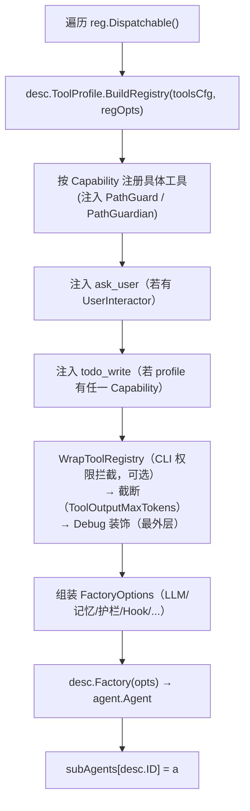

# agents — Domain Design

本文档描述专家代理与能力分级的**技术实现**:注册表数据结构、ToolProfile 模型、Factory+profile 装配模式、各类注入策略与技术取舍。融合了已删除的 `vv/doc/agents.md`(代理设计理念)与 `vv/doc/registries.md`(注册表与能力分级)的设计内核。源码:`vv/agents/`、`vv/registries/`,装配入口 `vv/setup/setup.go`。

> Primary / Fallback Primary 的能力分工虽与本领域共享 ToolProfile 模型,但其构造与递归阀门归 [orchestration](../orchestration/);本文仅在「Primary 的特殊装配路径」一节交代它如何复用本领域的 profile 与描述符,细节链接到 orchestration。

## 角色分工:一前门 + 专家

vv 的代理体系由"一前门 Primary + 若干专家"构成。前门(Primary,归 orchestration)只读、不写、提示词紧凑、每轮最多一次澄清;真正改代码、跑测试、深度研究的事下放给专家。专家的职责边界完全由 ToolProfile 划分:

| 代理 | 角色 | ToolProfile | Dispatchable | 归属领域 |
|------|------|-------------|--------------|---------|
| Primary | 前门统一助手:直答/只读探查/委派/规划 | ReadOnly(开 bash 切 Review) | 否 | orchestration |
| Fallback Primary | 递归超限保险:人格同 Primary、无工具、迭代=1 | None | 否 | orchestration |
| **Coder** | 编码专家:唯一写者 | Full | 是 | **agents** |
| **Researcher** | 研究员:只读 + 公网 | ReadOnly | 是 | **agents** |
| **Reviewer** | 评审员:只读 + bash,不写 | Review | 是 | **agents** |
| Planner | 规划描述:无工具,描述字段被 Primary 提示拼接器消费 | None | 否 | agents(描述符)/ orchestration(语义) |

## 专家代理的能力分工与"能力鸿沟"

三个 dispatchable 专家的能力面被有意拉开差距:

- **Coder(Full)**——唯一持有写工具(write/edit)的角色,真正改代码的事都到这里。
- **Researcher(ReadOnly)**——能跑搜索引擎、抓公网资料,但绝不动文件系统;用于 Primary 不便自读全项目时的二级研究。
- **Reviewer(Review)**——能跑 bash(测试/lint),但不能写;输出通常是"建议下一步"。

这种"能力鸿沟"是设计核心而非缺陷:Reviewer 不能修复它发现的问题、Researcher 不能改它读到的代码,**迫使一次 mutation 永远经过 Coder**,从而保留单一写入责任人。该约束与 orchestration 中"Primary 无写权限"互补,共同保证所有改动都来自一个明确的专家责任人(可解释、可审计、避免角色蔓延)。

## ToolProfile 模型(四档)

ToolProfile 是一个命名的能力集合 `{Name, Capabilities ⊆ {Read, Write, Execute, Search}}`。四档预设(`vv/registries/tool_access.go`):

| Profile | Capabilities | 含义 | 典型代理 |
|---------|-------------|------|---------|
| Full | Read + Write + Execute + Search | 读 + 写 + 执行 + 搜索 | Coder |
| Review | Read + Search + Execute | 读 + 搜索 + 执行 | Reviewer |
| ReadOnly | Read + Search | 读 + 搜索 | Researcher / Primary |
| None | ∅ | 无工具 | Planner / Fallback Primary |

预设之外允许自定义(动态规格场景),但日常使用应优先映射到这四档以保持一致性。`ProfileByName` 把字符串名(来自 DynamicAgentSpec.ToolAccess)解析回 profile。

### 能力 → 工具映射

每个 Capability 在 `BuildRegistry` 阶段翻译为具体工具集(`registerCapabilityTools`):

| Capability | 注册的工具 |
|-----------|-----------|
| Read | 读取文件 + 公网抓取(web_fetch)+ 可选公网搜索(web_search) |
| Write | 文件创建(write)+ 文件 patch(edit) |
| Execute | shell 执行(bash;受超时与路径 guardian 约束) |
| Search | 文件名 glob + 内容 grep |

**取舍:公网检索算"读"而非"搜索"**——把 web_fetch/web_search 归到 Read,是因为模型语义上把它当作"获取外部信息",与"在已知项目里找东西"(Search)是不同认知模式。工具实体与护栏细节归 [tools](../tools/) 领域。

## 注册表与代理描述符

注册表把"有哪些代理类型""它们能用哪些工具"从调用点抽出来,让代理生命周期变为**声明式**:声明一个描述符,下游所有装配/路由/委派自动跟随。数据结构(`vv/registries/registry.go`):

```
AgentDescriptor
├── ID, DisplayName, Description
├── ToolProfile          （声明能用哪些能力）
├── SystemPrompt         （默认系统提示;动态创建时复用）
├── Factory              （拿到完整依赖后产生 agent.Agent 实例）
└── Dispatchable         （是否被 Primary 通过 delegate_to_* 看见）
```

### 描述符的下游消费者(声明一次,多处消费)

| 消费者 | 用途 |
|--------|------|
| 代理工厂 | 装配中心遍历 `Dispatchable()`,按 ToolProfile 构造工具集,调 Factory 得实例 |
| Primary 提示拼接 | `PlannerAgentList()` 把每个 dispatchable 代理的 Description 汇成"可委派目标列表" |
| 委派工具家族 | Primary 工具集内每个 dispatchable 代理自动获得一个 `delegate_to_<id>` |
| HTTP 子代理路由 | 每个 dispatchable 代理注册为独立端点(归 http-api) |
| MCP 工具暴露 | dispatchable 代理暴露为 MCP 工具(归 mcp) |

任何新代理只需写一个描述符 + 一个 Factory,即被以上五条路径自动看见(对应 AGENTS-R7)。

### 与启动期一次性构造的关系

注册表**每次启动构造一次**,不是全局单例:不同进程/测试可独立装配出不同代理集合;ID 冲突在启动期 `panic`(`MustRegister`),避免运行期"半就绪"代理表;测试可注入 fake 描述符。填充后转为只读视图供下游消费。

## Factory + profile 装配模式

装配中心(`setup.go`)对每个 dispatchable 描述符执行(functional options 模式):



各 Factory 内部用 vage 的 `taskagent.New` + 一系列 `taskagent.With*` 选项装配 ReAct 代理;所有 Factory 形状一致,差异只在 ID/系统提示/是否读持久记忆。

### ask_user / todo_write 注入策略

这两个工具不属于任何 Capability,由装配阶段额外注入(`vv/setup/setup.go`):

- **ask_user**:当存在 `UserInteractor` 时,以 `RegisterIfAbsent` 挂入工具集(带 `AskUserTimeout`)。Coder/Researcher/Reviewer 均得到它(`setup.go` 保留一处 `desc.ID != "chat"` 的防御性判断,因 chat 已移除而成为死分支)。
- **todo_write**:当 `profile.Capabilities` 非空时注入,**全进程共享同一个 `todo.Store`**——使一条多代理 dispatcher 计划(coder → reviewer → coder)在同一 session 内看到单一单调列表。`VV_DISABLE_TODO=true` 整体关闭。ProfileNone 代理(planner / Fallback Primary)什么都不挂。

### 注入 Guard 接入(ToolResultGuards)

`FactoryOptions.ToolResultGuards` 携带工具结果注入扫描器(由 `cfg.Security.ToolResultInjection` 构造);非空时各 Factory 经 `taskagent.WithToolResultGuards` 挂到代理,对工具返回内容做注入扫描。nil 表示未启用(零成本默认)。Guard 实体与扫描语义归 [tools](../tools/) 与安全领域。

### HookManager 注入

`FactoryOptions.HookManager` 是 trace/可观测的事件总线;非空时经 `taskagent.WithHookManager` 注入,代理运行期的迭代/工具/上下文事件(含 EventContextBuilt)经它旁路分发。nil 时不分发(零成本默认)。事件消费归 [trace](../trace/)。

### 其他经 FactoryOptions 注入的接缝

| 字段 | 作用 | nil 行为 |
|------|------|---------|
| ExtraContextSources | 追加到 ContextBuilder 管道的额外 Source(Plan Workspace / Session Tree 视图) | 用默认管道 |
| IterationStore | 逐迭代 ReAct checkpoint,支持 `Resume(ctx, sessionID)` | 关 checkpoint(零成本) |
| BuildReportSink | 归档每轮 BuildReport | 不归档(事件仍发) |
| CheckpointFailureCB | 记录非致命 checkpoint 保存失败计数 | 不记 |

## 上下文注入(各代理统一处理)

每个代理每轮看到的系统级背景分层叠加,以"额外 Source"形式注入 vage ContextBuilder 管道,所有代理统一处理,无需每个 Factory 自写注入逻辑:

```
代理基础系统提示（含 VV.md 项目级提示，经 AppendProjectInstructions 附加）
  + 持久化记忆（仅 Coder，见 AGENTS-R10）
  + Plan Workspace 视图（启用时，经 ExtraContextSources）
  + Session Tree 视图（启用时；可被 auto-enable 门控延后激活）
```

**专家代理只读 plan/tree**:写工具(plan_update / tree_*)只挂给 Primary,避免多写者在同一份 plan.md 上互相覆盖(AGENTS-R8)。专家若发现需更新计划,反馈给 Primary 决定。

## Primary 的特殊装配路径

Primary 复用本领域的 ToolProfile 模型与描述符机制,但不走 `Dispatchable()` 自动循环——装配中心单独处理(`Dispatchable=false`,故不出现在 HTTP 子端点 / `delegate_to_*`,只能经 Dispatcher 进入)。其 profile 由"是否允许 Primary 直接跑 bash"开关决定(默认 ReadOnly,开 bash 切 Review),并在常规工具集上额外挂载委派工具家族、规划工具、Plan Workspace / Session Tree 工具、ask_user、todo_write。构造细节与递归阀门 / Fallback Primary 见 [orchestration](../orchestration/)。

## 演化策略

- **新增专家**:① 在注册表加一个 AgentDescriptor(声明 ToolProfile + 系统提示);② 装配中心自动按 profile 构造工具集、注入 Primary 的 `delegate_to_*` 家族;③ Primary 下一次 LLM 调用即看到新委派目标——无需改 Primary 提示词。
- **新增能力**(如加 `web_search`):① 把工具归类到一个或多个 Capability;② 任何 ToolProfile 含该 Capability 的代理自动获得新工具。
- **动态描述符 / 第三方代理**:DAG 中可按 step 的 spec 即时构造代理(base_type + 自定义提示 + 工具子集);插件机制可在装配前追加描述符(数据结构已支持,当前未启用)。

## 技术取舍

| 决策 | 取舍理由 |
|------|---------|
| **能力分级而非硬编码工具**(候选 ADR-0003) | 若把"代理类型有哪些""能用哪些工具"散落在调用点,新增代理要同步改调用点/HTTP 路由/Primary 工具列表(改多处),且"某代理有什么权限"只能靠读代码归纳。ToolProfile 把权限抽成可一句话陈述的数据,声明式扩展把演化代价压到最小。 |
| **能力鸿沟(researcher/reviewer 不能写)** | 用类型化代理而非运行期 if 检查实现"单一写者";比"加权限判断"更可靠,且让写入路径单一、可审计。 |
| **公网检索归 Read 而非 Search** | 贴合模型对"外部信息获取"与"项目内查找"的不同认知模式。 |
| **持久记忆仅注入 Coder** | 只有写代码的角色需要长期项目记忆;其余专家是短任务,注入只增成本。 |
| **todo_write 共享进程级 Store** | 多代理 dispatcher 计划需看到单一单调待办列表,而非各自割裂的副本。 |
| **注册表每启动构造一次(非单例)** | 进程/测试隔离;ID 冲突启动期 panic 而非运行期半就绪。 |
