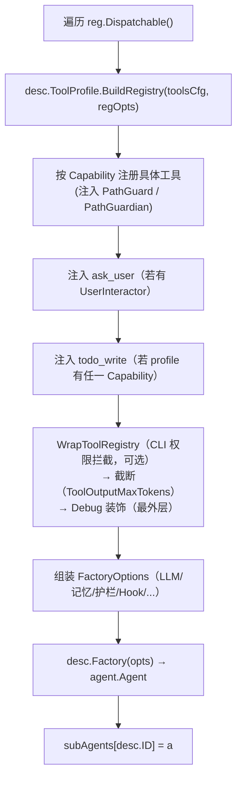

# agents — Domain Design

本文档描述专家代理与能力分级的**技术实现**:注册表数据结构、ToolProfile 模型、Factory+profile 装配模式、各类注入策略与技术取舍。融合了已删除的 `vv/doc/agents.md`(代理设计理念)与 `vv/doc/registries.md`(注册表与能力分级)的设计内核。源码:`vv/agents/`、`vv/registries/`,装配入口 `vv/setup/setup.go`。

> Primary / Fallback Primary 的能力分工虽与本领域共享 ToolProfile 模型,但其构造与递归阀门归 [orchestration](../orchestration/);本文仅在「Primary 的特殊装配路径」一节交代它如何复用本领域的 profile 与描述符,细节链接到 orchestration。

## 能力维度与预制组合

vv 的代理体系由"一前门 Primary + 若干能力组合"构成。Primary(归 orchestration)不是只读路由员,而是**与用户直接协作的主执行 agent**:它在所有 execution model 下持有 Full 工具,可直接完成 coding loop,也可按需派生一次性 worker 用于隔离、并行、研究与独立评审。

一个执行者由这些**正交维度**共同确定,而非由角色名隐式决定:

| 维度 | 由什么决定 | 归属 |
|------|-----------|------|
| **Agent runtime** | `base_type` → 已注册 AgentDescriptor 的 Factory 与基础行为 | agents |
| **ToolProfile** | 五档预设之一;决定 read/write/execute/search/memory 翻译出的工具子集 | agents |
| **PermissionPolicy** | 统一 permission / path guard / sandbox;**只减不增** | tools |
| **ContextSources** | 已注册的只读上下文来源(如 `diff`) | agents |
| **Skills** | 已注册的专项指令(如 `review`);**不授予工具** | agents |
| **ModelPolicy** | 系统已配置的模型,或继承默认 | configuration |
| **IsolationMode** | `isolated`(默认,全新子上下文)/ `shared`(共享会话任务背景) | orchestration |

启动期注册的类型表是**预制组合**,不是能力表达力的上限:

| 代理 | 角色 | ToolProfile | Dispatchable | 归属领域 |
|------|------|-------------|--------------|---------|
| Primary | 前门主执行 agent:直答/内联执行/派生 worker/规划 | Full(所有 execution model) | 否 | orchestration |
| Fallback Primary | 递归超限保险:人格同 Primary、无工具、迭代=1 | None | 否 | orchestration |
| **Coder** | 编码预制组合:默认唯一写者 | Full | 是 | **agents** |
| **Researcher** | 研究预制组合:只读 + 公网 | ReadOnly | 是 | **agents** |
| **Reviewer** | 评审预制组合:只读 + bash,不写 | Review | 是 | **agents** |
| Planner | 规划描述:无工具,描述字段被 Primary 提示拼接器消费 | None | 否 | agents(描述符)/ orchestration(语义) |

### 为什么是组合而不是枚举

按角色枚举时,每出现一种新形态(code-review、只读探查、带 diff 的研究……)都要新增一个类型,组合数随 runtime × 权限 × 上下文 × skill 的维度增长而爆炸。改为声明组合后,新形态不写代码:

```
code-review = coder runtime + Review profile + review skill + 禁写 + diff 上下文
```

代价是规格校验与装配变复杂(base type / profile / skill / context source 四类引用都要校验),这是刻意接受的:校验集中在一处,而类型爆炸会散布到注册表、提示词、委派工具、HTTP 路由、MCP 暴露五条下游。

### "能力鸿沟"如何在组合模型下继续成立

能力鸿沟现在挂在 **profile 上,而不是名字上**:

- **Full**——读 + 写 + 执行 + 搜索的完整档;Coder 与 Primary 用它,真正改代码的事落到它。
- **Edit**——带 write/edit 但不带 shell;给需要改文件、不必跑命令的派生 worker。
- **ReadOnly**——能跑搜索引擎、抓公网资料,但绝不动文件系统。
- **Review**——能跑 bash(测试/lint),但不能写;输出通常是"建议下一步"。

于是 "Reviewer 不能修复它发现的问题" 这句话的准确形式是:**Review 档不含写工具**——无论它建立在哪个 runtime 上、加载了什么 skill、system prompt 怎么写。runtime 决定行为风格,profile 决定权限,二者正交。Primary 持 Full 档、可直接 mutation,但仍经过同一 permission / path guard / sandbox,并保留明确的 agent attribution——前门的边界由这些护栏给出,而不是靠抽走它的写工具。

> **提示词必须与工具面一致**:当 profile 被从 base runtime 的默认档收窄时(如 coder runtime + Review 档),装配层会在系统提示里追加「Effective tool access」清单,写明实际可用工具并点明 write/edit 不可用。若 base 提示继续向模型广告它没有的工具,模型会反复尝试调用而失败——这是提示词正确性,不是权限改变(权限仍由 profile ∩ guard 决定)。

### Skill 与 ContextSource

两者都是"只影响模型看到什么",都不触碰权限:

- **Skill**(`vv/registries/skill.go`):`{ID, Description, Instructions}`,worker 构造时把 `Instructions` 追加到 base runtime 的系统提示之后。内置 `review`(评审纪律:file:line、按严重度排序、绝不改文件)与 `research`(调研纪律:结论必须带出处);`agents.skill_dir` 下每个子目录的 `SKILL.md`(Agent Skills 开放标准)在启动期并入同一注册表,ID 冲突时内置优先。亦可经 `skill_evolution` 人工确认后向同一对注册表追加文件 skill,并刷新 Primary 的 `use_skill` / `spawn_worker` enum;禁止覆盖内置、禁止卸载。skill 未注册 → 构造期报错。Primary 另经 `use_skill` 按 session 激活,instructions 从**下一轮**进入系统提示,不授予工具。
- **ContextSource**(`vv/registries/context_source.go`):`{ID, Description, Provider}`,provider 是纯读取器,渲染为 `## Context: <id> (read-only)` 块,拼在 worker 任务输入之前。内置 `diff` = 工作区对 HEAD 的 `git diff`(带体积上限截断)。provider 失败 → **中止派生**,而不是让 worker 在"以为读到了 diff"的状态下运行。

ContextSource 与代理注册表同构:启动期构造一次、ID 冲突 `MustRegister` panic、启动后只读。Skill 注册表启动集同样一次构造;进化批准可追加文件 skill,内置 ID 仍不可覆盖或卸载。

## ToolProfile 模型(五档)

ToolProfile 是一个命名的能力集合 `{Name, Capabilities ⊆ {Read, Write, Execute, Search, Remember, Interrupt}}`。五档预设:

| Profile | Capabilities | 含义 | 典型代理 |
|---------|-------------|------|---------|
| Full | Read + Write + Execute + Search + Remember + Interrupt | 读 + 写 + 执行 + 搜索 + 记忆 + HITL | Coder / Primary(worker 不因 Interrupt 接线) |
| Review | Read + Search + Execute | 读 + 搜索 + 执行 | Reviewer / code-review worker |
| Edit | Read + Search + Write | 读 + 搜索 + 写(无 shell) | 需要改文件但不需要 shell 的派生 worker |
| ReadOnly | Read + Search | 读 + 搜索 | Researcher |
| None | ∅ | 无工具 | Planner / Fallback Primary |

五档是**封闭集合**:worker spec 的 `tool_access` 只接受 `ProfileByName` 可解析的这五个名字,不开放自定义 profile。`ProfileNames()` 渲染 `spawn_worker` 的 schema enum,与 `ProfileByName` 的接受集合同源,避免"广告的值"与"校验的值"漂移。

### 能力 → 工具映射

每个 Capability 在 `BuildRegistry` 阶段翻译为具体工具集(`registerCapabilityTools`):

| Capability | 注册的工具 |
|-----------|-----------|
| Read | 读取文件 + 公网抓取(web_fetch)+ 可选公网搜索(web_search) |
| Write | 文件创建(write)+ 文件 patch(edit) |
| Execute | shell 执行(bash;受超时与路径 guardian 约束) |
| Search | 文件名 glob + 内容 grep |
| Remember | 不在 BuildRegistry 落地;装配阶段在 persistent store 非 nil 时挂 memory_set / memory_recall。声明了该能力但 store 为 nil 时记 Warn,不注册 |
| Interrupt | 不是工具,BuildRegistry 为 no-op。不是 worker 的 interrupt 开关;只给长期宿主装配 |

**取舍:公网检索算"读"而非"搜索"**——把 web_fetch/web_search 归到 Read,是因为模型语义上把它当作"获取外部信息",与"在已知项目里找东西"(Search)是不同认知模式。工具实体与护栏细节归 [tools](../tools/) 领域。

## 注册表与代理描述符

注册表把"有哪些代理类型""它们能用哪些工具"从调用点抽出来,让代理生命周期变为**声明式**:声明一个描述符,下游所有装配/路由/委派自动跟随。数据结构(`vv/registries/registry.go`):

```
AgentDescriptor
├── ID, DisplayName, Description
├── ToolProfile          （声明能用哪些能力）
├── SystemPrompt         （默认系统提示;动态创建时复用）
├── Factory              （拿到完整依赖后产生 agent.Agent 实例）
└── Dispatchable         （是否被 Primary 通过 delegate_to_* 看见）
```

### 描述符的下游消费者(声明一次,多处消费)

| 消费者 | 用途 |
|--------|------|
| 代理工厂 | 装配中心遍历 `Dispatchable()`,按 ToolProfile 构造工具集,调 Factory 得实例 |
| Primary 提示拼接 | `PlannerAgentList()` 把每个 dispatchable 代理的 Description 汇成"可委派目标列表" |
| 委派工具家族 | Primary 工具集内每个 dispatchable 代理自动获得一个 `delegate_to_<id>` |
| HTTP 子代理路由 | 每个 dispatchable 代理注册为独立端点(归 http-api) |
| MCP 工具暴露 | dispatchable 代理暴露为 MCP 工具(归 mcp) |

任何新代理只需写一个描述符 + 一个 Factory,即被以上五条路径自动看见(对应 AGENTS-R7)。

### 与启动期一次性构造的关系

注册表**每次启动构造一次**,不是全局单例:不同进程/测试可独立装配出不同代理集合;ID 冲突在启动期 `panic`(`MustRegister`),避免运行期"半就绪"代理表;测试可注入 fake 描述符。填充后转为只读视图供下游消费。

## Factory + profile 装配模式

装配中心(`setup.go`)对每个 dispatchable 描述符执行(functional options 模式):


```mermaid
flowchart TD
    A["遍历 reg.Dispatchable()"] --> B["desc.ToolProfile.BuildRegistry(toolsCfg, regOpts)"]
    B --> C["按 Capability 注册具体工具<br/>(注入 PathGuard / PathGuardian)"]
    C --> D["注入 ask_user（若有 UserInteractor）"]
    D --> E["注入 todo_write（若 profile 有任一 Capability）"]
    E --> F["WrapToolRegistry（CLI 权限拦截，可选）<br/>→ 截断（ToolOutputMaxTokens）<br/>→ Debug 装饰（最外层）"]
    F --> G["组装 FactoryOptions（LLM/记忆/护栏/Hook/...）"]
    G --> H["desc.Factory(opts) → agent.Agent"]
    H --> I["subAgents[desc.ID] = a"]
```

各 Factory 内部用 vage 的 `taskagent.New` + 一系列 `taskagent.With*` 选项装配 ReAct 代理;所有 Factory 形状一致,差异只在 ID/系统提示/是否读持久记忆。

### ask_user / todo_write 注入策略

这两个工具不属于任何 Capability,由装配阶段额外注入(`vv/setup/setup.go`):

- **ask_user**:当存在 `UserInteractor` 时,以 `RegisterIfAbsent` 挂入工具集(带 `AskUserTimeout`)。Coder/Researcher/Reviewer 均得到它(`setup.go` 保留一处 `desc.ID != "chat"` 的防御性判断,因 chat 已移除而成为死分支)。
- **todo_write**:当 `profile.Capabilities` 非空时注入,**全进程共享同一个 `todo.Store`**——使一条多代理 dispatcher 计划(coder → reviewer → coder)在同一 session 内看到单一单调列表。`VV_DISABLE_TODO=true` 整体关闭。ProfileNone 代理(planner / Fallback Primary)什么都不挂。

### 注入 Guard 接入(ToolResultGuards)

`FactoryOptions.ToolResultGuards` 携带工具结果注入扫描器(由 `cfg.Security.ToolResultInjection` 构造);非空时各 Factory 经 `taskagent.WithToolResultGuards` 挂到代理,对工具返回内容做注入扫描。nil 表示未启用(零成本默认)。Guard 实体与扫描语义归 [tools](../tools/) 与安全领域。

### HookManager 注入

`FactoryOptions.HookManager` 是 trace/可观测的事件总线;非空时经 `taskagent.WithHookManager` 注入,代理运行期的迭代/工具/上下文事件(含 EventContextBuilt)经它旁路分发。nil 时不分发(零成本默认)。事件消费归 [trace](../trace/)。

### 其他经 FactoryOptions 注入的接缝

| 字段 | 作用 | nil 行为 |
|------|------|---------|
| ExtraContextSources | 追加到 ContextBuilder 管道的额外 Source(Plan Workspace / Session Tree 视图) | 用默认管道 |
| IterationStore | 逐迭代 ReAct checkpoint,支持 `Resume(ctx, sessionID)` | 关 checkpoint(零成本) |
| BuildReportSink | 归档每轮 BuildReport | 不归档(事件仍发) |
| CheckpointFailureCB | 记录非致命 checkpoint 保存失败计数 | 不记 |

## 上下文注入(各代理统一处理)

每个代理每轮看到的系统级背景分层叠加,以"额外 Source"形式注入 vage ContextBuilder 管道,所有代理统一处理,无需每个 Factory 自写注入逻辑:

```
代理基础系统提示（+ Environment 运行时事实块 + 项目级提示，经 ComposeSystemPrompt 依次附加）
  + 持久化记忆（仅 Coder 全量渲染进系统提示，见 AGENTS-R10；Primary/Full 另有 memory_recall）
  + Plan Workspace 视图（启用时，经 ExtraContextSources）
  + Session Tree 视图（启用时；可被 auto-enable 门控延后激活）
```

**专家代理只读 plan/tree**:写工具(plan_update / tree_*)只挂给 Primary,避免多写者在同一份 plan.md 上互相覆盖(AGENTS-R8)。专家若发现需更新计划,反馈给 Primary 决定。

## Primary 的特殊装配路径

Primary 复用本领域的 ToolProfile 模型与描述符机制,但不走 `Dispatchable()` 自动循环——装配中心单独处理(`Dispatchable=false`,故不出现在 HTTP 子端点 / `delegate_to_*`,只能经 Dispatcher 进入)。其 profile 在所有执行模型下固定为 Full(read/search + write/edit + bash + memory;`primary_allow_bash` 已降为惰性兼容键),并在常规工具集上额外挂载委派工具家族、规划工具、Plan Workspace / Session Tree 工具、ask_user、todo_write。构造细节与递归阀门 / Fallback Primary 见 [orchestration](../orchestration/)。

## 演化策略

- **新增任务形态(首选)**:不写代码。声明能力组合即可——`spawn_worker` 或 DAG 动态节点给出 base_type + tool_access + skills + context;组合是运行期数据,不是新类型。
- **新增 skill**:手工在 `agents.skill_dir` 放一个 `SKILL.md` 目录(重启后 Discover),**或**对已落盘会话显式提取并经人工批准写入同一目录。批准路径热注册进同一对注册表并刷新 Primary 的 `use_skill` / `spawn_worker` enum,下一轮 LLM 调用即可看见新 ID。内置纪律仍可改 `DefaultSkills`。`spawn_worker` 的 schema enum 与校验跟随注册表,无需改 Primary 提示词,也无需改 handler 成功路径。
- **新增 context source**:在对应默认注册表加一条(`DefaultContextSources`)。
- **新增预制组合(仅当值得给它一个名字时)**:① 在注册表加一个 AgentDescriptor(声明 ToolProfile + 系统提示);② 装配中心自动按 profile 构造工具集、注入 Primary 的 `delegate_to_*` 家族;③ Primary 下一次 LLM 调用即看到新委派目标。判据是"这个组合值不值得一个稳定的名字与独立会话入口",而不是"我们又需要一种能力面"。
- **新增能力**(如加 `web_search`):① 把工具归类到一个或多个 Capability;② 任何 ToolProfile 含该 Capability 的执行者自动获得新工具。
- **第三方代理**:插件机制可在装配前追加描述符(数据结构已支持,当前未启用)。

## 技术取舍

| 决策 | 取舍理由 |
|------|---------|
| **能力分级而非硬编码工具**(候选 ADR-0003) | 若把"代理类型有哪些""能用哪些工具"散落在调用点,新增代理要同步改调用点/HTTP 路由/Primary 工具列表(改多处),且"某代理有什么权限"只能靠读代码归纳。ToolProfile 把权限抽成可一句话陈述的数据,声明式扩展把演化代价压到最小。 |
| **能力鸿沟挂在 profile 而非角色名** | 用能力档而非运行期 if 检查实现"单一写者";挂在 profile 上使它对任意组合都成立(review skill 无论加到哪个 runtime 上都拿不到 write),而挂在角色名上只对枚举出来的那几个名字成立。 |
| **正交组合而非枚举角色** | 枚举模型下 runtime × 权限 × 上下文 × skill 的组合数会持续膨胀,且每个新角色都要在五条下游(装配、提示、委派工具、HTTP、MCP)留痕;组合模型把扩展代价压成一次声明,代价是集中一处的规格校验。 |
| **skill 不授权、context source 只读** | 若允许 skill 带工具,"某执行者有什么权限"就要同时读 profile 与全部 skill 才能回答;保持 skill 纯提示,则权限永远是 profile ∩ guard 一句话。 |
| **公网检索归 Read 而非 Search** | 贴合模型对"外部信息获取"与"项目内查找"的不同认知模式。 |
| **持久记忆 prompt 仅注入 Coder** | 只有写代码的预制组合需要每轮看到长期项目记忆;Primary 用按需 `memory_recall`,其余专家是短任务。 |
| **todo_write 共享进程级 Store** | 多代理 dispatcher 计划需看到单一单调待办列表,而非各自割裂的副本。 |
| **注册表每启动构造一次(非单例)** | 进程/测试隔离;ID 冲突启动期 panic 而非运行期半就绪。 |
