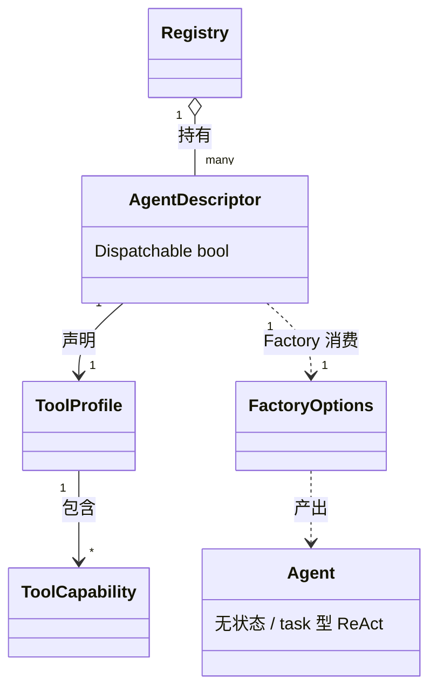

# agents — 实体模型

本领域的实体模型。完整字段权威清单引用 [model-agent](../../../../vv-prd/models/core/agents/model-agent.md);枚举见 [dictionary-agent-type](../../../../vv-prd/dictionaries/core/dictionary-agent-type.md) 与 [dictionary-tool-access-level](../../../../vv-prd/dictionaries/core/dictionary-tool-access-level.md)。源码:`vv/registries/`、`vv/agents/`。

## AgentDescriptor

**用途**:单一代理类型的**声明式元数据 + 工厂**。注册表的元素;"声明一次,多处消费"(工厂装配、Primary 提示拼接、委派工具、HTTP 子路由、MCP 暴露)。

| 属性 | 语义类型 | 说明 |
|------|---------|------|
| ID | text | 唯一标识(如 "coder");冲突在启动期 panic |
| DisplayName | text | 人类可读名(如 "Coder") |
| Description | text | 供 Primary 提示拼接的"可委派目标"描述,亦用于编排决策 |
| ToolProfile | reference(ToolProfile) | 声明能用哪些能力,装配阶段翻译为具体工具集 |
| SystemPrompt | text | 默认系统提示;动态创建/装配时复用(全文在代码中) |
| Factory | function | 拿到 FactoryOptions 后产出 `agent.Agent` 实例 |
| Dispatchable | enum(bool) | 是否可作委派目标 / HTTP 子端点 / MCP 工具 |

**关系**:被 Registry 持有(has-many);引用一个 ToolProfile;Factory 消费 configuration 装配中心提供的 FactoryOptions(LLM/记忆/护栏/Guard/Hook 等接缝,见 [design.md](design.md))。

## AgentType

**用途**:代理底层实现类型枚举,对应不同 vage 实现。

| 值 | 含义 | 归属领域 |
|----|------|---------|
| task | ReAct 循环代理,带可选工具访问 | agents(coder/researcher/reviewer + 内部 planner) |
| orchestrator | 任务理解、分解为 DAG、分发子代理、聚合结果 | orchestration |

完整定义见 [dictionary-agent-type](../../../../vv-prd/dictionaries/core/dictionary-agent-type.md)。本领域的专家代理均为 `task` 型。

## ToolProfile / ToolCapability

**用途**:命名的能力集合,实现能力分级(AGENTS-R1)。代理可用工具由它声明而非硬编码。

| 属性 | 语义类型 | 说明 |
|------|---------|------|
| Name | text | profile 名(full / review / read-only / none) |
| Capabilities | enum 集合(ToolCapability) | {Read, Write, Execute, Search} 的子集 |

**ToolCapability 取值**:

| 值 | 装配阶段翻译为 |
|----|---------------|
| Read | 读取文件 + web_fetch + 可选 web_search |
| Write | write + edit |
| Execute | bash(受超时 / 路径 guardian 约束) |
| Search | glob + grep |

**四档预设**(与 [dictionary-tool-access-level](../../../../vv-prd/dictionaries/core/dictionary-tool-access-level.md) 对齐):

| Profile | Capabilities | 典型代理 |
|---------|-------------|---------|
| Full | Read + Write + Execute + Search | Coder |
| Review | Read + Search + Execute | Reviewer |
| ReadOnly | Read + Search | Researcher / Primary |
| None | ∅ | Planner / Fallback Primary |

**关系**:被 AgentDescriptor 引用;`BuildRegistry` 把它翻译成一个 `tool.Registry`(具体工具映射见 [tools](../tools/) 与 [design.md](design.md))。

## 专家代理配置(FactoryOptions 视角)

**用途**:Factory 装配一个 task 代理所需的全部依赖与接缝(由 configuration 装配中心填充)。代理本身**无状态、无生命周期**;单次 Run 的迭代由 vage TaskAgent 管理。

| 属性 | 语义类型 | 说明 |
|------|---------|------|
| LLM / Model | reference / text | ChatCompleter 与模型名 |
| ToolRegistry | reference | 已按 ToolProfile 过滤、并注入 ask_user/todo_write、经装饰链包装的工具集 |
| MaxIterations | number | ReAct 最大迭代;planner 等单步代理固定为 1 |
| RunTokenBudget | number | 单次 Run token 预算(0 = 不限) |
| MaxParallelToolCalls | number | 单条 assistant 消息内并发工具上限(0=默认,≤1=串行) |
| PromptCaching | enum(bool) | 是否发 prompt-cache 断点提示 |
| Memory / PersistentMemory | reference | 会话记忆;持久记忆**仅 Coder** 注入(AGENTS-R10) |
| ProjectInstructions | text | VV.md 内容,经 `AppendProjectInstructions` 附加到系统提示尾 |
| ToolResultGuards | reference 集合 | 工具结果注入扫描器(nil=未启用) |
| HookManager | reference | 事件总线(nil=不分发,零成本) |
| ExtraContextSources | reference 集合 | 追加到 ContextBuilder 的 Source(Plan Workspace / Session Tree 视图) |
| IterationStore / BuildReportSink / CheckpointFailureCB | reference | checkpoint / 报告归档 / 失败计数接缝(均 nil=零成本路径) |

**关系**:由 AgentDescriptor.Factory 消费,产出 `agent.Agent`;各接缝的注入策略见 [design.md](design.md)「Factory + profile 装配模式」。完整字段与 max_iterations/token_budget/working_dir 等属性的权威定义见 [model-agent](../../../../vv-prd/models/core/agents/model-agent.md)。

## 实体关系

