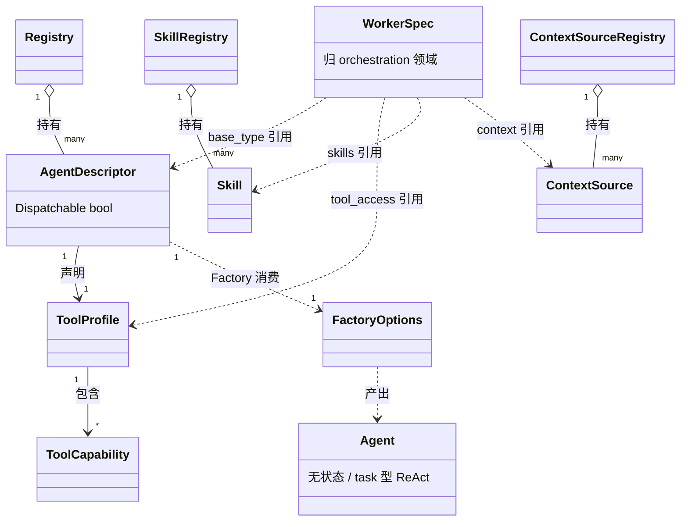

# agents — 实体模型

本领域的实体模型。源码:`vv/registries/`、`vv/agents/`。

## AgentDescriptor

**用途**:单一代理类型的**声明式元数据 + 工厂**。注册表的元素;"声明一次,多处消费"(工厂装配、Primary 提示拼接、委派工具、HTTP 子路由、MCP 暴露)。

| 属性 | 语义类型 | 说明 |
|------|---------|------|
| ID | text | 唯一标识(如 "coder");冲突在启动期 panic |
| DisplayName | text | 人类可读名(如 "Coder") |
| Description | text | 供 Primary 提示拼接的"可委派目标"描述,亦用于编排决策 |
| ToolProfile | reference(ToolProfile) | 声明能用哪些能力,装配阶段翻译为具体工具集 |
| SystemPrompt | text | 默认系统提示;动态创建/装配时复用(全文在代码中) |
| Factory | function | 拿到 FactoryOptions 后产出 `agent.Agent` 实例 |
| Dispatchable | enum(bool) | 是否可作委派目标 / HTTP 子端点 / MCP 工具 |

**关系**:被 Registry 持有(has-many);引用一个 ToolProfile;Factory 消费 configuration 装配中心提供的 FactoryOptions(LLM/记忆/护栏/Guard/Hook 等接缝,见 [design.md](design.md))。

## AgentType

**用途**:代理底层实现类型枚举,对应不同 vage 实现。

| 值 | 含义 | 归属领域 |
|----|------|---------|
| task | ReAct 循环代理,带可选工具访问 | agents(coder/researcher/reviewer + 内部 planner) |
| orchestrator | 任务理解、分解为 DAG、分发子代理、聚合结果 | orchestration |

本领域的专家代理均为 `task` 型。

## ToolProfile / ToolCapability

**用途**:命名的能力集合,实现能力分级(AGENTS-R1)。代理可用工具由它声明而非硬编码。

| 属性 | 语义类型 | 说明 |
|------|---------|------|
| Name | text | profile 名(full / review / read-only / none) |
| Capabilities | enum 集合(ToolCapability) | {Read, Write, Execute, Search, Remember} 的子集 |

**ToolCapability 取值**:

| 值 | 装配阶段翻译为 |
|----|---------------|
| Read | 读取文件 + web_fetch + 可选 web_search |
| Write | write + edit |
| Execute | bash(受超时 / 路径 guardian 约束) |
| Search | glob + grep |
| Remember | memory_set + memory_recall(store 未注入时不注册) |

**五档预设**:

| Profile | Capabilities | 典型代理 |
|---------|-------------|---------|
| Full | Read + Write + Execute + Search + Remember | Coder / Primary |
| Review | Read + Search + Execute | Reviewer |
| Edit | Read + Search + Write | 需要改文件但不需要 shell 的派生 worker |
| ReadOnly | Read + Search | Researcher |
| None | ∅ | Planner / Fallback Primary |

**关系**:被 AgentDescriptor 引用,或被 worker spec 的 `tool_access` 直接引用;`BuildRegistry` 把它翻译成一个 `tool.Registry`(具体工具映射见 [tools](../tools/) 与 [design.md](design.md))。五档为封闭集合:`ProfileByName` 是唯一解析入口,`ProfileNames()` 是唯一广告入口。

## Skill

**用途**:命名的专项指令片段,为执行者追加"按什么纪律产出"(AGENTS-R11)。**不授予工具、不放宽权限**。

| 属性 | 语义类型 | 说明 |
|------|---------|------|
| ID | text | 唯一标识(`review` / `research`) |
| Description | text | 一句话描述,渲染进 `spawn_worker` 工具 schema |
| Instructions | text | 追加到 base runtime 系统提示之后的提示片段 |

**关系**:由 `SkillRegistry` 持有(启动期构造一次、ID 冲突 panic、启动后只读);被 worker spec 的 `skills` 数组按 ID 引用;未注册 ID 在构造期报错。

## ContextSource

**用途**:命名的只读上下文来源,决定执行者"读到什么任务上下文"(AGENTS-R12)。

| 属性 | 语义类型 | 说明 |
|------|---------|------|
| ID | text | 唯一标识(内置 `diff`) |
| Description | text | 一句话描述,渲染进 `spawn_worker` 工具 schema |
| Provider | reference | 纯读取器 `func(ctx) (string, error)`;`diff` = 工作区对 HEAD 的 git diff(超限截断) |

**渲染形式**:`## Context: <id> (read-only)` + 正文,多个来源按声明顺序拼接,整体置于任务指令**之前**。

**关系**:由 `ContextSourceRegistry` 持有(同上三条不变量);被 worker spec 的 `context` 数组按 ID 引用;未注册 ID 或 provider 失败均中止派生。

## 预制组合配置(FactoryOptions 视角)

**用途**:Factory 装配一个 task 代理所需的全部依赖与接缝(由 configuration 装配中心填充)。代理本身**无状态、无生命周期**;单次 Run 的迭代由 vage TaskAgent 管理。

| 属性 | 语义类型 | 说明 |
|------|---------|------|
| LLM / Model | reference / text | `largemodel.Caller`、协议与模型名 |
| ToolRegistry | reference | 已按 ToolProfile 过滤、并注入 ask_user/todo_write、经装饰链包装的工具集 |
| MaxIterations | number | ReAct 最大迭代;planner 等单步代理固定为 1 |
| RunTokenBudget | number | 单次 Run token 预算(0 = 不限) |
| MaxParallelToolCalls | number | 单条 assistant 消息内并发工具上限(0=默认,≤1=串行) |
| PromptCaching | enum(bool) | 是否发 prompt-cache 断点提示 |
| Memory / PersistentMemory | reference | 会话记忆;持久记忆 **prompt 全量渲染仅 Coder**(AGENTS-R10);记忆工具由 CapRemember 授予 |
| Environment | text | 运行时事实块(工作目录、平台、日期、git、项目提示文件名、迭代预算),经 `AppendEnvironment` 插入基础提示与项目级提示之间 |
| ProjectInstructions | text | 项目级提示文件内容(`VV.md`/`AGENTS.md`/`CLAUDE.md` 首个命中),经 `AppendProjectInstructions` 附加到系统提示尾 |
| ToolResultGuards | reference 集合 | 工具结果注入扫描器(nil=未启用) |
| HookManager | reference | 事件总线(nil=不分发,零成本) |
| ExtraContextSources | reference 集合 | 追加到 ContextBuilder 的 Source(Plan Workspace / Session Tree 视图) |
| IterationStore / BuildReportSink / CheckpointFailureCB | reference | checkpoint / 报告归档 / 失败计数接缝(均 nil=零成本路径) |

**关系**:由 AgentDescriptor.Factory 消费,产出 `agent.Agent`;各接缝的注入策略见 [design.md](design.md)「Factory + profile 装配模式」。

## 实体关系

```mermaid
classDiagram
    Registry "1" o-- "many" AgentDescriptor : 持有
    SkillRegistry "1" o-- "many" Skill : 持有
    ContextSourceRegistry "1" o-- "many" ContextSource : 持有
    AgentDescriptor "1" --> "1" ToolProfile : 声明
    ToolProfile "1" --> "*" ToolCapability : 包含
    AgentDescriptor "1" ..> "1" FactoryOptions : Factory 消费
    FactoryOptions ..> Agent : 产出
    WorkerSpec ..> AgentDescriptor : base_type 引用
    WorkerSpec ..> ToolProfile : tool_access 引用
    WorkerSpec ..> Skill : skills 引用
    WorkerSpec ..> ContextSource : context 引用
    AgentDescriptor : Dispatchable bool
    Agent : 无状态 / task 型 ReAct
    WorkerSpec : 归 orchestration 领域
```

> WorkerSpec 本身是 orchestration 的值对象(见 [../orchestration/models.md](../orchestration/models.md));此处只表达它对本领域四类能力维度的引用关系。
