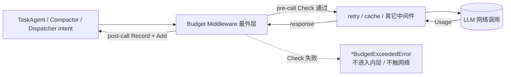

# budget 领域设计(design)

> 本文档描述 budget 领域的 HOW;业务规则与不变量见 [spec.md](spec.md)(BUDGET-R*),实体字段见 [models.md](models.md)。

## 中间件位置:最外层

Budget Middleware 由 `vage/largemodel.NewBudgetMiddleware` 构造,经 `largemodel.Chain` 装配到 LLM 调用链的 **最外层**——位于 retry / circuit-breaker / cache / debug 等所有中间件之外。

最外层是硬约束:被拒绝的请求 **绝不能** 被内层 retry 放大、也 **绝不能** 被重复计数(BUDGET-R1、BUDGET-R6 的前提)。这是把预算放在最外层而非贴近网络层的根本原因——内层中间件可能放大或重试调用,只有最外层拦截才能保证"拒绝在网络前发生且仅计数一次"。

调用顺序由 enforcement 流程固定为 `Check → LLM call → Add`,逐步细节见 [procedure-budget-enforcement](../../../../vv-prd/procedures/core/budget/procedure-budget-enforcement.md),不在此复述。流式调用同样在 pre-call 做 Check,把 post-call Record 推迟到 stream close,保证迟到的 usage 仍被计入。

## 两度量:token vs USD

每个 Tracker 同时承载两个独立维度:

| 维度 | 来源 | 适用性 | 取舍 |
|------|------|--------|------|
| token 数 | LLM 返回的 `Usage`(`PromptTokens + CompletionTokens`) | 对所有 provider 通用 | cache-read token 已包含在 input 内,**不得重复计数** |
| USD 成本 | 由 Model Pricing 折算 | 仅当活动模型有价格表条目 | 缺价格表则静默禁用 cost 维度(BUDGET-R7) |

**为什么两度量并存**:token 通用但不能跨模型横向比较成本;USD 直观但依赖价格表。两者独立配置、独立判定,first-to-exceed 决定拒绝维度(BUDGET-R6)。

**Pricing-agnostic trackers**:折算公式由中间件持有,Tracker 只接收预先算好的 USD。这样价格表可以演进而无需触碰 Tracker。折算用 per-million-token 费率,区分 input / output / cache-read,具体见 `vv/traces/budgets/wire.go` 的 `postRecord`,不在此复述。

## 价格表可覆盖

内置默认价格表覆盖主流模型;用户可在配置里新增条目或覆盖既有条目。价格表归属 [cost-tracking](../cost-tracking/cost-tracking-overview.md)(`costtraces.Pricing`),budget 仅消费。未匹配到价格的模型,cost 维度限制静默跳过(token 维度不受影响)。

## Daily 进程内计数取舍

Daily 计数 **仅存于进程内存**,进程重启清零。这是有意取舍:

- **不持久化的代价**:重启后 daily 用量归零,可能超出"真实"自然日额度。
- **不持久化的收益**:免去跨进程协调(多个 vv 进程共享一个 daily 计数器需要外部存储 + 锁),复杂度不值得。
- **窗口滚动**:在 UTC 00:00 滚动,且滚动逻辑(`rollLocked`)在与 Add / Check **同一把锁** 下执行,所以午夜切换不会与在途请求竞争。
- **UTC 对齐**:避免共享主机上的时区歧义。

持久化 daily 状态 deferred 至 P1-6(SQLite)。session 计数本就跟随进程生命周期,无持久化语义。

## 零成本路径

预算是 opt-in。装配期判定:

- Tracker 构造器在无任何非零硬限制时返回 **nil**(`newTracker`);nil 是合法的"禁用层"哨兵——`Check` / `Add` / `Snapshot` 在 nil receiver 上全是 no-op,调用方无需 nil 守卫。
- 当 session 与 daily 两个 Tracker 都为 nil 时,`Wire` 返回 `(nil, nil)`,装配中心 **完全跳过** Budget Middleware 的插入。

结果:无限制配置 = 无 Tracker + 无中间件 + 无额外延迟(BUDGET-R5)。

## 三层快照渲染

`/budget`(CLI)与 `GET /v1/budget`(HTTP)渲染 Run / Session / Daily 三层。三层来源不同:

| 层 | 来源 | 渲染 |
|----|------|------|
| Run | `cfg.Agents.RunTokenBudget`(orchestration TaskAgent Run Budget) | "budget per run = N tokens" 或 "not configured" |
| Session | session Budget Tracker 的 `Snapshot()` | used / hard tokens + USD;窗口为进程生命周期(无 reset 倒计时) |
| Daily | daily Budget Tracker 的 `Snapshot()` | used / hard + USD;附 "resets in ~Xh" 倒计时 |

Snapshot 是 Tracker 状态的只读视图(`remaining = -1` 表示该维度无限制)。CLI 屏幕底部另实时显示前两种成本视图(当前 turn、cost tracker),预算视图是第三种(见 cost-tracking 三视图)。HTTP 端 nil 层被省略,客户端据此判断哪些层启用。渲染代码见 `vv/cli/budget.go`、`vv/httpapis/budget.go`,不在此复述。

## 事件:旁路订阅

`EventBudgetWarn` / `EventBudgetExceeded` 经 vage 事件总线发出,与 trace / session 等共用同一条总线、旁路订阅(ADR 0005)。主请求路径只负责发事件,落盘 / 展示由订阅者异步处理,不污染主路径。

## HTTP 拒绝改写为 429

budget 领域产生的拒绝是 `*BudgetExceededError`,经代理 run 路径以 JSON body 向上传播。http-api 的 `budgetErrorMiddleware` 探测响应体中的 budget-exceeded 签名(error 文本含 "budget exceeded" 或 `type == "budget_exceeded"`),把状态码改写为 429(BUDGET-R2)。用错误文本探测而非紧耦合具体 JSON schema,既能命中顶层 error 字段也能命中嵌套 envelope。实现见 `vv/httpapis/budget.go`。

## 技术取舍(候选 ADR 0008)

| 决策 | 取舍 |
|------|------|
| 预算在 LLM 调用前预检并拒绝(非事后告警) | 网络前拒绝才能真正阻止成本;代价是预检在每次调用增加一次加锁判定(零成本路径下无此开销) |
| 中间件置于最外层 | 保证拒绝不被内层 retry 放大、usage 不重复计数;代价是预算看到的是"组件实际收发"的请求 |
| Daily 进程内计数、重启清零 | 免跨进程协调;代价是重启可能超额(deferred P1-6 持久化) |
| nil tracker 作禁用哨兵 | 调用方分支免写;代价是 nil receiver 上的方法需显式 no-op |
| 软告警一次性 | 避免告警风暴;代价是越过阈值后持续高位不再提醒(仅硬上限会再拒绝) |

完整候选 ADR 列表见 [../../../architecture/adr/adr.md](../../../architecture/adr/adr.md);预算硬阀门不变量见 [../../../constitution.md](../../../constitution.md) § 4。
