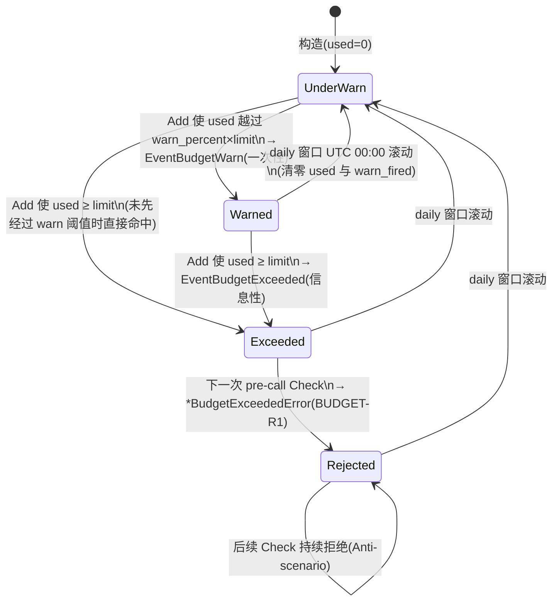

# budget 领域规格(spec)

## Overview

budget 领域把声明式的 token / USD 上限转化为运行期的 **硬性成本约束**。约束分三层 scope(`run ⊂ session ⊂ daily`),度量两个维度(token 数、USD 成本)。预算的语义是 enforcement:它是 vv 中唯一能在成本越界时 **拒绝下一次 LLM 调用** 的子系统;[cost-tracking](../cost-tracking/cost-tracking-overview.md) 观测同一份数据但从不拒绝。

边界:本领域负责"限多少、何时拒、何时告警、向谁展示"的业务规则与不变量;token→USD 的折算依赖 cost-tracking 的 Model Pricing,具体公式与中间件链路位置见 [design.md](design.md)。Run-scope 的实际计数由 orchestration 的 TaskAgent Run Budget 提供,本领域只在三层快照里呈现它,不参与其 enforcement。

## Core entities

| 实体 | 职责 | 引用 |
|------|------|------|
| Budget Config | `vv.yaml` 的 `budget:` 块映射出的声明式上限;每字段 opt-in,零值禁用该项 | [models.md](models.md)#budget-config |
| Budget Tracker | 单一 scope(session 或 daily)的并发安全累加器,持有 used / hard / warn 状态,提供 Check / Add / Snapshot | [models.md](models.md)#budget-tracker |
| Budget Scope | 标识聚合层(run / session / daily)的字典 | [models.md](models.md)#budget-scope |

三 scope 嵌套关系:`run ⊂ session ⊂ daily`。run 由 TaskAgent Run Budget(orchestration)在代理迭代内 enforce;session / daily 由 Budget Tracker 在 LLM 调用链上 enforce。两者互补,内层更紧可先触发,外层兜底。

## Business rules

| ID | 规则 | 理由 / 边界 |
|----|------|------------|
| **BUDGET-R1** | 超过 session 或 daily 任一已配置硬上限时,必须在 LLM 调用 **到达网络前** 拒绝;拒绝错误满足 `errors.Is(err, ErrBudgetExceeded)` | 网络前拒绝才能阻止成本发生(constitution § 4)。 |
| **BUDGET-R2** | HTTP 模式下,预算拒绝 surface 为 HTTP 429 | 由 http-api 的 budget-error 中间件改写;CLI 模式下为错误消息 + 一份 `0` remaining 的快照 |
| **BUDGET-R3** | 首次越过 `warn_percent × limit`(默认 0.8)的 Add,每层每窗口发 **一次** `EventBudgetWarn`;`warn_fired` 一次性,仅在 daily 窗口滚动时重置 | session tracker 整个进程内最多告警一次;告警是软的,不拒绝调用 |
| **BUDGET-R4** | Daily 窗口在 UTC 00:00 滚动,滚动时清零 used 计数与 `warn_fired`;计数进程内,重启清零 | UTC 对齐避免共享主机时区歧义;不持久化是有意取舍(见 design.md),持久化 deferred 至 P1-6 |
| **BUDGET-R5** | 无任何非零限制配置时,不构造 Tracker、不装配 Budget Middleware、不引入额外延迟(零成本路径) | 预算是 opt-in;未启用的成本必须为零 |
| **BUDGET-R6** | 同一 tracker 上 token 与 cost 维度独立;两者都配置时,Check / Add 在 **第一个越界** 维度返回,`BudgetExceededError.Dimension` 携带 `tokens` 或 `cost` | first-to-exceed wins;token 优先于 cost |
| **BUDGET-R7** | 缺少 Model Pricing 时静默禁用 cost 维度 enforcement(cost 计为 0,不报错) | 未定价模型不应因无价格表而阻塞;token 维度仍正常 enforce |
| **BUDGET-R8** | `/budget`(CLI)与 `GET /v1/budget`(HTTP)渲染 Run / Session / Daily 三层快照;未配置的层显示 "not configured" / 被省略 | 可见性是预算价值的一部分;快照是 Tracker 状态的只读视图 |

## States & transitions

单个 Budget Tracker 在一个窗口内的状态演进(以某一维度为例):

要点:`EventBudgetExceeded` 在 Add 后发出,是 **信息性** 的;真正的拒绝发生在 **下一次** pre-call Check(BUDGET-R1)。session tracker 无滚动边,只能由进程重启回到初态。

## Domain events

| 事件 | 触发 | 载荷要点 | 消费者 |
|------|------|---------|--------|
| `EventBudgetWarn` | 首次越过 warn 阈值的 Add(BUDGET-R3) | scope、dimension、used / limit(token 与 cost)、percent | CLI 提示、HTTP 转发、trace 落盘 |
| `EventBudgetExceeded` | Add 后命中硬上限(信息性);亦在 pre-call Check 拒绝时发出 | scope、dimension、used / limit | CLI、HTTP、trace |

两事件经 vage 事件总线发出,订阅者旁路消费(见 [design.md](design.md));schema 字段见 `vage/schema`(`BudgetWarnData` / `BudgetExceededData`)。

## Interactions

| 对端 | 关系 | 说明 |
|------|------|------|
| [configuration](../configuration/configuration-overview.md) | 上游 | 装配中心从 `budget:` 块构造 session / daily Tracker;无限制即不装配中间件(BUDGET-R5) |
| [cost-tracking](../cost-tracking/cost-tracking-overview.md) | 消费 | 借 Model Pricing 把 token 折算为 USD;trackers 本身 pricing-agnostic,中间件预先算好 cost 传入 |
| [orchestration](../orchestration/orchestration-overview.md) | 互补 | Run-scope 由 TaskAgent Run Budget 在代理迭代内 enforce;本领域只在三层快照呈现 run |
| [http-api](../http-api/http-api-overview.md) | 被暴露 | `GET /v1/budget` 渲染快照;budget-error 中间件把拒绝改写为 429(BUDGET-R2) |
| [cli](../cli/cli-overview.md) | 被暴露 | `/budget` 渲染 Run / Session / Daily 三层(BUDGET-R8) |
| [trace](../trace/trace-overview.md) | 旁路订阅 | 告警 / 超限事件可被 trace 落盘 |

## Non-goals

- **不持久化 daily 计数**:重启清零;跨进程协调的复杂度不值得(deferred P1-6 SQLite)。
- **不做 per-user / per-tenant 预算桶**:只有进程级 session 与 UTC daily 两个 scope;多租户配额不在 MVP 范围。
- **不做实时主动通知 / 推送**:告警仅作为事件发出,由订阅者(CLI/HTTP/trace)决定是否展示或转发;本领域不发邮件、不调 webhook。
- **不做预算的动态运行期调参**:上限来自启动期配置,运行中不重载。

## Anti-scenario

**超限后绝不放行下一次 LLM 调用。** 一旦某层 used ≥ limit,后续每一次 pre-call Check 都必须返回 `*BudgetExceededError` 直至窗口滚动(daily)或进程重启(session)。即便上一次拒绝已发出 `EventBudgetExceeded`,也不得因"已经告知过用户"而放行后续调用——拒绝是持续的硬阀门,不是一次性提醒(违反即违反 constitution § 4 与 BUDGET-R1)。

## Data dictionary

| 术语 | 定义 |
|------|------|
| hard limit(硬上限) | 不可越过的 token 或 USD 上限;命中即在网络前拒绝 |
| warn threshold(软告警阈值) | `warn_percent × hard limit`;越过发一次性告警,不拒绝 |
| scope(作用域) | 聚合层:run / session / daily,见 Budget Scope 字典 |
| window(窗口) | 计数累加的时间区间;session = 进程生命周期,daily = UTC 自然日 |
| dimension(维度) | 度量轴:`tokens` 或 `cost` |
| zero-cost path(零成本路径) | 无限制配置时不构造任何预算组件、无额外延迟 |
| snapshot(快照) | Tracker 状态的只读视图,供 CLI/HTTP 渲染 |

跨领域术语(Budget、事件总线、递归预算)见 [../../../glossary.md](../../../glossary.md)。
