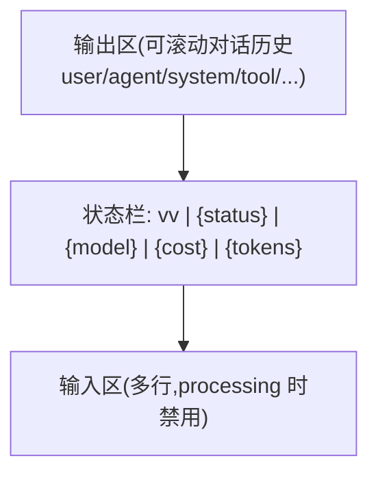
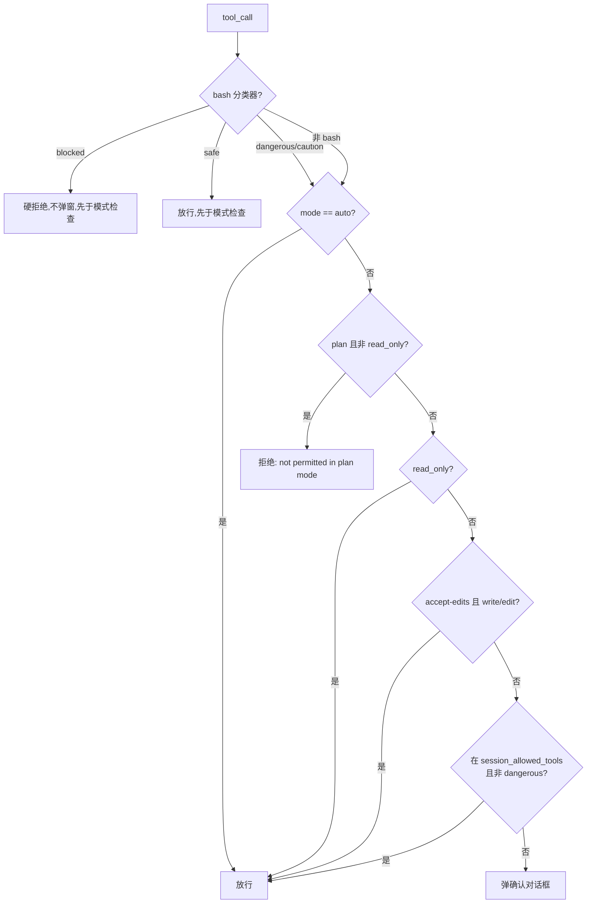

# cli 领域设计(design)

> HOW。业务行为见 [spec.md](spec.md);实体字段见 [models.md](models.md)。此处不复述可从代码恢复的逻辑。

## 1. 三入口:交互式 TUI / 单提示 / 评测

CLI 系统下有三种运行入口,**共用同一套分发器与代理装配**,差别只在「交互层」:

| 入口 | 触发 | 交互层 | 用途 |
|------|------|--------|------|
| **交互式 TUI** | `vv`(默认)/ `--mode cli` | Bubble Tea/huh 常驻 TUI,斜杠命令,多轮对话 | 日常开发,人在回路 |
| **单提示** | `vv -p "..."` | 无 TUI;流式输出走 stdout,诊断走 stderr | 脚本化 / CI / pipeline / cron |
| **评测** | `vv -eval <jsonl>` | 无 TUI;跑数据集出报告 + 退出码(0 全过 / 1 否) | 离线质量度量 |

`-p` 与 `-eval` 互斥,且二者均与 `--mode http\|mcp` 互斥——它们是「短期 CLI 任务」,不适合常驻服务。

**单提示模式的专门简化**:
- 无 TUI:直接写 stdout,便于管道接下游(如 review 代码、生成 changelog)。
- **非交互式 ask_user**:遇 `ask_user` 工具调用**直接返回固定降级消息**让模型改换策略(spec CLI-R6 / ASKUSR-04)。
- 权限确认同样降级:无人值守,危险操作按拒绝处理而非无条件放过。
- 不能进入 HTTP/MCP 模式。

## 2. TUI 状态机与渲染

TUI 本质是一个状态机(完整 6 态见 [spec.md](spec.md) 状态机)。三核心态(idle / processing / confirming)是其简化视角:idle 等待输入、processing 流式接收事件、confirming(即 awaiting_confirmation)弹权限对话框。实现新增了 awaiting_user_input / compressing / shutting_down。

**增量 markdown 渲染**:流式事件一边到达一边把**已确定**的部分写屏,**未确定**部分(流尾不完整 token)留缓冲区。这样用户尽快看到响应,又不因不完整内容产生跳动(CLIMSG-02)。工具调用 / 阶段 / 子代理消息为**预渲染**(pre-rendered)终端样式,直接写 viewport 不再二次加样式(CLIMSG-06),以保证排版稳定与性能。

### 主对话视图布局

垂直堆叠单屏,无页面导航;对话框为 modal 覆盖。

## 3. 状态栏(用户可见可观测性)

状态栏常驻于输出区与输入区之间,每帧渲染,格式 `vv | {status} | {model} | {cost} | {tokens}`:
- **model**:短名(`claude-sonnet-4-20250514` → `sonnet-4`,剥 `claude-` 前缀与日期后缀)。
- **cost**:累计 USD,`<$1` 显示 `$X.XXX`,否则 `$X.XX`;无价表显示 `N/A`。
- **tokens**:累计 input+output,千位用 `k` 后缀(`12.3k tokens`)。

cost/tokens 在每次 `llm_call_end`(含编排中子代理调用)后更新并重渲(CLIMSG-15)。数据全部来自统一**事件总线**,CLI 不自行采集(零额外开销)。

## 4. 权限模式机制

vv 在 CLI 下提供四档权限策略,从严到松(语义见 [spec.md](spec.md) CLI-R1):

| 模式 | 适用场景 |
|------|---------|
| `default` | 日常:危险或写操作弹确认 |
| `accept-edits` | 信任本次任务的写操作,不再每次确认(bash 仍确认) |
| `auto` | 完全信任本会话,几乎不打断 |
| `plan` | 只允许读和搜索;「看代码不动」 |

**判定顺序**(实现于 `vv/cli/permission.go`):

**关键设计决策**:
- **本会话粒度的「永久允许」**:Allow Always 只在本会话生效,不跨会话——避免临时 yes 永久放权(spec CLI-R3)。切换模式即清空(CLI-R4),让新模式策略完整生效。
- **bash 命令分类器**:bash 不像 read/write 有清晰危险度,由分类器把单条命令归 safe/caution/dangerous/blocked。判定**先于**模式检查,使 blocked 在 auto 下仍硬拒绝、dangerous 每次重确认(CLI-R5)。规则可配置扩展。bash 分级实现属 [tools](../tools/tools-overview.md) 领域,cli 仅消费判定并据此调制对话框(dangerous 不给 "Allow Always",标题加 `[DANGEROUS: rule-name]`)。
- **路径白名单与权限模式解耦**:即使选 `auto`,工作区 allow-list 仍生效——另一道防线(属 tools 领域)。
- **非交互降级**:HTTP/MCP/单提示无终端,遇危险操作直接拒绝而非无条件放过。

## 5. 确认对话框与 ask_user 对话框

两类 modal 对话框(均用 huh),语义相反,需区分:

| 维度 | 确认对话框 | ask_user 对话框 |
|------|-----------|----------------|
| 触发 | 工具需用户授权 | 代理调用 `ask_user` 工具 |
| 输入 | 三选一(Allow / Allow Always / Deny);dangerous bash 仅二选 | 自由文本(多行) |
| 超时 | **永不超时**(CLI-R7),无限等待 | `ask_user_timeout`,超时返回降级消息 |
| Ctrl+C | 视同 Deny | 取消代理运行,返回降级消息 |
| 非交互 | 降级为拒绝 | 立即返回固定降级消息 |

实现 `vv/cli/permission.go`、`vv/cli/askuser.go`。

## 6. 斜杠命令(控制平面)

斜杠命令是 TUI 的「控制平面」,让用户不离开会话即做元操作。它们**故意做得轻**——不属于代理能力,而是用户对 vv 进程的元操作,这种分离让代理提示词无需处理 UI 控制(spec CLI-R8)。实现入口 `vv/cli/memory.go: handleCommand`(在路由到代理前拦截)。

| 命令 | 作用 | 实现 |
|------|------|------|
| `/exit`、`/quit` | 触发关闭流程(见 §8) | cli.go |
| `/help` | 列出可用命令 | cli.go |
| `/compact` | 手动触发上下文压缩 | memory.go: handleCompactCommand |
| `/permission [mode]` | 显示 / 切换权限模式,切换清空允许集 | permission.go: handlePermissionCommand |
| `/memory list\|show\|set\|delete` | 管理共享 namespace 记忆(user-path) | memory.go |
| `/budget` | 显示 session/daily 预算用量 | budget.go: renderBudgetReport |

> `--tree <id>`、`--session` 为启动 flag 而非斜杠命令(`tree.go` / `resume.go`)。

**会话恢复(`--session`)**:列出最近会话 / 用同一 id 续上次 / 强制开新会话。MVP 仅恢复 id(让事件、记忆、plan 写同一目录),**不重放历史消息**(spec Non-goal)。取舍逻辑:id 复用已能让多次执行共享 plan.md / Session Tree / 记忆,覆盖大部分实际诉求;完整 checkpoint+replay 在路线图。

## 7. 上下文压缩通知

CLI 在消息处理中按 token 估算(len/4 启发式,CLIMSG-09)触发压缩,有两条路径:
- **主动 auto-compact**:`estimated_token_count` 超阈值(`context_compression_threshold × model_max_context_tokens × 0.9`)→ 在下次 LLM 调用前摘要可压缩消息(除 system prompt 与最近 N 个保护轮对),替换为单条 `context_summary` 消息,展示 `[context compressed: summarized N messages ...]`(CLIMSG-10/11/12)。
- **反应式 emergency compact**:LLM 返回上下文溢出错误(HTTP 413 / `context_length_exceeded` / 模式匹配)→ 更激进压缩(仅保护 1 轮对)后重试一次;再失败则提示开新会话(CLIMSG-13)。

压缩为 `compressing` 瞬态,完成回 `processing`。`context_summary` 消息以暗色「Previous context (summarized)」呈现。

## 8. 启动与关闭

- **启动**:与 HTTP 模式共用初始化路径(加载配置、建 LLM client、注册工具、建代理、建路由),再启 Bubble Tea TUI(进 alternate screen,保留用户原终端内容),显示 welcome。`--debug` 在 TUI 模式写文件(`~/.vv/debug-<pid>.log`,`VV_DEBUG_FILE` 可覆盖)而非 tty,避免污染 TUI;`-p` 模式写 stderr。
- **关闭**:`/exit` 或 idle 下 Ctrl+C 触发;processing 下首次 Ctrl+C 取消当前运行(回 idle),二次才退出(CLISHUT-01)。退出必须**完整恢复终端**(光标、屏幕模式、echo),并优雅取消活动代理运行(CLISHUT-02/03)。

## 9. 技术取舍小结

| 取舍 | 选择 | 理由 |
|------|------|------|
| 调用分发器 | **in-process 直接调用**,非 HTTP | CLI 与代理同进程,省序列化/网络开销;CLIMSG-03 直接传内存对话历史 |
| 对话持久化 | **仅内存,不持久化** | 对话文本无需落盘;session 领域按 id 落事件流即足够恢复上下文 |
| Allow Always 范围 | **会话内,不跨会话** | 临时授权不应永久化;安全优先 |
| ask_user 输入 | **自由文本,无结构化** | MVP 简化;模型可在问题文本里自定义格式 |
| 确认 vs ask_user 超时 | **确认不超时 / ask_user 超时** | 授权需人明确决定;问答可在无人时降级继续 |
| debug 输出 | **TUI 写文件 / -p 写 stderr** | 绝不污染 stdout 的 TUI 渲染 |
| 可观测性数据源 | **统一事件总线旁路订阅** | 子系统未启用即零开销(零成本默认路径) |
