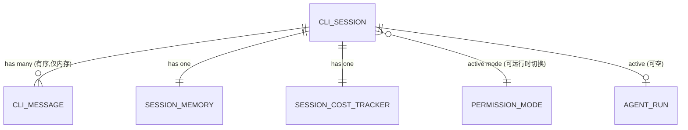

# cli 领域实体模型(models)

> 业务语义类型(text / number / datetime / enum / reference / set / boolean / map)。完整字段定义引用 `vv-prd/models/core/cli/`;此处给关系与状态全景,不复制可从代码恢复的细节。行为规则见 [spec.md](spec.md),实现取舍见 [design.md](design.md)。

## 实体关系

---

## CLI Session

**用途**:单个交互终端会话的内存状态容器,协调代理执行与用户确认流。会话随 vv CLI 启动而生,随用户退出而灭。完整字段见 [model-cli-session](../../../../vv-prd/models/core/cli/model-cli-session.md)。

### 属性

| 属性 | 类型 | 必填 | 说明 |
|------|------|------|------|
| session_id | text | 是 | 启动时生成 |
| status | enum(CLI Session Status) | 是 | 6 态生命周期,见下「状态」 |
| conversation | reference(CLI Message 有序列表) | 是 | 仅存内存 |
| active_agent_run | reference | 否 | idle 时为空 |
| session_memory | reference(Session Memory) | 是 | 启动时创建,承载事实与摘要 |
| estimated_token_count | number | 是 | 每加一条消息后更新(len/4),驱动压缩 |
| cost_tracker | reference(Session Cost Tracker) | 是 | 每次 LLM 调用后更新,供状态栏 |
| permission_mode | enum(Permission Mode) | 是 | 初值来自配置,`/permission` 可改 |
| session_allowed_tools | set(text) | 是 | "Allow Always" 授权集;退出或换模式时清空 |

### 关系

| 关联 | 类型 | 说明 |
|------|------|------|
| CLI Message | has many | 有序对话历史 |
| Session Memory | has one | 会话上下文(压缩摘要载体) |
| Session Cost Tracker | has one | token/cost 累计 |
| Permission Mode | uses | 当前授权策略 |
| Agent / 分发器 | invokes | in-process 调用处理用户消息 |
| Configuration | uses | mode、permission_mode、压缩参数 |

### 状态

6 态枚举见 [dictionary-cli-session-status](../../../../vv-prd/dictionaries/core/dictionary-cli-session-status.md);迁移全景见 [spec.md](spec.md) 状态机。关键迁移摘要:

| 现态 | 触发 | 目标态 | 后置动作 |
|------|------|--------|----------|
| idle | 提交非空消息 | processing | 建 user 消息;调分发器 |
| processing | 代理完成 | idle | 建 agent 消息;重启输入 |
| processing | 工具需确认 | awaiting_confirmation | 弹确认对话框 |
| awaiting_confirmation | Allow Always | processing | 加入 session_allowed_tools;放行 |
| processing | 调 ask_user | awaiting_user_input | 弹问答对话框 |
| awaiting_user_input | 超时 | processing | 回降级消息为工具结果 |
| processing | token 超阈值/溢出 | compressing | 摘要可压缩消息 |
| any | /exit / 二次 Ctrl+C | shutting_down | 取消活动运行;恢复终端 |

---

## CLI Message

**用途**:对话中的单条消息;来源为用户输入、代理输出、系统通知,或工具/编排阶段/子代理生命周期的预渲染显示元素。仅内存,不持久化。完整字段见 [model-cli-message](../../../../vv-prd/models/core/cli/model-cli-message.md)。

### 属性

| 属性 | 类型 | 必填 | 说明 |
|------|------|------|------|
| role | enum(CLI Message Role) | 是 | 9 值,见下「角色」 |
| content | text | 是 | agent 消息含 markdown;预渲染消息为终端样式串 |
| timestamp | datetime | 是 | 创建时刻 |
| rendered | boolean | 否 | 默认 false;true 时直写 viewport 不再加样式 |
| tool_calls | tool call 列表 | 否 | 仅 agent 消息;含工具名、参数、结果 |
| estimated_tokens | number | 否 | 创建时按 len/4 估算,供累计追踪 |
| metadata | map | 否 | context_summary 用:`{compressed, source_count, strategy}` |

### 关系

| 关联 | 类型 | 说明 |
|------|------|------|
| CLI Session | belongs to | 每条消息属且仅属一个会话 |

### 角色(role 枚举)

9 值,完整见 [dictionary-cli-message-role](../../../../vv-prd/dictionaries/core/dictionary-cli-message-role.md):`user` / `agent` / `system` / `tool` / `tool_result` / `error` / `phase` / `subagent` / `context_summary`。其中 `tool` / `tool_result` / `phase` / `subagent` / `context_summary` 为预渲染(`rendered=true`)显示元素。

---

## 权限模式状态(Permission Mode)

**用途**:CLI Session 上决定工具授权策略的会话级枚举值,可经 `/permission` 运行时切换。非独立持久实体,而是会话状态的一部分。授权语义见 [spec.md](spec.md) CLI-R1,判定实现见 [design.md](design.md) §4。

### 值

| 值 | 标签 | 授权语义 | 排序 |
|----|------|----------|------|
| default | Default | 只读自动放行;写/执行弹确认 | 1 |
| accept-edits | Accept Edits | 额外自动放行 write/edit;bash 仍确认 | 2 |
| auto | Auto | 全部放行,无确认 | 3 |
| plan | Plan | 只读放行;写/执行自动拒绝(只读模式) | 4 |

完整定义见 [dictionary-permission-mode](../../../../vv-prd/dictionaries/core/dictionary-permission-mode.md)。

### 关系与状态

- **承载于** CLI Session 的 `permission_mode` 属性(初值来自 Configuration)。
- **切换**:四值间任意切换,经 `/permission <mode>`;每次切换触发 `session_allowed_tools` 清空(spec CLI-R4)。切换状态图见 [spec.md](spec.md)。
- **与 bash 风险分级正交**:分类器判定先于模式检查;blocked/safe/dangerous 的处理独立于当前模式(spec CLI-R5)。
