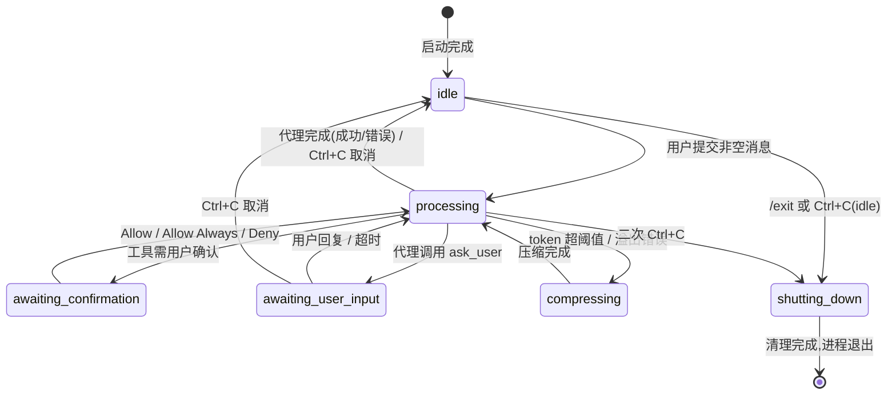

# cli 领域规格(spec)

> WHAT/WHY。HOW 见 [design.md](design.md);实体字段见 [models.md](models.md)。术语见 [../../../glossary.md](../../../glossary.md)。

## Overview

cli 是 vv 的**默认形态**:一个常驻的交互式终端会话,用户在此与代理多轮对话。本领域的职责边界是「**交互层 + 授权层**」——它把用户输入交给分发器(orchestration),把分发器的流式事件渲染到终端,并在工具执行前依据**权限模式**决定放行 / 拒绝 / 弹确认。它**不**做意图分类、不执行工具、不管理记忆与会话的持久化,这些归各自领域。

之所以独立成域:CLI 承载了 HTTP/MCP 没有的两类语义——(1) **人在回路的工具授权**(确认对话框、Allow Always、权限模式切换);(2) **用户可见的可观测性**(状态栏实时 cost/tokens、压缩通知、预算告警)。这两类语义只在「有终端、有真人」时成立,因此与无人值守的服务模式物理隔离。

`-p` 单提示与 `-eval` 评测同属 CLI 系,但为**非交互**:跑一次即退出,无 TUI,无权限对话框(详见规则 CLI-R6)。

## Core entities

| 实体 | 职责 | 详见 |
|------|------|------|
| **CLI Session** | 单个交互终端会话的状态容器:对话历史、当前状态、活动代理运行、权限模式、会话授权集、token 估算、cost tracker。仅存于内存,会话结束即销毁。 | [models.md](models.md) |
| **CLI Message** | 对话中的单条消息。来源可为 user / agent / system / tool / tool_result / error / phase / subagent / context_summary。部分为预渲染终端样式。不持久化。 | [models.md](models.md) |
| **权限模式(Permission Mode)** | 决定工具授权策略的会话级枚举,可运行时切换。 | [models.md](models.md) |

## Business rules

此处只声明**授权语义的不变量**,逐步流程不复述。

| 规则 ID | 名称 | 描述 | 对照 prd |
|---------|------|------|----------|
| **CLI-R1** | 四模式授权语义 | 工具授权由权限模式 + 工具 `read_only` 属性共同决定:`default`=只读自动放行、写/执行弹确认;`accept-edits`=额外自动放行 `write`/`edit`,bash 仍确认;`auto`=全部放行无确认;`plan`=只读放行、写/执行**自动拒绝**。`read_only` 工具在 default/accept-edits/plan 三模式下恒自动放行。 | PERM-02/03/04, dict-permission-mode |
| **CLI-R2** | plan 模式只读 | `plan` 模式下非只读工具被**显式拒绝**并回传可读错误("Tool X is not permitted in plan mode"),而非静默丢弃,使代理可改换策略。这是 plan 模式存在的核心约束:看代码不动手。 | PERM-03, CLICONF-02 |
| **CLI-R3** | Allow Always 作用域 | 用户选 "Allow Always" 将工具名加入 `session_allowed_tools`,后续同名工具调用在**本会话内**免确认。该集合**不跨会话**——避免一次临时 yes 永久放权。 | PERM-05, dict-confirmation-action |
| **CLI-R4** | 运行时切换清空允许集 | `/permission <mode>` 运行时切换权限模式时,**清空** `session_allowed_tools`,确保新模式策略完整生效。`/permission`(无参)仅显示当前模式。 | PERM-08, runtime-permission-mode-switch |
| **CLI-R5** | bash 分级与模式正交 | bash 命令先经风险分类器(safe/caution/dangerous/blocked),该判定**先于**任何模式检查:`blocked` 在含 `auto` 的所有模式下硬拒绝且不弹窗;`safe` 在非 plan 模式下免对话放行;`dangerous` **每次**调用都重新确认且永不获得会话级放行(即使 bash 在 `session_allowed_tools` 中),且确认对话框不提供 "Allow Always"。 | PERM-10/11/12, CLICONF-04 |
| **CLI-R6** | 非交互模式 ask_user 失败 | 非交互模式(`-p` / `-eval`,无终端)下:`ask_user` 工具调用**不弹对话框**,立即返回固定降级消息让模型自行决断;权限确认同理降级(无人可点 → 危险操作按拒绝处理)。`-p` 与 `--mode http\|mcp`、`-eval` 互斥。 | ASKUSR-04, PERM-09, dict-permission-mode |
| **CLI-R7** | 确认对话框无超时 | 工具确认对话框(Allow/Allow Always/Deny)**永不超时**,无限等待用户输入;Ctrl+C 视同 Deny。ask_user 对话框则**有** `ask_user_timeout`,超时返回降级消息。两者超时策略相反。 | CLICONF-03, ASKUSR-03/07 |
| **CLI-R8** | 命令前缀分流 | 以 `/` 开头的输入视为对 vv 进程的**元命令**(内建命令),本地处理,不下发给代理;其余为代理消息。元命令与代理能力解耦,使代理提示词无需处理 UI 控制。 | CLIMSG-01 |
| **CLI-R9** | 输入互斥 | 代理处理期间(processing/awaiting_*)输入区禁用,防止并发请求;流结束回 idle 才重新启用。 | CLIMSG-05 |

## States & transitions

### CLI Session 状态机

完整迁移表见 [models.md](models.md);此处给出状态全景。



### 权限模式切换

模式仅在 `/permission <mode>` 运行时改变;初值来自配置(YAML `cli.permission_mode` / env `VV_PERMISSION_MODE` / flag `--permission-mode`)。四模式间任意切换,每次切换均触发 CLI-R4 清空允许集。

```mermaid
stateDiagram-v2
    direction LR
    default --> accept_edits: /permission accept-edits
    default --> auto: /permission auto
    default --> plan: /permission plan
    accept_edits --> default
    accept_edits --> auto
    accept_edits --> plan
    auto --> default
    auto --> plan
    plan --> default
    plan --> auto
    note right of plan: 切换即 clear(session_allowed_tools)
```

## Domain events

cli 是**事件消费方**而非发布方:它订阅分发器/代理的流式事件并渲染。下表为它消费的关键事件及渲染语义。

| 消费事件 | 来源 | 渲染/动作 |
|----------|------|-----------|
| `text_delta` | orchestration | 增量 markdown 渲染到当前 agent 消息 |
| `tool_call_start` / `tool_result` | orchestration/tools | 预渲染工具调用与结果摘要 |
| `phase_start/end`、`sub_agent_start/end` | orchestration | 预渲染编排阶段 / 子代理生命周期指示 |
| `llm_call_end` | cost-tracking | 更新会话 cost tracker,重渲状态栏(CLI-R 外,见 CLIMSG-15) |
| `token_budget_exhausted` | budget | 以 system 消息展示预算耗尽 |

cli 自身向用户**呈现**(非发布)的系统通知:welcome、取消通知、压缩通知(`[context compressed: ...]`)、预算告警 toast、错误。

## Interactions

| 交互 | 对端领域 | 契约 |
|------|----------|------|
| 下发用户消息 | orchestration | **in-process 直接调用分发器**(`agent.StreamAgent`),无 HTTP 序列化开销;传入当前会话完整对话历史作为上下文(CLIMSG-03);拿回流式事件通道。 |
| 工具授权判定 | tools / orchestration | cli 持有权限模式 + `session_allowed_tools`,在 `tool_call` 事件上做放行/拒绝/弹窗判定;bash 风险分级由 tools 领域分类器提供,cli 仅消费判定结果。 |
| 展示成本 | cost-tracking | 订阅 `llm_call_end`,状态栏实时显示 model / 累计 cost / 累计 tokens。 |
| 管理记忆 | memory | `/memory list\|show\|set\|delete` 经 user-path 操作**共享 namespace**;会话级 Session Memory 承载上下文压缩(摘要)。 |
| 预算查询 | budget | `/budget` 展示 session/daily 用量;预算告警 toast。 |

## Non-goals

- **不做结构化输入提问**:`ask_user` 在 MVP 仅收**自由文本**(单一多行文本框),不提供选项菜单 / 表单 / 校验。模型若需结构化,自行在问题文本里约定格式。
- **不重放历史消息**:`--session` 会话恢复 MVP 仅复用 session id(让事件、记忆、plan 写到同一目录),**不重放**历史对话。完整 checkpoint+replay 在路线图,非本期目标。
- **不持久化对话**:CLI Message 与 CLI Session 仅存内存,会话结束即销毁(持久化由 session 领域按 id 落事件流,非对话文本)。
- **不跨会话记忆授权**:`session_allowed_tools` 不持久化、不跨会话(CLI-R3)。

## Anti-scenario

> 必须永不发生的行为:

- **plan 模式下执行写/bash**:在 `plan` 模式下,代理调用 `write`/`edit`/`bash`(或任何非只读工具)**绝不可被执行**,即使该工具曾在别的模式下被 "Allow Always"。系统必须以可读错误拒绝(CLI-R2),不得静默放行,也不得弹出确认对话框给用户「绕过」的机会。理由:plan 模式的全部价值在于「只读保证」,一次越权写入即破坏该不变量。
- **blocked bash 在 auto 下放行**:`auto` 模式下 `blocked` 级 bash 命令(如 `rm -rf /`)**绝不可执行**;分级先于模式检查,硬拒绝且不弹窗(CLI-R5)。

## Data dictionary

| 术语 | 定义 | 完整枚举 |
|------|------|----------|
| 权限模式 | 会话级工具授权策略,4 值 | 见 CLI-R1 |
| 确认动作 | 确认对话框三选项:allow / allow_always / deny | 见 CLI-R3 |
| CLI 会话状态 | 6 态生命周期:idle / processing / awaiting_confirmation / awaiting_user_input / compressing / shutting_down | 见状态机 |
| CLI 消息角色 | 9 值消息来源/类型 | 见 [models.md](models.md) |
| session_allowed_tools | 经 "Allow Always" 授权的工具名集合;会话内有效,切换模式或退出时清空 | 见 CLI-R3/R4 |
| 非交互模式 | `-p` 单提示 / `-eval` 评测;无 TUI、无终端、无确认对话框 | 见 CLI-R6 |
