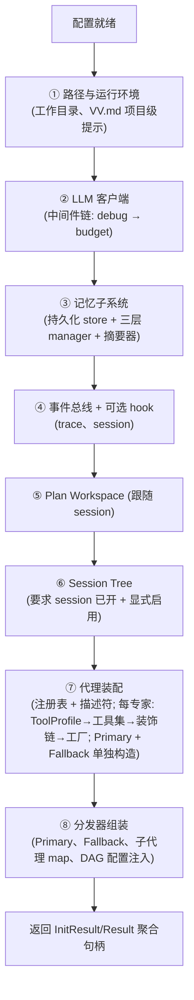

# configuration — Domain Design

数据模型见 [models.md](models.md);字段语义详见 YAML 注释与 [model-configuration](../../../../vv-prd/models/core/config/model-configuration.md)。

## 1. 配置来源优先级链

所有字段遵循同一条链(实现 CONFIG-R1):

```
最终值 = CLI 标志（若给出）
      ?? 环境变量（VV_* 系列）
      ?? YAML 文件（~/.vv/vv.yaml）
      ?? 程序内默认值
```

环境变量主要覆盖三类,各有理由:

| 类别 | 例子 | 为何用 env 覆盖 |
|------|------|----------------|
| 凭据 | API key、auth token | 避免写到磁盘(共享机器不落盘) |
| 子系统开关 | trace / session / tree / debug | 便于临时启用/关闭,不改 YAML |
| 会话与目录路径 | 会话根、工作目录 | 便于 CI/CD 隔离 |

**Load 三层处理**:① 解析(YAML 反序列化 + 严格未知字段)→ ② 默认填充(窗口尺寸、并发上限、超时)→ ③ 显式校验(枚举合法性 + 冲突字段如评测器名)。废弃键走 "silent ignore + slog.Warn"(CONFIG-R9),避免破坏性升级。

**取舍**:统一优先级链而非逐字段定制,换取可预测性与单一加载入口(为未来远程/多 profile 配置留扩展空间)。

## 2. 首次启动向导

配置文件不存在或缺关键字段(如 API key)时:

- **交互式 CLI**:进入向导收集最小必要配置,写回 YAML 并把文件权限调到 600(CONFIG-R10)。
- **非交互模式**(`-p` / HTTP / MCP / `-eval`):直接退出报错(CONFIG-R5),不阻塞等待输入。

## 3. 模式分派与互斥

run mode 决定后续路径(详见 dictionary-run-mode;mcp 为现有第三模式):

| 模式 | 入口 | 输入 | 输出 |
|------|------|------|------|
| `cli` | 交互式 TUI | stdin + 终端事件 | 终端输出 |
| `cli` + `-p` | 单提示 | 命令行参数 | stdout 结果 + stderr 诊断 |
| `cli` + `-eval` | 评测 | JSONL 数据集 | 报告 + 退出码 |
| `http` | REST/SSE 服务 | HTTP 请求 | HTTP 响应 |
| `mcp` | MCP 服务 | stdio / Streamable HTTP | MCP 协议消息 |

**互斥规则**(CONFIG-R8):

- `-p` 与 `-eval` 互斥;两者都禁止与 `mode: http` / `mode: mcp` 同用。
- `--session list` / `--tree` 仅 CLI 模式可用(HTTP 用户调对应 REST 端点)。
- 后三类(`-p` / `-eval` / HTTP / MCP)必须用**非交互式 ask_user 实现**:无终端可弹问,遇 ask_user 工具调用直接失败(HTTP 另有异步回调机制)。
- `--debug` 在不同模式下选不同输出 sink(文件 / stderr / slog)。

**启动入口角色**:解析意图 → 选模式 → 调装配中心 → 移交控制权。它是薄胶水层,不持业务逻辑,不直接持有 LLM 客户端/记忆管理器/代理工厂等下层组件。

## 4. 装配 8 阶段

装配中心是配置与运行期组件间的唯一桥梁:单一构造点、零成本默认、顺序明确、可替换接缝。每阶段失败回滚此前已开资源(CONFIG-R6)。



顺序由隐含依赖固化:事件总线必须在 hook 注册前;记忆管理器必须在代理工厂前;Session Tree 必须在 session 之后。

## 5. LLM 中间件链

每个对外 LLM 请求按固定顺序包装(仅在对应开关启用时存在):

```
LLM 客户端
  └─ debug 中间件        （cfg.Debug = true 时才存在）
       └─ budget 中间件  （任一 budget tracker 启用时才存在）
            └─ 实际调用
```

routing 启用时另构造一个**独立 router LLM 客户端**,套同一条中间件链,让分发器内部的轻量分类调用指向更便宜的小模型。

## 6. 工具装饰链

每个代理拿到的工具注册表经多层装饰,顺序约束严格:

```
原始 ToolRegistry（按 ToolProfile 构造）
  + ask_user / todo_write 注入
  ↓
权限拦截    （仅 CLI 模式下挂；最内层）
  ↓
长度截断    （tool_output_max_tokens > 0 时挂）
  ↓
debug 装饰  （cfg.Debug = true 时挂；最外层）
  ↓
代理实际调用
```

- **权限拦截必须在最内层**:它需看到原始工具名做策略匹配。
- **debug 必须在最外层**:它要记录代理*实际收到*的(已截断的)结果(对应 procedure Step 5)。

## 7. Primary 后置注入与双实例

Primary 不是普通 dispatchable 代理:

1. **后置注入**:Primary 持有的 `plan_task` 工具需要分发器引用(执行 DAG),而分发器又需要 Primary 才能完成构造 → 分发器先以"未注入 Primary"状态创建,再回填。
2. **双实例**:除带完整工具的 Primary,另构造一个 **Fallback Primary**:相同人格与提示词,但无任何工具、最大迭代=1。这是递归预算超限时的硬保险。

## 8. 可选子系统挂载策略

未启用时组件**不构造**,不暴露句柄,对应入口(HTTP 路由、CLI 命令、Primary 工具)也不挂(CONFIG-R2)。

| 子系统 | 默认 | 启用条件 | 与其他系统耦合 |
|--------|------|---------|---------------|
| LLM | — | 必填 | — |
| Memory(持久化) | 开 | backend 选 file/sqlite | — |
| Session | 开 | `session.enabled` | 提供事件总线下游消费者 |
| Plan Workspace | 跟随 session | 无独立开关 | 共用会话根;Primary 多注册工具 |
| Session Tree | 关 | `session_tree.enabled` + **session 必须开** | 共用会话根;Primary 多注册工具;可挂 auto-enable 计数 hook |
| Trace | 关 | `trace.enabled` | 事件总线另一消费者 |
| Budget | 按需 | 任一硬上限非零即开 | LLM 中间件链额外一层 |
| Debug | 关 | `--debug` / `VV_DEBUG` | LLM 中间件 + 工具装饰各加一层 |
| Web Search | 按需 | provider + 凭据 | — |
| MCP Server | 跟随 mode | `mode: mcp` | — |
| Eval | 关(HTTP 端点);CLI `-eval` 始终可用 | — | — |

依赖关系在装配阶段显式校验(CONFIG-R3):`session_tree.enabled=true` 而 `session.enabled=false` → 启动报错而非沉默忽略。

## 9. InitResult / Options 契约

- **上游 → 下游(Options)**:注入"是否包 CLI 权限拦截"、"哪种 ask_user interactor"、"debug sink 是哪个",以及预构造的 HookManager / Workspace / TreeStore / TreePredicate / Vector 句柄。其余信息全从配置读取。
- **下游 → 上游(InitResult / Result)**:返回聚合句柄,含分发器、记忆引用、可选子系统句柄、统一 Shutdown。**任何字段都可能为 nil**(对应子系统未启用),上层须做 nil 检查。

此契约让上层入口极薄:不需知道"要构造 8 个组件",只需拿聚合句柄、按字段决定挂哪些路由。字段清单见 [models.md](models.md)。

## 10. Shutdown 独立 3s 上下文

Shutdown 在与主上下文**解耦**的独立 3 秒超时上下文执行(CONFIG-R12):

- 关闭事件总线(trace/session 异步 hook 落盘)。
- 关闭 memory store(SQLite 后端需 close)。
- 关闭调试 sink。

理由:主上下文在 SIGINT 那刻已被取消,若用它收尾,异步 hook 与 store 来不及写完最后一批事件。独立超时既保证有限时间内完成,又不被外层取消牵连。

## 11. Path 与安全边界

装配过程确定一组 **canonical 工作边界**,一次性写入文件工具与 bash 工具构造选项,全代理共享(不因代理不同而改变安全包络):

- 工作目录(默认进程 cwd;启动时捕获,CONFIG-R11)。
- 允许访问的目录列表(默认工作目录 + 系统临时目录)。
- 危险命令分类器(配置的黑/红/白名单 + 内置规则库)。

**凭据安全**:API key 类字段永不写日志(CONFIG-R10);允许存 YAML 但 env 优先级更高(共享机器不落盘);向导写 YAML 调权限至 600;debug 输出对已知密钥字段脱敏。

**项目级提示 VV.md**:`<workdir>/VV.md` 运行时一次性读入,附加到每个代理系统提示尾部(项目代码规范、构建/测试命令、安全约束、项目惯例);不参与 YAML 序列化。

## 12. 技术取舍小结

| 决策 | 理由 |
|------|------|
| 单一构造点(装配中心) | 把"按配置组合子系统"的复杂度集中一处,让上下游各自简单 |
| 零成本默认 | 未启用子系统不付任何运行期代价,行为等价无该特性构建 |
| 失败回滚 | 半成品资源不泄露,启动要么完整成功要么干净退出 |
| 权限拦截最内层 / debug 最外层 | 前者需原始工具名做策略;后者需记录实际收到的结果 |
| Fallback Primary 无工具、迭代=1 | 递归预算超限时的硬保险,避免失控 |
| Shutdown 3s 独立上下文 | 主上下文已取消,需独立时限保证异步收尾写完 |
| 废弃键软忽略 | 配置升级不产生破坏性变更 |
