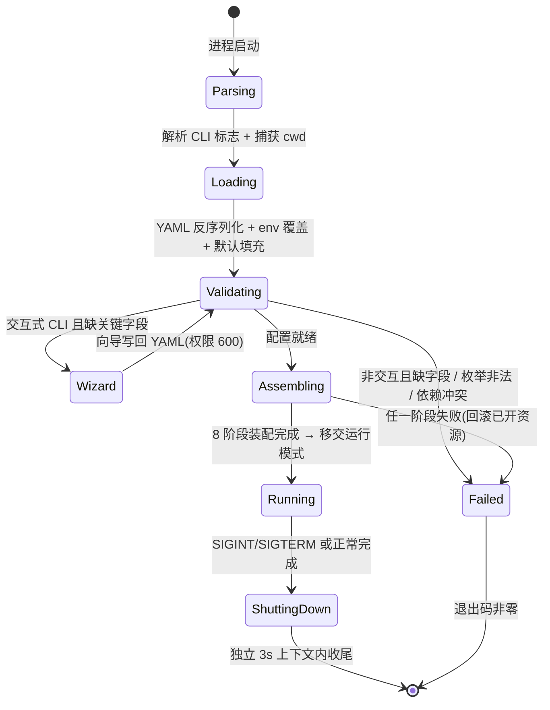

# configuration — Domain Spec

## Overview

configuration 领域负责把"外部输入(CLI 标志、环境变量、YAML 文件)"转化为"运行期组件图"。它包含两个紧耦合的职责:

1. **配置体系**:从多个来源按固定优先级解析、填默认、校验,得到唯一的 `Configuration`。
2. **装配中心(setup)**:以 `Configuration` 为唯一输入,按固定顺序构造所有运行期组件,失败回滚,返回聚合句柄。

**范围**:配置字段语义、来源优先级、首次启动向导、模式分派与互斥、组件装配顺序、子系统启停决策、Shutdown。

**边界**:本领域只决定"构造什么、以什么顺序、用什么参数",不实现被构造组件的业务逻辑(LLM 调用、工具执行、代理推理、记忆读写均归各自领域)。装配中心是这些领域唯一的实例化入口——上层入口(cli/http-api/mcp)不直接持有下层组件。

术语见 [../../../glossary.md](../../../glossary.md)。

## Core entities

| 实体 | 职责 | 详见 |
|------|------|------|
| Configuration | 全部运行期设置的唯一聚合(含各子系统开关分组:llm/server/tools/agents/memory/orchestrate/context/security/mcp/eval/budget/trace/session/session_tree/vector/debug) | [models.md](models.md) |
| InitResult / Result | 装配输出的聚合句柄:分发器引用 + 可选子系统句柄(可为 nil)+ 统一 Shutdown | [models.md](models.md) |
| Options | 上层注入装配中心的接缝:权限拦截包装、ask_user interactor、debug sink 等 | [models.md](models.md) |

子系统开关及其默认状态、依赖关系见 [design.md](design.md)「可选子系统挂载策略」。完整字段清单见 `vv/configs/config.go` 的 YAML 注释。

## Business rules(不变量)

| ID | 规则 | 说明 |
|----|------|------|
| CONFIG-R1 | 来源优先级固定 | 每个配置项的最终值 = `CLI 标志 ?? 环境变量(VV_*) ?? YAML(~/.vv/vv.yaml) ?? 程序默认`。优先级链对所有字段一致,不可逐字段调换。对应 STARTUP-03 / PERM-06 / DEBUG-01。 |
| CONFIG-R2 | 零成本默认 | 未启用的可选子系统**不构造、不挂事件、不占内存**;运行期行为与"未编译该特性的构建"逐字节等价(对应 DEBUG-02)。空 `budget` 块 → 无 tracker、无中间件。 |
| CONFIG-R3 | 依赖强校验 | 子系统间的硬依赖在装配阶段显式校验并报错,不沉默忽略。例:`session_tree.enabled=true` 而 `session.enabled=false` → 启动失败;Plan Workspace 跟随 session(共用会话根)。 |
| CONFIG-R4 | 必填 LLM key | 缺 LLM API key 必须以清晰错误失败(对应 STARTUP-01)。交互式 CLI 进入首次启动向导收集;非交互模式直接退出。 |
| CONFIG-R5 | 非交互缺 key 即退出 | 非交互场景(`-p` / HTTP / MCP / `-eval`)缺关键字段时直接退出报错,**绝不阻塞等待**用户输入(这些场景无终端可弹问)。 |
| CONFIG-R6 | 失败回滚 | 装配任一阶段失败,回滚此前已开资源(关 store、关事件总线、关 debug sink),半成品不泄露到运行期。 |
| CONFIG-R7 | 枚举强校验 | 枚举字段(permission mode、memory backend、orchestrate mode、run mode、evaluator 名)必须落在合法集合内,否则启动期报错。 |
| CONFIG-R8 | 模式互斥 | 三运行模式(cli/http/mcp)单进程单选;`-p` 与 `-eval` 互斥,且均禁止与 `mode: http`/`mode: mcp` 同用。 |
| CONFIG-R9 | 废弃项软忽略 | 废弃配置键走 "silent ignore + slog.Warn":不阻塞启动,日志明确提示该键被忽略、请删除(避免破坏性升级)。`confirm_tools` 被 `permission_mode` 取代时记弃用警告(PERM-07)。 |
| CONFIG-R10 | 凭据不落日志 | API key 类字段永不写日志;debug 输出对已知密钥字段做脱敏(DEBUG-03)。向导写 YAML 时把文件权限调到 600。 |
| CONFIG-R11 | cwd 启动捕获 | 工作目录在任何目录变更前于启动时捕获(STARTUP-06);未显式配置 `working_dir` 时用之(STARTUP-07)。 |
| CONFIG-R12 | Shutdown 上下文解耦 | Shutdown 在独立 3s 超时上下文执行,不受主上下文(SIGINT 已取消)牵连,确保异步 hook/store 收尾写完最后一批事件。 |

完整启动业务规则(STARTUP-*/DEBUG-*/PERM-*)见 [design.md](design.md)。

## States & transitions(启动生命周期)

## Domain events

configuration 领域本身不发布业务事件。它**构造**事件总线(HookManager)并据配置挂载下游消费者(trace、session、metrics、session_tree 计数 hook);这些 hook 的事件归属各自领域。装配相关的可观测信号仅为 slog 启动/弃用/回滚日志。

## Interactions(为各领域提供构造句柄)

| 协作领域 | 装配中心提供的句柄/接缝 |
|----------|------------------------|
| orchestration | Dispatcher(Primary + Fallback Primary + 子代理 map + DAG 配置注入) |
| agents | 注册表 + 按 ToolProfile 构造的工具集 + 代理工厂 |
| tools | PathGuard / PathGuardian(canonical 工作边界)、bash 危险命令分类器 |
| memory | MemoryManager、PersistentMem、ConversationCompactor |
| session | SessionStore、Workspace、TreeStore、IterationStore、MetricsStore/Hook(均可为 nil) |
| budget / trace / cost | SessionBudget/DailyBudget tracker(可为 nil)、TraceConfig 驱动的 hook |
| cli / http-api / mcp | 经 Options 反向注入(权限拦截、ask_user interactor、debug sink);经 InitResult 拿聚合句柄决定挂哪些路由 |

契约细节见 [design.md](design.md)「InitResult/Options 契约」。

## Non-goals

- 不做远程/中央配置拉取(目前单文件 `~/.vv/vv.yaml`;加载层为单一入口,留扩展空间)。
- 不做多环境 profile 切换(`vv.<profile>.yaml`)。
- 不做配置版本化迁移(无顶层 `version` 字段)。
- 不实现任何被构造组件的运行期业务逻辑。
- 不持有运行期可变状态:装配产出后,配置视为只读快照。

## Anti-scenario(绝不能发生)

- **绝不**在非交互模式(`-p`/HTTP/MCP/`-eval`)下因缺 API key 或 ask_user 调用而阻塞等待终端输入——必须立即失败。
- **绝不**在某子系统(如 budget/debug/session_tree)关闭时仍构造其组件、挂其中间件或事件 hook(违反零成本默认)。
- **绝不**在装配中途失败后让已打开的 store / 事件总线泄露到运行期(必须回滚)。
- **绝不**把 API key 写入日志或未脱敏的 debug 记录。

## Data dictionary

| 术语 | 语义类型 | 定义 |
|------|---------|------|
| run mode | enum | cli / http / mcp,单进程单选;见 dictionary-run-mode |
| 零成本默认 | 概念 | 未启用子系统不构造、不挂事件、不占内存,行为等价于无该特性的构建 |
| 首次启动向导 | 流程 | 配置缺失时交互式收集最小必要配置并写回 YAML(权限 600) |
| canonical 工作边界 | 概念 | 工作目录 + 允许访问目录列表 + 危险命令分类器,一次性写入文件/bash 工具,全代理共享 |
| 接缝(seam) | 概念 | 上层经 Options 注入的可替换回调,无需重写装配本身 |
| VV.md | 文件 | `<workdir>/VV.md` 项目级提示,运行时读入并附加到各代理系统提示尾部;不参与 YAML 序列化 |
