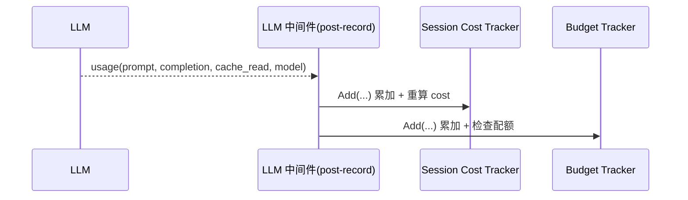
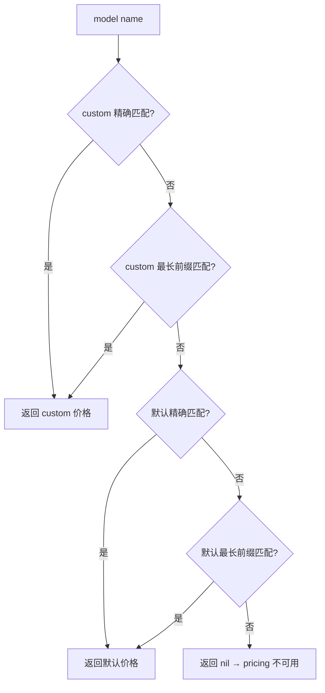

# cost-tracking 领域设计(design)

> HOW。业务行为见 [spec.md](spec.md)，实体模型见 [models.md](models.md)。涵盖"三种成本视图"的设计(budget / trace 部分由各自领域保留)。

## 三种成本视图

可观测性最常被问"花了多少钱"。vv 提供三种粒度，**都基于同一份 LLM 中间件的统计数据，差别只在累加边界**(COST-R5)。

| 视图 | 范围 | 实时性 | 归属领域 | 暴露 |
|------|------|-------|---------|------|
| 当前 turn 累计 token | 进行中的一轮 | 流式实时 | cost-tracking | CLI 状态栏 |
| Cost tracker | 进程/会话生命周期总和(Session Cost Tracker) | 实时 | cost-tracking | CLI 状态栏 / HTTP 响应 |
| Budget tracker | 配额维度(session / daily) | 实时 + 告警 | budget([../budget/](../budget/)) | HTTP `/v1/budget` |

前两种由本领域负责并在 CLI 屏幕底部实时显示；第三种属 budget 领域。三者同源，不存在第二套计数——这是核心约束:新增成本维度只需换累加边界，不需要重接 LLM。

## 同源中间件统计

成本累加挂在 aimodel **LLM 中间件链**上，作为旁路而非主路径(ADR 0005 事件总线旁路订阅 + 零成本默认)。

- 每次 LLM 调用完成，中间件 post-record 闭包回调 `(promptTokens, completionTokens, cacheReadTokens, model)`。
- 同一份回调数据**同时**喂给 Session Cost Tracker(本领域)与 Budget Tracker(budget 领域)。两者互不读取，均由 budget 中间件的 post-record 闭包驱动。
- Session Cost Tracker 是观测性质，**永不阻断**调用；Budget Tracker 才驱动 enforcement。

`Add` 在锁内累加 token、自增 call_count，并在价格可用时按 COST-R4 口径重算 `EstimatedCostUSD`；`Snapshot` 返回深拷贝供消费方读取(成本指针单独复制，避免读写竞争)。

## 价格表查找算法

实现 COST-R3：custom 优先于默认，各自先精确匹配再最长前缀匹配。

- **最长前缀**:候选 pattern 按长度降序排序后逐个比较，确保 `gpt-4o-mini` 不被更短的 `gpt-4o` 抢先命中。
- **缺失**:返回 nil 时 tracker 的 `pricing` 为 nil，成本为 null(COST-R8 / anti-scenario)。绝不回退到任意价格或静默计 0。

## CLI 状态栏 vs HTTP 富化

两种模式复用同一 tracker 与价格查找，差别在累加边界(COST-R2)与展示载体。

| 维度 | CLI 状态栏 | HTTP 富化 |
|------|-----------|----------|
| 累加边界 | 整个交互 session | 单次 request |
| tracker 生命周期 | 随 session 存活 | 响应发出即销毁 |
| 展示 | 屏幕底部实时:model name / 累计 cost / 累计 tokens | sync 响应注入 `estimated_cost_usd`；streaming 末尾发 `usage` 事件 |
| 价格缺失 | 显示 "N/A" | 省略 `estimated_cost_usd` 字段 |

**HTTP 富化中间件**(`vv/httpapis/cost.go`)按 endpoint 分流：

- **sync(`/run`)**:录制响应体，解析 `usage` 与 `model`，命中价格则注入 `estimated_cost_usd` 字段后重写；解析失败或无价格则原样透传(降级不报错)。
- **streaming(`/stream`)**:边透传 SSE 边从 `llm_call_end` 事件累加 token，流结束后用解析出的 model 查价格、重算成本，追发一个 `usage` SSE 事件。透传与累加并行，不延迟主流。

## 可覆盖价格表

实现 COST-R7。默认价格表内置覆盖主流模型；operator 可叠加 custom 条目:

| 来源 | 优先级 | 加载 |
|------|-------|------|
| `VV_MODEL_PRICING` 环境变量(JSON) | 最高(合并/覆盖) | 进程启动解析；JSON 非法则 warn 并忽略，不中断启动 |
| YAML `model_pricing` | 次之 | configuration 领域加载 |
| 内置 `DefaultPricing` | 兜底 | 编译期常量 |

custom 条目经 configuration 转换为本领域价格类型后注入查找函数。运行期价格表不变。

## 技术取舍

| 决策 | 取舍 | 理由 |
|------|------|------|
| 旁路中间件累加，不进主路径 | 主路径只发回调，累加在中间件内 | 不污染主请求路径；未启用即零开销(ADR 0005) |
| Token Usage 瞬态不持久化 | 无历史成本账单 | 事后分析交给 trace 事件流；避免本领域承担存储与聚合(non-goal) |
| Cost Tracker 与 Budget Tracker 同源但分离 | 两套 tracker、共一份回调 | 观测与 enforcement 职责清晰；本领域永不阻断(spec 边界) |
| 价格缺失返回 null 而非 0 | 消费方需处理 "N/A" | 区分"真零成本"与"价格未知"(anti-scenario) |
| 仅进程内、仅 USD | 无跨进程协调、无汇率 | MVP 范围；复杂度不值得(对齐 budget 日预算进程内计数取舍) |

## Non-functional considerations

- **零开销默认**:未挂中间件(无 budget、CLI 无状态栏需求)即不构造 tracker。
- **并发安全**:tracker 内部加锁；`Snapshot` 返回深拷贝。
- **降级**:HTTP 富化任一解析步骤失败均原样透传上游响应，不返回错误、不丢失原始数据。

## Dependencies

无领域级依赖。价格表条目来自 configuration(启动期注入)，token 数据来自 LLM 中间件回调。下游消费方见 [cost-tracking-overview.md](cost-tracking-overview.md)。
