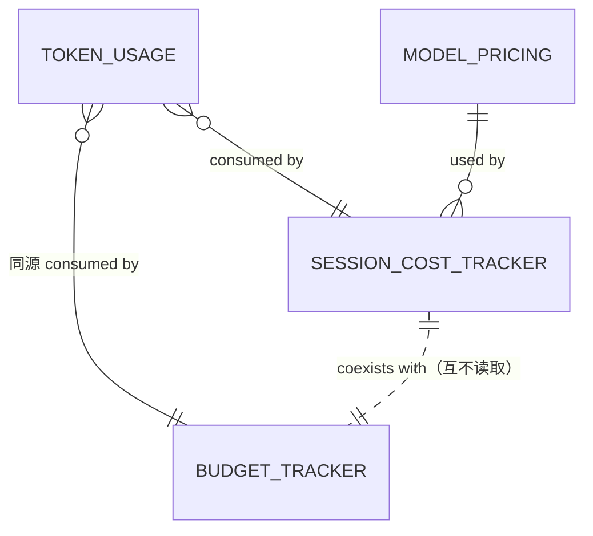

# cost-tracking 领域实体模型(models)

> 业务语义类型(text / number / float / boolean / reference)。完整字段清单回链 `vv-prd/models/core/costtracker/`，本文不重复复述、只给领域读者的速览与关系。规则见 [spec.md](spec.md)，实现见 [design.md](design.md)。

## Token Usage

**用途**:捕获单次 LLM API 调用的 token 消耗。瞬态值对象，不持久化，经中间件回调从 LLM 响应向上传播至 CLI 与 HTTP 层。完整字段见 [`vv-prd/.../model-token-usage.md`](../../../../vv-prd/models/core/costtracker/model-token-usage.md)。

| 属性 | 类型 | 必填 | 说明 |
|------|------|------|------|
| input_tokens | number | 是 | input/prompt token 数；Anthropic 下含 cache-read(total input)(COST-R1) |
| output_tokens | number | 是 | output/completion token 数 |
| cache_read_tokens | number | 是 | 缓存命中的 input token 数；不支持缓存的 provider 为 0(COST-R1) |

**关系**

| 关联实体 | 关系 | 说明 |
|---------|------|------|
| Session Cost Tracker | consumed by | 每份 Token Usage 喂入 tracker 累加 |
| Budget Tracker(budget 领域) | consumed by | 同一份 Token Usage 同时喂入，互不读取(COST-R5) |

## Session Cost Tracker

**用途**:在累加边界(CLI=session / HTTP=request，COST-R2)内汇总 token 与估算成本，提供 CLI 状态栏与 HTTP 响应所需数据。完整字段见 [`vv-prd/.../model-session-cost-tracker.md`](../../../../vv-prd/models/core/costtracker/model-session-cost-tracker.md)。

| 属性 | 类型 | 必填 | 说明 |
|------|------|------|------|
| total_input_tokens | number | 是 | 累计 input token(Anthropic 含 cache-read) |
| total_output_tokens | number | 是 | 累计 output token |
| total_cache_read_tokens | number | 是 | 累计 cache-read token |
| total_tokens | number | 是 | 累计 input + output |
| total_cost_usd | float | 否 | 累计估算成本(USD)；价格不可用时为 null(COST-R8) |
| call_count | number | 是 | LLM 调用次数 |
| model_name | text | 是 | 主模型完整标识(来自配置) |
| pricing_available | boolean | 是 | 是否有匹配价格；决定成本显示数值或 "N/A" |

**关系**

| 关联实体 | 关系 | 说明 |
|---------|------|------|
| Token Usage | receives | 每次调用后用该次 Token Usage 更新累计 |
| Model Pricing | uses | 用费率折算 total_cost_usd(COST-R4) |
| CLI Session | belongs to | CLI 模式下每 session 一个 |
| Configuration | uses | model name 与价格表来自配置 |
| Budget Tracker(budget 领域) | coexists with | 同源同一份 Token Usage；本实体纯观测，Budget Tracker 驱动 enforcement；两者互不读取 |

## Model Pricing

**用途**:定义某模型的 USD 费率，用于估算成本。启动期从配置(默认 + YAML + 环境变量)解析，运行期不变。无匹配条目时成本不可用(CLI "N/A" / HTTP null)。完整字段与默认价格表见 [`vv-prd/.../model-model-pricing.md`](../../../../vv-prd/models/core/costtracker/model-model-pricing.md)。

| 属性 | 类型 | 必填 | 说明 |
|------|------|------|------|
| model_pattern | text | 是 | model 标识或前缀 pattern；支持精确 + 最长前缀匹配(COST-R3) |
| input_per_m_tokens | float | 是 | 每百万 input token 的 USD 成本 |
| output_per_m_tokens | float | 是 | 每百万 output token 的 USD 成本 |
| cache_per_m_tokens | float | 否 | 每百万 cache-read token 的 USD 成本；缺省 0，通常低于 input 费率 |

默认价格表覆盖主流模型(claude-opus-4 / claude-sonnet-4 / gpt-4o / gpt-4o-mini / gpt-4.1 / gpt-4.1-mini)；费率明细见 PRD 链接，operator 可覆盖(COST-R7)。

**关系**

| 关联实体 | 关系 | 说明 |
|---------|------|------|
| Session Cost Tracker | used by | tracker 用费率算估算成本 |
| Configuration | belongs to | 价格条目存于配置的 model_pricing 属性 |

## 实体关系图

