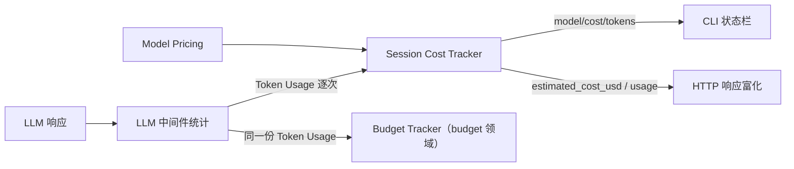

# cost-tracking 领域规格(spec)

> WHAT / WHY。HOW 见 [design.md](design.md)，实体模型见 [models.md](models.md)，完整字段清单回链 `vv-prd/models/core/costtracker/`。

## Overview

cost-tracking 回答用户最常问的问题——"花了多少钱"。它从每次 LLM API 响应抽取 token usage，按累加边界汇总，再用可配置价格表估算 USD 成本。

本领域**只管追踪与估算**：观测性质，永不阻断 LLM 调用。硬上限与配额拒绝属 budget 领域([../budget/](../budget/))。两者同源但职责分离。

## Core entities

实体属性表与关系见 [models.md](models.md)；完整字段回链 `vv-prd/models/core/costtracker/`。

| 实体 | 角色 | 生命周期 |
|------|------|---------|
| **Token Usage** | 单次 LLM 调用的 token 消耗(input / output / cache-read)。瞬态值对象，不持久化。 | 每次 LLM 调用产生一份，经中间件回调向上传播 |
| **Session Cost Tracker** | 在累加边界内汇总 token 与估算成本。 | CLI：每 session 一个，贯穿交互全程；HTTP：每 request 一个，响应发出即销毁 |
| **Model Pricing** | 某模型的 USD 费率(input / output / cache 每百万 token)。 | 进程启动时从配置解析；运行期不变 |

术语 Token Usage / Cost Tracker / Budget 见 [../../../glossary.md](../../../glossary.md)。

## Business rules

| ID | 规则 |
|----|------|
| **COST-R1** | **token 抽取来源**：token usage 从 LLM API 响应抽取，统一经 aimodel 规一化。`input_tokens` 对 Anthropic 含 cache-read(即 total input)；`cache_read_tokens` 来自 Anthropic `cache_read_input_tokens` 或 OpenAI `prompt_tokens_details.cached_tokens`；provider 不支持缓存时为 0。 |
| **COST-R2** | **累加边界**：CLI 模式按 **session** 累加(一个 tracker 贯穿整个交互 session)；HTTP 模式按 **request** 累加(每请求一个 tracker，响应后销毁)。两种模式累加逻辑相同，只是边界不同。 |
| **COST-R3** | **价格查找**：先**精确匹配** model name，再**最长前缀匹配**(例如 `claude-sonnet-4-20250514` 命中 `claude-sonnet-4`)；custom 价格表优先于默认价格表。算法见 [design.md](design.md)。 |
| **COST-R4** | **成本计算口径**：为避免对 cache-read 重复计费，非缓存 input = `input_tokens − cache_read_tokens`，按 `(非缓存 input × input 费率) + (cache-read × cache 费率) + (output × output 费率)` 折算，单位百万 token。 |
| **COST-R5** | **三视图同源**：当前 turn 累计 token、Cost tracker、Budget tracker 三种视图都基于**同一份 LLM 中间件统计数据**，差别只在累加边界。不存在第二套计数。 |
| **COST-R6** | **仅 USD**：所有成本以 USD 表示，无货币换算、无汇率。 |
| **COST-R7** | **价格表可覆盖**：默认价格表覆盖主流模型(claude-opus-4 / claude-sonnet-4 / gpt-4o / gpt-4o-mini / gpt-4.1 / gpt-4.1-mini)；operator 经 YAML `model_pricing` 或 `VV_MODEL_PRICING` 环境变量新增或覆盖条目。 |
| **COST-R8** | **价格缺失即不估算**:模型无匹配价格条目时，成本为 null —— CLI 显示 "N/A"，HTTP 省略 `estimated_cost_usd` 字段。token 计数始终可用，与价格无关。 |

## Domain events

本领域不**发出**领域事件，而是作为 LLM 中间件链的旁路订阅者**消费**逐次调用回调(post-record 闭包)累加。事件总线旁路设计见 ADR 0005。

| 输入信号 | 来源 | 处理 |
|---------|------|------|
| 单次 LLM 调用完成(prompt / completion / cache-read token 数 + model) | aimodel 中间件 post-record 闭包 / HTTP `llm_call_end` SSE 事件 | 累加进对应 Session Cost Tracker，重算估算成本 |

## Interactions

| 交互方 | 方向 | 契约 |
|--------|------|------|
| LLM 中间件 | 入 | 每次调用回调 token 数 + model；本领域不主动拉取 |
| cli 状态栏 | 出 | 实时 Snapshot：model name、累计 cost、累计 tokens |
| http-api | 出 | sync 注入 `estimated_cost_usd`；streaming 末尾发 `usage` SSE 事件 |
| budget | 平行 | 共享同一份逐次 Token Usage；两者互不读取，均由 post-record 闭包喂入 |

## Non-goals

- **无历史跨会话成本日志**：tracker 随 session/request 生命周期存在，不落盘、不聚合历史账单。事后分析依赖 trace 领域的事件流，不在本领域。
- **无货币换算**:仅 USD(COST-R6)。
- **无实时告警**:成本超阈告警属 budget 领域(软告警阈值)。本领域纯展示，不发告警、不阻断。

## Anti-scenario

**成本估算不得对未配置模型用错误价格静默计 0。** 当 model name 在 custom 与默认价格表中**都无**精确或最长前缀匹配(COST-R3)时，系统**不得**回退到任意价格、也**不得**把成本静默记为 `0.00` USD 营造"零成本"假象。实际 fallback 行为(COST-R8)：估算成本为 **null**，CLI 渲染 "N/A"，HTTP 响应**省略** `estimated_cost_usd` 字段；token 计数照常累加并展示。这样消费方能明确区分"真零成本"与"价格未知"。

## Data dictionary

仅本领域内部使用的术语；跨领域术语见 [../../../glossary.md](../../../glossary.md)。

| 术语 | 定义 |
|------|------|
| **累加边界(accumulation boundary)** | 决定一个 Session Cost Tracker 汇总范围的边界：CLI=session，HTTP=request(COST-R2)。 |
| **当前 turn 累计 token** | 进行中一轮(turn)内的 token 累计，流式实时；三视图之一(COST-R5)。 |
| **最长前缀匹配(longest-prefix match)** | 价格查找中，精确匹配失败后按 model name 前缀、取最长命中的价格 pattern(COST-R3)。 |
| **pricing_available** | 该 model 是否有匹配价格条目；决定成本展示为数值还是 "N/A"/null(COST-R8)。 |
| **估算成本(estimated cost)** | 由 token 数 × 价格表折算的 USD 值，非账单实际计费；"估算"强调它来自本地价格表而非 provider 回执。 |
