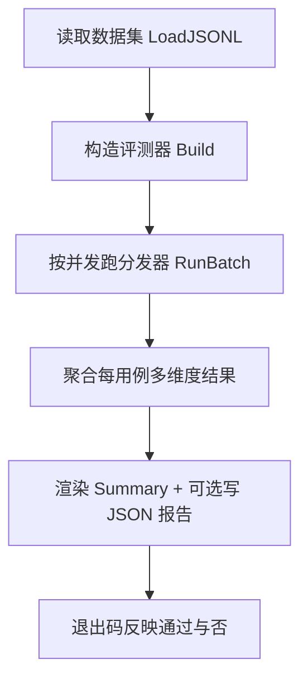

# eval 领域 Design

> 业务行为见 [spec.md](spec.md),实体字段见 [models.md](models.md)。
> 源码:`vv/eval/`(`dataset.go` / `evaluator.go` / `runner.go` / `report.go`)——这是 vv 到 `vage/eval` 框架的 CLI / HTTP 适配层,真正的评测逻辑住在 `github.com/vogo/vage/eval`。

## 定位与分层

vv 的 eval 子系统让 vv 能**对自己的代理质量做回归测试**。它本身不实现评分算法,而是:

- **加载数据集**(`dataset.go`)、**装配评测器**(`evaluator.go`)、**编排批量执行**(`runner.go`)、**渲染报告**(`report.go`);
- 评分逻辑(latency / cost / contains / llm_judge / exact_match / tool_call、`CompositeEvaluator`、`BatchEval`)均来自 `vage/eval`。

这样 vv 层只承担"数据集格式、配置接线、报告呈现",评分语义随框架升级而复用。

## 数据集模型与执行策略

### JSONL 数据集

测试用例采用 JSONL:每行一个独立用例。三个特性驱动了这个选择:

- **流式追加**:可以一边跑业务一边收集"现实用例";
- **行级容错**:一行解析失败不影响其它用例,失败行记入报告(EVAL-R9);
- **diff 友好**:版本控制下逐用例 review 修改。

`input` 字段是 `json.RawMessage`,允许字符串简写(`"input": "hello"` → 单条 user 消息)或完整 `RunRequest` 对象(`"input": {"messages": [...]}`);`expected` 同样支持两种写法。解码细节见 `dataset.go` 的 `DecodeCaseLine` / `decodeRunRequest` / `decodeRunResponse`,此处不复述。

### 执行流程

设计要点:

- **复用分发器**:评测跑的是真实分发器(`Dispatcher.Run`),所以"评测通过"等价于"产品代码通过";Runner 用**非交互 `UserInteractor`** 构建分发器,离线流程绝不等待人工输入。
- **超时单独控制**:每用例独立 wall-clock 超时;`RunBatch` 刻意**不**使用 `vageeval.BatchEval` 的并发,因为需要 case 级的 `context.WithTimeout` deadline——`BatchEval` 不暴露这个能力(见 `runner.go` 注释)。
- **解析失败也写入报告**:让评测者看到"某行 JSON 坏了",不再沉默忽略;CLI 路径把 `LoadError` 折叠为合成 `line-N` 结果并相应增加 `TotalCases` / `ErrorCases`。

## 六评测器

| 评测器 | 维度 | 额外成本 | 暴露 | 备注 |
|--------|------|---------|------|------|
| `latency` | 响应时长是否在 `eval.latency_threshold_ms` 内 | 无(零额外 LLM 调用) | vv 配置键 | 默认成员;默认阈值 60000 ms |
| `cost` | token 用量是否在 `eval.cost_budget_tokens` 内 | 无 | vv 配置键 | 默认成员;默认预算 10000 tokens |
| `contains` | 输出是否包含 `eval.contains_keywords` 全部关键词 | 无 | vv 配置键 | `contains_keywords` 为空则 build 时报错 |
| `llm_judge` | 由 LLM 对照可选 `criteria` 打分 | 每用例多一次 LLM 调用 | vv 配置键 | opt-in;模型取 `eval.llm_judge_model`,回落 `llm.model` |
| `exact_match` | 输出与 `Expected` 精确匹配 | 无 | 仅 `vage/eval` 程序化 | 不经 vv 配置键暴露 |
| `tool_call` | 是否调用了指定工具 | 无 | 仅 `vage/eval` 程序化 | 不经 vv 配置键暴露 |

`contains` 适合有客观答案的用例;`llm_judge` 适合需要语义判断的开放问题。多个评测器经框架层 `CompositeEvaluator` **等权**组合(`Weight: 1.0`);单个评测器直接使用。装配开关逻辑见 `evaluator.go` 的 `Build`。

### 默认组合零成本理由

默认列表 `[latency, cost]` 是有意选择:二者只读 `Actual` 中已有的时长与 token 数据,**不触发任何额外 LLM 调用**,因此首次使用零额外开销,且能立刻反映性能与开销退化(EVAL-R2)。`llm_judge` 因每用例多一次 LLM 调用而强制 opt-in(EVAL-R3)。这呼应一条更深的取舍:

- **不内嵌通用"标准答案"**:除 `contains`、`llm_judge` 外的评测器都是**过程指标**(速度、成本)而非**结果指标**(对错),因为生成式模型的"对错"高度上下文相关,难以通用化。
- **可扩展**:评测器接口开放,未来可加自定义实现(如"必须调用了某个工具"、"输出长度在区间内")——`tool_call` 已是框架层的一例。

## CLI vs HTTP 入口

| 入口 | 触发 | 适用 | 门控 |
|------|------|------|------|
| CLI | `vv -eval <dataset.jsonl>` | 本地手动跑、CI | 无门控;与 `-p`、`--mode http\|mcp` 互斥(EVAL-R5) |
| HTTP | `POST /v1/eval/run` | 远程触发、CI 批量 | **默认关闭**;须 `eval.enabled: true`(或 `VV_EVAL_ENABLED=true`)(EVAL-R6) |

- CLI 入口与 `-p` 单提示同属"短期任务模式":跑完即退出,退出码反映是否通过。流程逐步见 `runner.go` 的 `RunCLI`。
- HTTP 入口默认**关闭**,避免把评测能力暴露给业务调用者;启用是有意的 opt-in 安全姿态。`httpapis.Serve` 检查 `cfg.Eval.Enabled` 决定是否注册路由,使"功能在不在"通过路径的 404 而非专用标志可观测。两入口共用同一 `EvalConfig` 与同一 LLM client。
- 端点契约(请求/响应体、错误码 400/404/500)见 [001-run-eval.md](../../../../vv-prd/applications/api/pages/core/eval/001-run-eval.md)。

## 并发 / 超时控制

`RunBatch`(`runner.go`)用有界 worker 池实现:

- **并发**:`cfg.Eval.Concurrency` 作为信号量容量(`<=0 → 1`,默认 1)。
- **超时**:每用例独立 `context.WithTimeout(cfg.Eval.TimeoutMs)`(默认 60000 ms);`context.DeadlineExceeded` 经 `runError` 归一为 `"timeout"`(EVAL-R10)。
- **父取消短路**:goroutine 取信号量前先查 `ctx.Err()`,被取消的批量快速排空而非争抢信号量;但仍为每个用例记录一条结果,以维持 `Passed+Failed+Error == Total` 的 Count 不变量(EVAL-R8)。`nil` 结果槽位也按"缺结果错误"计入,保证记账一致。

## 退出码

`RunCLI` 返回进程退出码:`FailedCases > 0 || ErrorCases > 0` → 1,否则 0(EVAL-R4)。`PrintSummary` 把总数/通过/失败/错误/平均分/时长写 stdout,并列出失败与错误用例;`-eval-out <path>` 给定时,`WriteReportJSON` 把含每用例多维度明细、原始输出、token 用量的完整报告以缩进 JSON 写盘,作为 CI 工件便于跨次比对。

## 与可观测性的关系

评测期间的 LLM / 工具事件仍走主事件总线:trace 启用 → 每次评测调用有结构化 trace 可逐用例复盘;budget 启用 → 评测消耗预算,大型评测前须确认 budget 配置;debug 启用 → 大量调试输出,谨慎组合。

## 技术取舍

| 取舍 | 选择 | 理由 |
|------|------|------|
| 评分逻辑归属 | 住在 `vage/eval`,vv 仅适配 | 评分语义随框架升级复用;vv 只管数据集格式与报告呈现 |
| 批量并发实现 | 自建有界池而非 `BatchEval` | 需要 case 级 `context` deadline,`BatchEval` 不暴露 |
| 默认评测器 | `[latency, cost]` | 零额外 LLM 成本;立刻反映性能/开销退化 |
| `llm_judge` 启用方式 | 强制 opt-in | 每用例多一次 LLM 调用,成本不可忽略 |
| HTTP 面暴露 | 默认关闭、显式 opt-in | 避免把评测能力暴露给业务调用者 |
| 未知评测器名 | 启动期(`configs.Load`)拒绝 | 配置错字在启动暴露,而非跑到半路才发现 |
| 解析失败处理 | 跳过 + 计错 + 写入报告 | 让评测者看到坏行,不沉默忽略 |
| 离线交互 | 非交互 `UserInteractor` | 离线/CI 流程不得等待人工输入 |

## 非功能考量

- **性能**:并发由 `eval.concurrency` 控制(默认 1);单用例超时默认 60000 ms。
- **成本**:默认零额外 LLM 成本;`llm_judge` 每用例一次额外调用,且消耗 budget。
- **安全**:HTTP 面默认关闭;CLI 与运行模式互斥保证单进程单模式。

## Dependencies

- **orchestration**:`Dispatcher.Run` 执行每个用例;降级行为=用例执行错误被捕获为 `EvalResult.Error`,不中止整批。
- **configuration**:`EvalConfig` 与默认值(`config.go` 的 `applyDefaults` / `ValidateEval`);校验失败 → 启动失败。
- **外部框架**:`github.com/vogo/vage/eval`(评分器与组合器、`AgentRunFunc` 契约)。
