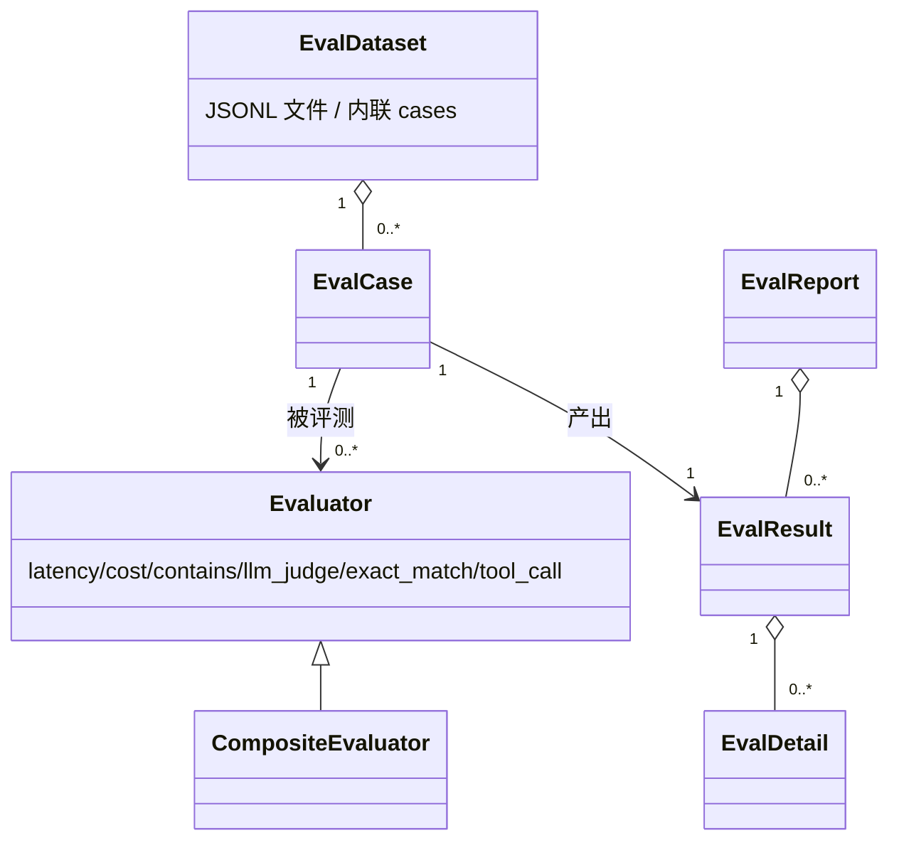

# eval 领域实体模型

本文件定义 eval 领域的核心实体及其关系。类型用业务语义类型(text / number / boolean / enum / reference / object),物理类型与序列化细节见源码 `vv/eval/` 与框架 `vage/eval/eval.go`。

## Eval Dataset

**用途**:承载一组评测用例。CLI 为磁盘上的 JSONL 文件;HTTP 为请求体内联的 `cases` 数组。流式追加、行级容错、diff 友好。

| 属性 | 类型 | 必填 | 说明 |
|------|------|------|------|
| (载体) | text(文件路径)/ array(内联) | 是 | CLI:JSONL 文件路径;HTTP:`{"cases":[...]}` 数组 |
| cases | reference[] → Eval Case | 是 | 每行/每项一个用例;空行跳过;HTTP 下空数组 → 400 |
| loadErrors | object[] | — | 仅 CLI:逐行解析失败记录(`line`、`err`),折叠为报告中的合成 `line-N` 结果 |

**关系**:聚合 0..* 个 Eval Case;经 Runner 一对一映射出一份 Eval Report。

> 字段完整定义引用 `vv/eval/dataset.go`(`caseLine`、`LoadError`)。

## Eval Case

**用途**:单个评测用例——一次代理调用的输入与期望/标签。对应框架 `eval.EvalCase`。

| 属性 | 类型 | 必填 | 说明 |
|------|------|------|------|
| id | text | 是 | 稳定的用例标识;缺失 → 该行解析失败 |
| input | text \| object(RunRequest) | 是 | 字符串=单条 user 消息简写;对象=完整 `RunRequest`;缺失/无 messages → 解析失败 |
| expected | text \| object(RunResponse) | 否 | 预期输出;供对照型评测器(如 `exact_match`)使用 |
| actual | reference → RunResponse | 否 | 由 Runner 在评测前调用 `Dispatcher.Run` 填入 |
| criteria | text[] | 否 | 评分准则名,供 `llm_judge` 消费 |
| tags | text[] | 否 | 分组/过滤标签 |

**关系**:属于一个 Eval Dataset;被一个或多个 Evaluator 评测;产出一条 Eval Result。

> 字段引用 `vage/eval/eval.go`(`EvalCase`)。

## Evaluator

**用途**:一个打分维度,对一个 Eval Case 的 `actual`(及可选 `expected`/`criteria`)输出 [0,1] 分值与通过判定。

| 属性 | 类型 | 说明 |
|------|------|------|
| name | enum | `latency` / `cost` / `contains` / `llm_judge`(经 vv 配置暴露);`exact_match` / `tool_call`(仅框架程序化) |
| dimension | text | 评测维度(时延 / 成本 / 关键词 / 语义 / 精确匹配 / 工具调用) |
| extraCost | enum | `none` / `per-case LLM call`(仅 `llm_judge`) |
| config | object | 维度相关配置:`latency_threshold_ms` / `cost_budget_tokens` / `contains_keywords` / `llm_judge_model` |

**Composite Evaluator**(框架层):把多个 Evaluator 以等权(`Weight: 1.0`)组合为单一分值;vv 在 `eval.evaluators` 含多名时自动启用,单名时直接用对应评测器。

**关系**:评测一个 Eval Case;由 `configs.EvalConfig.Evaluators` 选择;未知名在启动期被 `configs.ValidateEval` 拒绝。

> 装配引用 `vv/eval/evaluator.go`、配置字段引用 `vv/configs/config.go`(`EvalConfig`)。

## Eval Report / Summary

**用途**:批量评测的聚合结果。Report 是完整对象(可经 `-eval-out` 写 JSON 或作 HTTP 响应体);Summary 是其打到 stdout 的精简终端视图。对应框架 `eval.EvalReport`。

### Eval Report

| 属性 | 类型 | 说明 |
|------|------|------|
| totalCases | number | 总用例数(含折叠的解析失败行) |
| passedCases | number | 通过数 |
| failedCases | number | 失败数 |
| errorCases | number | 错误数(含 timeout、解析失败、缺结果槽) |
| avgScore | number | 非错误用例的平均分 [0,1] |
| totalDuration | number(ms) | 批量总时长 |
| results | reference[] → Eval Result | 每用例结果 |

> 不变量:`passedCases + failedCases + errorCases == totalCases`(EVAL-R8)。

### Eval Result

| 属性 | 类型 | 说明 |
|------|------|------|
| caseId | text | 对应 Eval Case.id;解析失败行为合成 `line-N` |
| score | number | 总分 [0,1] |
| passed | boolean | 是否通过 |
| error | text | 非空表示错误;`"timeout"` 表示超时(EVAL-R10) |
| duration | number(ms) | 用例评测时长 |
| usage | object | token 用量(来自 actual 或 judge 调用) |
| details | reference[] → Eval Detail | 每维度明细 |

### Eval Detail

| 属性 | 类型 | 说明 |
|------|------|------|
| name | text | 维度/准则名 |
| score | number | 该维度分值 [0,1] |
| passed | boolean | 该维度是否通过 |
| message | text | 人类可读解释 |

**关系**:Report 聚合 0..* 个 Result;每个 Result 聚合 0..* 个 Detail;Result 与 Eval Case 经 `caseId` 一对一对应。

> 字段引用 `vage/eval/eval.go`(`EvalReport` / `EvalResult` / `EvalDetail`)与 `vv/eval/report.go`(Summary 渲染)。
