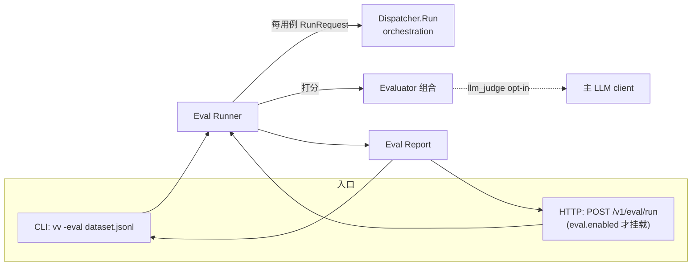

# eval 领域 Spec

## Overview

eval 领域提供 vv 的**离线评测与质量度量**能力:给定一组评测用例(JSONL 数据集),逐用例跑一遍真实分发器(Dispatcher),按一个或多个评测器(Evaluator)打分,聚合成报告。两个目标场景:

- **本地回归**:升级模型、改 prompt、新增工具后跑历史用例集,观察通过率是否退化。
- **CI 守门**:流水线对核心数据集批量评测,失败/错误即阻塞合并(退出码 1)。

边界:本领域只负责"跑评测、打分、出报告、给退出码";它不定义代理行为本身(属 orchestration),不存储历史评测结果(报告是一次性工件),不提供评测结果的趋势分析与看板。

> 设计理念、执行策略、评测器机制与技术取舍见 [design.md](design.md);实体字段见 [models.md](models.md)。

## Core entities

实体定义与完整属性见 [models.md](models.md),此处仅列业务语义:

| 实体 | 业务含义 |
|------|---------|
| **Eval Dataset** | 一个 JSONL 文件(CLI)或一组内联用例(HTTP),每行/每项是一个独立 Eval Case。流式追加、行级容错、diff 友好。 |
| **Eval Case** | 一个评测用例:稳定 `id` + 输入(纯文本简写或完整 `RunRequest`)+ 可选预期/评分准则/标签。 |
| **Evaluator** | 一个打分维度。六种:框架经 vv 配置暴露的 `latency`、`cost`、`contains`、`llm_judge`,加 `vage/eval` 仅程序化可用的 `exact_match`、`tool_call`。多个评测器经 `CompositeEvaluator` 等权组合。 |
| **Eval Report / Summary** | 批量评测的聚合结果:总数 / 通过 / 失败 / 错误 / 平均分 / 总时长,以及每用例的多维度明细。Summary 是其终端友好的精简视图。 |

## Business rules

| Rule ID | 规则 | 说明 |
|---------|------|------|
| **EVAL-R1** | 六评测器,四个经配置暴露 | `eval.evaluators` 接受 `latency`、`cost`、`contains`、`llm_judge`;`exact_match`、`tool_call` 存在于 `vage/eval` 框架层但不经 vv 配置键暴露,仅可程序化对接 vv 评测运行器。枚举见 [dictionary-evaluator-name](../../../../vv-prd/dictionaries/core/dictionary-evaluator-name.md)。 |
| **EVAL-R2** | 默认组合零额外成本 | 默认评测器列表为 `[latency, cost]`,二者只消费 `Actual` 中已有数据(响应时长、token 用量),**不产生额外 LLM 调用**。这保证首次使用零额外开销。 |
| **EVAL-R3** | `llm_judge` 必须显式 opt-in | `llm_judge` 每用例多一次 LLM 调用,只有显式列入 `eval.evaluators` 才启用;启用时复用主 LLM client,模型取 `eval.llm_judge_model`,缺省回落到 `llm.model`;LLM client 缺失或模型为空 → 构建失败(HTTP 500 / 退出码 1)。 |
| **EVAL-R4** | 退出码语义(CLI) | 所有用例通过(无 failed、无 error)→ 退出码 0;否则 → 退出码 1。CLI 评测属"短期任务模式":跑完即退出,退出码反映是否通过。 |
| **EVAL-R5** | 运行模式互斥 | `-eval` 与 `-p`(单提示)、`--mode http\|mcp` 互斥;冲突组合打印错误到 stderr 并退出 1。单进程单模式。 |
| **EVAL-R6** | HTTP 面 opt-in 门控 | `POST /v1/eval/run` 仅当 `eval.enabled: true`(或 env `VV_EVAL_ENABLED=true`)时挂载;否则路由不注册,路径返回默认 mux 的 HTTP 404(非 403)。CLI `-eval` 不受此开关影响。 |
| **EVAL-R7** | 未知评测器启动期拒绝 | `configs.ValidateEval` 在 `configs.Load` 时拒绝 `eval.evaluators` 中的未知名,使配置错字在启动期暴露,而非跑到半路才发现评测器没生效。 |
| **EVAL-R8** | Count 不变量 | 每份报告恒有 `PassedCases + FailedCases + ErrorCases == TotalCases`,包括批量中途被父 context 取消时。 |
| **EVAL-R9** | 解析失败也写入报告 | JSONL 行解析失败不是致命错误:跳过该行、计入错误、并在最终报告中以合成结果 `line-N` 呈现(CLI);HTTP 路径下个别畸形用例同理以非空 `error` 计入 `error_cases` 而不中止整批。 |
| **EVAL-R10** | 每用例独立超时计为错误 | 每用例独立 wall-clock 超时(`eval.timeout_ms`);超时被记为 `EvalResult.Error = "timeout"`,便于运维过滤;超时计入错误而非通过。 |

> 各规则的实现位置(配置默认、组合策略、超时与取消的并发记账)见 [design.md](design.md);本节只声明不变量与意图,不复述代码逻辑。流程逐步对照 [procedure-offline-eval.md](../../../../vv-prd/procedures/core/eval/procedure-offline-eval.md) 的 EVAL-01…EVAL-08。

## Domain events

eval 领域**不发布自有领域事件**。评测期间用例执行产生的 LLM 调用、工具调用事件仍由 orchestration / 可观测性领域经主事件总线发出:

- trace 启用时,每次评测调用都有结构化 trace,可事后逐用例复盘。
- budget 启用时,评测消耗预算——大型评测前须确认 budget 配置。
- debug 启用时,评测产生大量调试输出,谨慎组合。

评测结果本身经报告(stdout summary、可选 JSON 文件、HTTP 响应体)同步返回,不走事件总线。

## Interactions

- **与 orchestration**:Runner 用非交互 `UserInteractor` 构建分发器(离线流程不得等待人工输入),逐用例调用 `Dispatcher.Run`,把返回填入 `EvalCase.Actual` 再交评测器。
- **与 configuration**:CLI 与 HTTP 共用同一份 `EvalConfig`(评测器列表、延迟阈值、成本预算、超时、并发);CLI 标志 `-eval-out`/`-eval-concurrency`/`-eval-timeout-ms` 叠加在 `cfg.Eval` 之上。
- **HTTP 暴露**:仅 opt-in 时挂载,供 CI 批量评测;请求体非空 `cases`,否则 HTTP 400。

## Non-goals

- **不内嵌通用"标准答案"判定**:除 `contains` 与 `llm_judge` 外,评测器是**过程指标**(速度、成本)而非**结果指标**(对错);生成式模型的"对错"高度上下文相关,难以通用化。
- **不做评测结果的持久化与趋势分析**:报告是一次性工件(stdout + 可选 JSON);跨次比对由 CI 工件管理,不由本领域负责。
- **不提供评测看板/可视化**。
- **不定义代理行为**:Runner 只调用既有分发器,行为正确性属 orchestration 领域。

## Anti-scenario

- **`eval.enabled: false` 时,`POST /v1/eval/run` 路由不得挂载。** 此时对该路径的请求必须命中默认 mux 返回 HTTP **404**(而非 403,也非一个"功能已禁用"的业务错误体)——能力的存在与否仅通过路由是否注册来体现,不得有任何代码路径在该开关为假时执行评测。
- 任何评测路径都**不得**等待人工输入(必须用非交互 `UserInteractor`),否则离线/CI 场景会挂起。

## Data dictionary

| 术语 | 定义 |
|------|------|
| **Eval Dataset** | JSONL 评测用例集合(CLI 为文件,HTTP 为内联 `cases` 数组)。 |
| **Eval Case** | 单个评测用例;`input` 为字符串简写(单条 user 消息)或完整 `RunRequest`。 |
| **Evaluator** | 一个打分维度;经配置暴露的:`latency` / `cost` / `contains` / `llm_judge`。 |
| **Composite Evaluator** | 框架层(`vage/eval`)的等权组合器,聚合多个评测器为单一分值。 |
| **过程指标 / 结果指标** | 过程指标=速度/成本(`latency`/`cost`);结果指标=对错(`contains`/`llm_judge`)。 |
| **零额外成本默认** | 默认 `[latency, cost]` 不触发任何额外 LLM 调用。 |
| **opt-in 暴露** | HTTP 评测面默认关闭,须显式 `eval.enabled: true` / `VV_EVAL_ENABLED=true` 启用。 |
| **timeout 错误** | 每用例 wall-clock 超时;记为 `EvalResult.Error = "timeout"`,计入错误。 |
| **Count 不变量** | `Passed + Failed + Error == Total`(EVAL-R8)。 |

> 跨领域通用术语(运行模式、`-eval` 评测、分发器、RunRequest)见 [../../../glossary.md](../../../glossary.md)。
