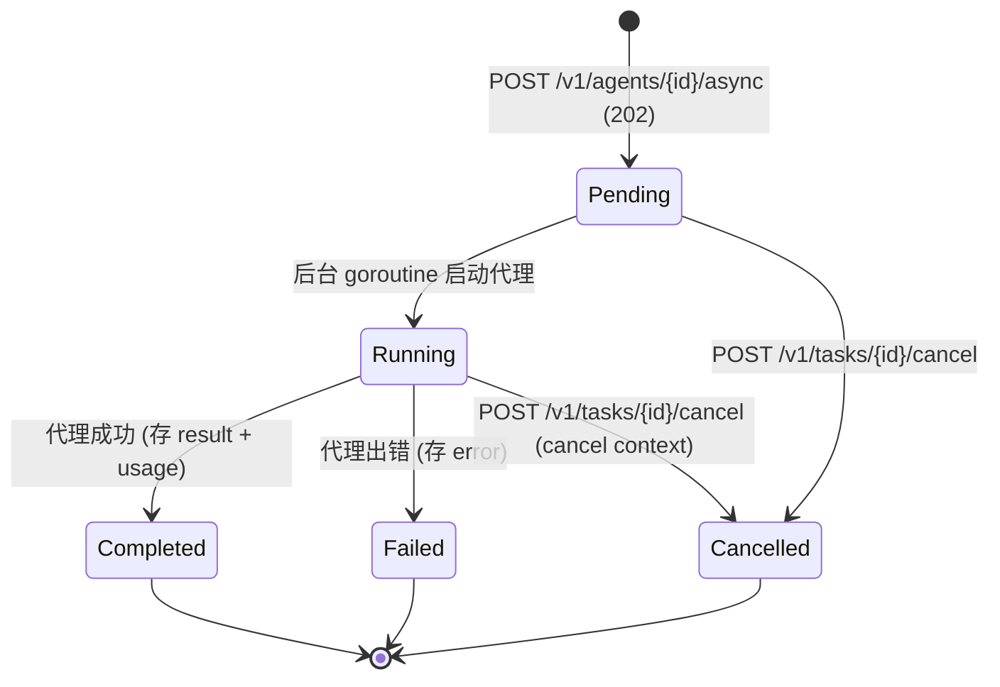

# http-api 领域规格(spec)

## Overview

http-api 是 vv `mode: http` 下的对外边界领域。它把 [orchestration](../orchestration/spec.md) 的单一 Dispatcher(`agent.StreamAgent`)暴露为长驻 REST + SSE 服务,供 Web 前端与自有应用消费。

存在意义(WHY):

- **统一三种交互形态**:同一个 Dispatcher 经 sync / streaming / async 三种调用形态满足不同客户端——前端需要逐字渲染选 streaming,脚本要简单一问一答选 sync,长任务要"提交后离开"选 async。
- **无终端下的功能等价**:HTTP 模式不能弹同步对话框,故把 `ask_user` 交互改造成异步回调(反向 RPC),使其与 CLI 模式功能等价又不引入长连接的语义复杂度。
- **把成本/预算语义抬到边界**:让前端无需自带价格表(成本富化),让预算硬上限以标准 HTTP 语义(429)而非裸 500 暴露。

边界:本领域只做 **HTTP 适配与边界中间件**;业务逻辑分别归 orchestration / memory / session / eval / budget / cost-tracking 领域。它不实现代理推理、不实现记忆存储、不计费——只转发、富化、重写状态码。

## Core entities

实体属性表、关系与状态见 [models.md](models.md);完整字段以 vv-prd 为准。

| 实体 | 用途 | 来源 |
|------|------|------|
| **Async Task** | async 模式下后台代理执行的句柄:跟踪状态、完成时存结果与 usage、支持取消。 | [../../../../vv-prd/models/core/server/model-async-task.md](../../../../vv-prd/models/core/server/model-async-task.md) |
| **HTTP Request 信封** | 三种交互模式共享的 RunRequest:messages + session_id + options(含 `debug`)。 | applications/api/pages `003/004/005-*-agent.md` |
| **HTTP Response 信封** | sync 的 RunResponse(messages + usage + duration + `estimated_cost_usd`)、async 的 task 视图、错误信封(`code` + `message`)。 | applications/api/pages、[../../../../vv-prd/applications/api/application-api.md](../../../../vv-prd/applications/api/application-api.md) |
| **SSE 事件** | streaming 模式下的事件流(见下方 Domain events)。 | [../../../../vv-prd/procedures/core/agent-execution/procedure-streaming-request.md](../../../../vv-prd/procedures/core/agent-execution/procedure-streaming-request.md) |
| **Pending Interaction** | `ask_user` 在 stream/async 下的待回应记录:interaction id + 问题 + 超时。 | [../../../../vv-prd/procedures/core/cli/procedure-http-user-question.md](../../../../vv-prd/procedures/core/cli/procedure-http-user-question.md) |

## Business rules

逐步流程与端点级规则(SYNC-* / STREAM-* / ASYNC-* / ASKHTTP-*)由 vv-prd procedures 承载,不在此复述。下列为本领域的**跨端点不变量**。

| 规则 ID | 名称 | 描述 |
|---------|------|------|
| **HTTP-R1** | 三交互模式语义 | 同一 Dispatcher 经三条路径暴露:**sync**(`POST /v1/agents/{id}/run`)阻塞至完成返回完整 RunResponse + 200;**streaming**(`/stream`)以 `text/event-stream` 推送事件流;**async**(`/async`)立即返回 task id + 202,后台执行,经轮询/取消管理。三者业务结果一致,仅交付时机与通道不同。 |
| **HTTP-R2** | 预算错误重写为 429 | 当代理执行因预算超限失败时,错误体经 budget 中间件识别("budget exceeded"签名)并把响应状态重写为 **429 Too Many Requests**(保留稳定 JSON 信封),**绝不**让其冒泡为 500,也**绝不**返回 200。见 Anti-scenario A1。 |
| **HTTP-R3** | 成本富化 | 边界中间件统一把 Token Usage 折算为 USD:sync 在响应 usage 上加 `estimated_cost_usd`;streaming 在 `agent_end` 后补发一个 `usage` SSE 事件;async 在任务完成时把 usage(含 `estimated_cost_usd`)存入 task。价格不可用时 `estimated_cost_usd` 为 null。折算复用 cost-tracking 价格表,且区分 cache-read token 以免重复计费。 |
| **HTTP-R4** | `ask_user` 异步回调 | 在 stream/async 下,代理调用 `ask_user` 时不阻塞同步对话框,而是:生成 interaction id → 发 `pending_interaction` SSE 事件 → 等待客户端 `POST /v1/interactions/{id}/respond` → 把回答作为工具结果唤醒代理。超时则以 fallback 消息继续。每个 interaction id 只接受一次回应(重复→409)。 |
| **HTTP-R5** | 非交互模式的 `ask_user` 回退 | 在 sync 下无法支持执行中交互,`ask_user` 走非交互回退(与 CLI `-p` 模式一致),立即返回 fallback 而不发任何事件、不阻塞请求。 |
| **HTTP-R6** | 子系统未启用→路由不挂 | 端点分组按依赖子系统是否激活决定是否挂载(memory 恒挂;interactions/budget/eval/sessions/workspace/tree/vector 按需);未启用的子系统对应路由不存在,而非返回半禁用端点。维持零成本默认路径。 |
| **HTTP-R7** | request-id 恒开 | 每个请求注入 `X-Request-ID`(客户端未带则自动生成),贯穿成本/预算/debug 链路用于追踪;成本可忽略,故不做开关。 |
| **HTTP-R8** | debug 不改契约 | `debug=true` 时把每次 LLM/工具调用的关联记录写入 slog 服务日志(以 request id、async 任务 id 标记),但响应体(sync JSON / streaming SSE 字节流 / async 结果)与非 debug 模式对同样输入**逐字节一致**,不新增字段、不新增 SSE 事件类型、不增删端点。 |

## States & transitions

仅 Async Task 有持久状态机;sync/streaming 是请求生命周期内的瞬态,不建模为领域状态。状态值见 [../../../../vv-prd/dictionaries/core/dictionary-task-status.md](../../../../vv-prd/dictionaries/core/dictionary-task-status.md)。

不变量:仅 Pending / Running 可取消(ASYNC-02);Completed / Failed / Cancelled 为终态;任务存储达上限(默认 1000)时新 async 请求拒绝为 429(ASYNC-01)。

## Domain events

streaming 模式下经 SSE 发出的事件类型(契约与字段见 procedure-streaming-request.md;消费者为 HTTP 客户端/前端):

| 类别 | 事件类型 | 用途 |
|------|----------|------|
| Agent 生命周期 | `agent_start` / `agent_end` / `iteration_start` | 标记一次代理运行的起止与每轮迭代 |
| 内容 | `text_delta` | 增量渲染助手回答 |
| 工具执行 | `tool_call_start` / `tool_call_end` / `tool_result` | 显示工具进度 |
| 编排 | `phase_start` / `phase_end` / `sub_agent_start` / `sub_agent_end` | 显示当前 phase 与子代理执行(`sub_agent_end` 含 per-sub-agent usage) |
| 用户交互 | `pending_interaction` | `ask_user` 待回应:interaction id + 问题 + 超时(见 HTTP-R4) |
| 资源 | `token_budget_exhausted` | token 预算耗尽 |
| LLM 可观测 | `llm_call_start` / `llm_call_end` / `llm_call_error` | 累加 token 统计(成本富化中间件拦截 `llm_call_end` 累计) |
| 成本汇总 | `usage` | 流结束后(`agent_end` 之后)补发的聚合 token + `estimated_cost_usd`(见 HTTP-R3) |
| 错误 | `error` | 代理出错时发出并关流 |

> 事件类型与 CLI 模式完全一致——这是 vage 事件总线带来的统一性。

## Interactions

| 对端领域 | 关系 | 暴露方式 |
|----------|------|----------|
| **orchestration** | 调用 | sync/stream/async 三路径都调用其单一 Dispatcher(`/` 入口);本领域不感知 Primary/委派/规划内部语义 |
| **cost-tracking** | 复用 | 成本富化中间件调用其价格表查询与 USD 折算 |
| **budget** | 复用 + 暴露 | budget 中间件识别其超限错误并重写 429;`GET /v1/budget` 暴露其 Tracker 快照 |
| **memory** | 暴露 | `/v1/memory/*` CRUD(走 user-path,仅共享 namespace) |
| **session** | 暴露 | `/v1/sessions/*`(元数据/事件/children/patch/delete/resume/metrics)、`/v1/sessions/{id}/workspace/*`、`/v1/sessions/{id}/tree*` |
| **eval** | 暴露 | `POST /v1/eval/run`(opt-in,`eval.enabled=true` 才挂) |

## Non-goals

- **无认证 / 授权**:本领域不实现登录、令牌校验、API key 鉴权或角色权限;MVP 假定服务部署在受信网络/反向代理之后。
- **无多租户**:不区分租户、不做按租户的资源隔离或配额;所有请求共享同一进程的代理、记忆与预算空间。
- **不做协议转换给上游 LLM**:把代理暴露给外部 LLM 调用是 `mcp` 领域的职责;本领域只服务自有用户界面。
- **不缓存代理响应**、**不实现请求重放/幂等键**。

## Anti-scenario

**A1(预算超限不得放行)**:当某请求触发预算硬上限,服务**绝不**返回 HTTP 200 + 正常 RunResponse 放它继续消耗 token,也**绝不**让原始错误冒泡成裸 500。正确行为是 budget 中间件把响应重写为 429(带 `budget_exceeded` 语义的 JSON 信封)。违反此项即破坏 budget 领域的硬上限保证(见 HTTP-R2 / ADR-0008 候选)。

## Data dictionary

仅本领域内部使用的术语;跨领域术语见 [../../../glossary.md](../../../glossary.md)。

| 术语 | 定义 |
|------|------|
| **交互模式(Interaction Mode)** | sync / streaming / async 三选一,决定 Dispatcher 调用的交付通道与时机(HTTP-R1)。 |
| **成本富化中间件(Cost Enrichment Middleware)** | 在 HTTP 边界对响应附加 `estimated_cost_usd` / `usage` 事件的外层中间件;复用 cost-tracking 价格表。 |
| **预算中间件 / 429 重写(Budget Middleware)** | 内层中间件,识别响应体的预算超限签名并把状态码改写为 429;仅在 Tracker 激活时挂载。 |
| **反向 RPC / 异步回调** | `ask_user` 在 HTTP 下的实现:服务发问题事件 → 客户端回写 → 唤醒代理(HTTP-R4)。 |
| **Pending Interaction(待回应记录)** | interaction store 中的一条等待客户端回应的记录;有 id、问题文本、超时;过期(2× 超时)由后台清理。 |
| **任务存储上限** | async 任务存储的最大容量(默认 1000),达上限新请求拒绝为 429(ASYNC-01)。 |
| **request-id** | 每请求注入的 `X-Request-ID`,贯穿成本/预算/debug 链路(HTTP-R7)。 |
| **零成本默认路径** | 子系统未启用→对应路由与中间件均不挂载(HTTP-R6);定义见 glossary。 |
