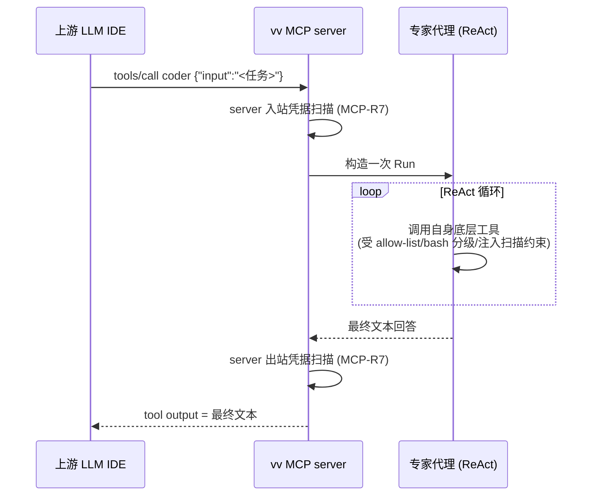
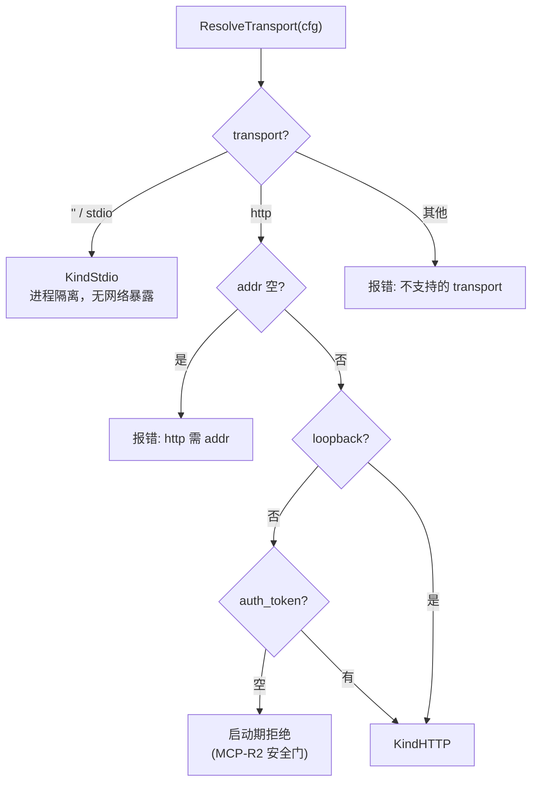

# mcp — Domain Design

本文档描述 MCP 服务端形态的**技术实现**:把代理暴露给上游 LLM 的设计、两种传输的对比与取舍、网络暴露安全门、白名单/expose_dispatcher 暴露策略、ask_user 非交互 interactor、凭据过滤在 MCP server 边界的扩展、以及底层安全层在 MCP 模式的复用。本文完整吸收了已删除的 `vv/doc/mcp.md`(MCP 模式设计理念)的内核。源码:`vv/mcps/`(`serve.go` / `transport.go` / `register.go` / `auth.go`),配置校验在 `vv/configs/`,协议实现来自 MCP Go SDK 与 vage `mcp/server`。

> 被暴露代理的能力分级(ToolProfile)、ReAct 循环、工具实体均归 [agents](../agents/) 与 [tools](../tools/);本文只交代"如何把它们暴露出去 + 暴露时的安全门"。

## 形态与定位:vv 作为被调用方

`mode: mcp` 把 vv 转成一个 MCP 服务端,让上游 LLM IDE 以"调用工具"的方式使用 vv 的代理。与 HTTP 模式的根本区别:

| 维度 | HTTP 模式 | MCP 模式 |
|------|----------|---------|
| vv 的角色 | "应用",前端用户面对它 | "工具源",上游 LLM 面对它 |
| 暴露粒度 | 完整代理对话能力(REST + SSE) | 每个 dispatchable 代理映射为一个 MCP tool |
| 协调者 | 终端用户负责协调 | 上游 LLM 自行决定何时调用 vv |
| 一句话 | 用户用 vv | 别的代理用 vv(agent-by-agent) |

这是一种**全新的使用模式**:把 vv 嵌入一个更大的 agent 体系,让父代理"委托一个编码任务给 vv 的 coder"。三模式(CLI/HTTP/MCP)per-process 互斥;MCP 模式拒绝 `-p`,`--debug` 仍可用(debug 走 `slog`,保证 stdio 上 JSON-RPC 流不被污染)。

## 工具映射的语义

每个被暴露的 vv 代理变成一个 MCP tool。一次调用的完整链路:

关键语义:上游看到的是"我调用了一个工具",不是"我对话了一个代理"。会话状态**不跨多次 tool 调用累加**(除非上游显式传 session id)。

## 暴露策略:白名单 + expose_dispatcher

**默认暴露全部 dispatchable 代理**(coder/researcher/reviewer/…)。两个收窄旋钮:

- **白名单 `mcp.server.agents`**:空 = 全部;非空 = 仅暴露列出的代理 ID(`selectAgents`)。用途:只把 `reviewer` 暴露给团队的 review bot,避免给它隐性的写权限。列了未注册 ID → 启动期报错 `mcp.server.agents[i]=... not registered`。
- **`expose_dispatcher`(默认 false)**:Dispatcher(即 Primary 前门)默认**不暴露**——上游 LLM 一般不需要再多一层路由,他们会直接调具体专家。开关用于"上游希望委托完整 vv 决策(Explore→Classify→Dispatch)"的少数场景。

非 dispatchable 代理(planner)永不进入工具列表(与 AGENTS-R6 一致)。暴露的工具名集合 = 各代理 ID(+ Dispatcher ID,若开),由 `toolNames` 汇总进启动日志。

## 两种传输对比与取舍

| 传输 | 安全模型 | 网络暴露 | 适用 | 取舍 |
|------|---------|---------|------|------|
| **stdio**(默认) | 进程隔离:只有启动 vv 的进程能与它说话 | 零 | 本地单用户:上游 IDE 把 `vv --mode mcp` 拉起为子进程,经 stdin/stdout 说 MCP | 零配置、零身份与网络问题;首选 |
| **Streamable HTTP** | Bearer token + DNS rebinding 防护 | 有 | 共享 / 远程:开 TCP 监听服务 Streamable HTTP(spec `2025-03-26`) | 默认 `127.0.0.1:7801`,开箱仅本机可达;远程暴露须显式配 token |

旧的 HTTP+SSE 传输**刻意不支持**(上游已废弃)。stdio 不存在身份与网络问题,故所有网络安全门只对 HTTP 生效。

## 网络暴露安全门(双层 defence-in-depth)

这是本领域最硬的约束(MCP-R2)。判 loopback 的规则(`IsLoopbackAddr`):`localhost`、127.0.0.0/8、`::1` 算 loopback;**空主机(裸 `:port`)不算**——因为 `net.Listen` 在该地址会绑定每个网卡,等同公开暴露。

非 loopback 绑定且未设 `auth_token` 时**启动期拒绝**,且校验**双层**:

1. **config-time** `configs.ValidateMCPServer`——`configs.Load` 路径上拦截。
2. **startup-time** `mcps.ResolveTransport`——再校验一次。

刻意分层:直接构造 `*configs.Config` 的 embedder/测试(不走 `Load`)仍被 `ResolveTransport` 拦住,**无法静默绕过**。这条硬约束的唯一目的:防止"裸跑公网"。

其余 HTTP 安全细节(`serveHTTP`):
- **Bearer auth**(MCP-R3):设 token 时 `/` 经 `bearerAuth` 包裹,比较用 `crypto/subtle.ConstantTimeCompare`;`GET /healthz` 旁路认证返回 204 供存活探测。
- **DNS rebinding 防护**(MCP-R4):继承 SDK `StreamableHTTPOptions`(`DisableLocalhostProtection=false`),loopback socket 上非 loopback Host 头返回 403。
- **优雅停机**:`ctx.Done()` → `httpSrv.Shutdown(background)`;用 `done` channel 保证停机 goroutine 不泄漏(即便 `Serve` 因外部关闭 listener 而意外返回)。
- **会话超时**:`session_timeout`(秒,0=不超时)清理长时间未活动的 HTTP session。

## ask_user 非交互 interactor

MCP 模式**不挂** CLI 权限拦截链——没有终端弹不出确认对话框,且上游 LLM 期望同步、无打断的工具执行。对应地,`ask_user` 被接到 `askuser.NonInteractiveInteractor`:代理发起提问时立即得到"无交互终端"显式错误,**绝不挂起**等待一个不存在的终端(MCP-R5)。`permissionState` 整体视为非交互。

## 凭据过滤在 MCP server 边界

凭据扫描是 MCP 模式特有的安全措施——CLI/HTTP 假设运行环境是用户自己的,不存在"对外暴露";MCP 把工具暴露给**外部** LLM,故进出 MCP 通道的入参与回值都要扫。

`BuildServer` 用 `configs.BuildMCPCredentialScanner` 构造扫描器,经 `mcpserver.WithCredentialScanner` + `WithScanCallback` 装到 server。扫描点从原有 2 个扩展到 **4 个**:

| 方向 | 含义 | 防的是 |
|------|------|--------|
| client 出站 | vv 作为客户端调下游工具时给出的参数 | 把内部凭据塞进下游能看到的字段 |
| client 入站 | 下游工具结果返回 vv | 下游回值里的凭据进入 vv 上下文 |
| **server 入站**(新增) | 上游 client → 代理的入参 | —— |
| **server 出站**(新增) | 代理 → 上游 client 的结果 | vv 内部读到的凭据泄露给上游 LLM 的 prompt |

默认 `enabled=true, action=redact`;命中发 `EventMCPCredentialDetected` + `slog.Warn`(`buildScanCallback`),载荷**只带掩码预览**(`credscrub.Hit.Masked`),绝不带明文。动作 / 规则集 / 扫描上限的量化见 [security.md](../../../non-functional/security.md)「MCP 凭据过滤」。

## 安全层复用:MCP 模式不降低姿态

所有既有 vv 安全层在 MCP 模式**继续生效,姿态与 HTTP 模式完全一致**(MCP-R6):

| 层 | MCP 模式行为 |
|----|-------------|
| 工作区 allow-list(`tools.allowed_dirs`) | 应用到代理调用的每个 file-touching 工具 |
| bash 危险命令分类器 | Dangerous / Blocked 硬拒绝(非交互) |
| 工具结果注入扫描(ToolResultInjectionGuard) | 挂到每个代理;High 严重度结构性攻击仍升为 block |
| MCP 凭据过滤 | 见上,扩展到 server 入/出两点 |
| ask_user | 接 NonInteractiveInteractor(MCP-R5) |
| CLI 权限对话框 | **不安装**(无终端);permissionState 视为非交互 |

替代逻辑:MCP 不依赖交互层,安全靠路径白名单 + bash 分类器 + 注入/凭据扫描这几层**不依赖交互的底层防御**构成的安全包络。

## 不暴露原始工具 / 无 passthrough

两条边界(MCP-R8 / MCP-R9):

- **不暴露原始工具**:`bash/read/write/edit/glob/grep` 不作顶层 MCP 工具。刻意保留代理的系统提示/护栏在回路里,防止父代理绕过 dispatch 流水线直接操作文件系统。
- **无 MCP passthrough**:vv 作为客户端连接的下游 server 工具不被中继为 vv 自己的 MCP 工具。vv 暴露的 = 它自己的代理,边界清晰。

## 与会话子系统的取舍

MCP 模式下默认仍可启用 session 子系统,每次 tool 调用产生独立 session id(或上游传入)。但因 MCP 调用一般 stateless,会话视图在 MCP 场景价值有限。这是**配置而非硬约束**,保持灵活性。

## 运维提示

- 日志走 `slog`,stdio 传输不被污染。
- 启动行 `"vv: mcp server ready"` 列出有效 `transport` / `addr`(stdio 时为空)/ `exposed_tools` / 是否 `auth` / `session_timeout_s`——grep 这行可确认一个会话的配置。
- 手动冒烟:`npx @modelcontextprotocol/inspector vv --mode mcp`。

## 技术取舍

| 决策 | 取舍理由 |
|------|---------|
| **网络暴露门双层校验**(候选 ADR) | 单点校验易被直接构造配置的 embedder 绕过。config-time + startup-time 双设防,使"裸跑公网"在任何入口都被拦——安全是最高价值,宁可重复校验。 |
| **stdio 为默认传输** | 进程隔离零网络暴露、零身份配置,覆盖本地单用户主场景;HTTP 仅在显式远程需求时启用并强制 token。 |
| **裸 `:port` 视为非 loopback** | `net.Listen(":port")` 绑定所有网卡 = 公开暴露;若放行会成为最隐蔽的误暴露入口,故明确归非 loopback。 |
| **Dispatcher 默认不暴露** | 上游 LLM 已是路由者,多一层 Dispatcher 通常冗余;仅在"委托完整 vv 决策"时显式开。 |
| **ask_user 返回错误而非挂起** | 上游期望同步工具执行;挂起会让父代理无限等待。显式错误让上游可感知并改写任务。 |
| **凭据扫描扩展到 server 边界** | MCP 是唯一"对外暴露代理"的模式,vv 内部读到的凭据可能经代理回答泄露给上游 prompt;故在 server 入/出加扫描点。 |
| **不暴露原始工具 / 无 passthrough** | 保持代理护栏在回路、边界清晰;避免父代理绕过 dispatch 流水线或把 vv 当成任意工具中继器。 |
| **仅单共享 token,不做多用户认证** | MCP 当前定位是受信网络后的共享服务;完整用户认证留给 P4-1,避免过早引入 OAuth/JWT 复杂度。 |
