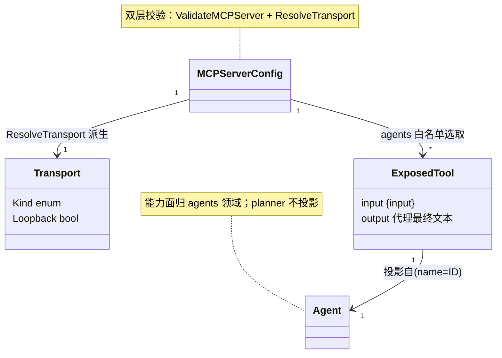

# mcp — 实体模型

本领域的实体模型。安全约束量化见 [security.md](../../../non-functional/security.md)。源码:`vv/mcps/`(`transport.go` 定义 `Transport`/`Kind`),配置结构 `configs.MCPServerConfig`。

## MCP Server 配置(`mcp.server.*`)

**用途**:声明式控制 MCP 服务端的**暴露面**与**传输**。由 [configuration](../configuration/) 解析与启动期校验;是本领域所有行为的输入。

| 属性 | 语义类型 | 默认 | 说明 |
|------|---------|------|------|
| transport | enum(`stdio` / `http`) | `stdio` | 传输形态;空串等同 `stdio`。亦受 `VV_MCP_TRANSPORT` 覆盖 |
| addr | text(host:port) | `127.0.0.1:7801` | HTTP 传输监听地址;`VV_MCP_ADDR` 覆盖。transport=http 时必填 |
| auth_token | text(secret) | 空 | 共享 Bearer token;**非 loopback 绑定时必填**(含裸 `:port`),否则启动期拒绝(MCP-R2)。`VV_MCP_AUTH_TOKEN` 覆盖 |
| agents | reference 集合(代理 ID) | 空(= 全部) | 暴露白名单;空 = 全部 dispatchable 代理,非空 = 仅列出的(MCP-R1) |
| expose_dispatcher | enum(bool) | `false` | true 时额外暴露顶层 `dispatcher` 工具(MCP-R1) |
| session_timeout | number(秒) | `0`(不超时) | HTTP session 空闲多久后关闭 |

**关系**:被 `Serve` / `BuildServer` 消费;`agents` 经 AgentLookup 解析为具体代理(引用 [agents](../agents/) 描述符);`auth_token` / `addr` / `transport` 经 `ValidateMCPServer`(config-time)与 `ResolveTransport`(startup-time)双层校验后产出 **传输配置**。

## 暴露工具描述符(Exposed Tool)

**用途**:一个被暴露 dispatchable 代理(或 Dispatcher)在 MCP 工具列表中的呈现。**不是独立持久实体**——它是代理描述符在 MCP 协议面的投影,工具名 = 代理 ID。

| 属性 | 语义类型 | 说明 |
|------|---------|------|
| name | text | MCP 工具名 = 代理 ID(`coder` / `researcher` / `reviewer` / `dispatcher`) |
| source | reference(Agent) | 来源代理;能力面(Full/ReadOnly/Review/None)由 [agents](../agents/) 定义,本领域不复述 |
| input schema | 概念 | `{"input": "<自由文本任务>"}` |
| output | 概念 | 代理 ReAct 循环的最终文本回答 |
| 暴露条件 | 规则 | 在白名单内(或白名单空);`dispatcher` 仅 `expose_dispatcher=true` 时存在 |

**关系**:由 `selectAgents`(白名单过滤)+ `BuildServer`(注册 + 可选 Dispatcher)从 [agents](../agents/) 的 dispatchable 代理生成;工具名集合由 `toolNames` 汇总进启动日志。非 dispatchable 代理(planner)永不生成对应描述符(MCP-R10)。原始工具(bash/read/...)绝不生成顶层描述符(MCP-R8)。

## 传输配置(Transport)

**用途**:`ResolveTransport` 把 `MCPServerConfig` 归一化后的、供 `Serve` 消费的**解析结果**。是网络暴露安全门的执行载体。

| 属性 | 语义类型 | 说明 |
|------|---------|------|
| Kind | enum(`KindStdio` / `KindHTTP`) | 解析出的传输种类 |
| Addr | text | 仅 `KindHTTP` 时非空 |
| Loopback | enum(bool) | Addr 是否绑 loopback 主机;`localhost` / 127.0.0.0/8 / `::1` 为 true,裸 `:port`(空主机)为 **false** |

**派生规则**(`ResolveTransport`,对应 MCP-R2):

| 输入 | 结果 |
|------|------|
| transport 空 / `stdio` | `{Kind: KindStdio}` |
| `http` + addr 空 | 报错:http 需 addr |
| `http` + 非 loopback + 无 auth_token | **启动期拒绝**(安全门) |
| `http` + (loopback 或 有 token) | `{Kind: KindHTTP, Addr, Loopback}` |
| 其他 transport 值 | 报错:不支持的 transport |

**关系**:由 `MCPServerConfig` 派生;驱动 `serve` 分支(stdio → `mcp.StdioTransport`;http → `serveHTTP`,后者据 `auth_token` 决定是否包裹 `bearerAuth`)。

## 实体关系

