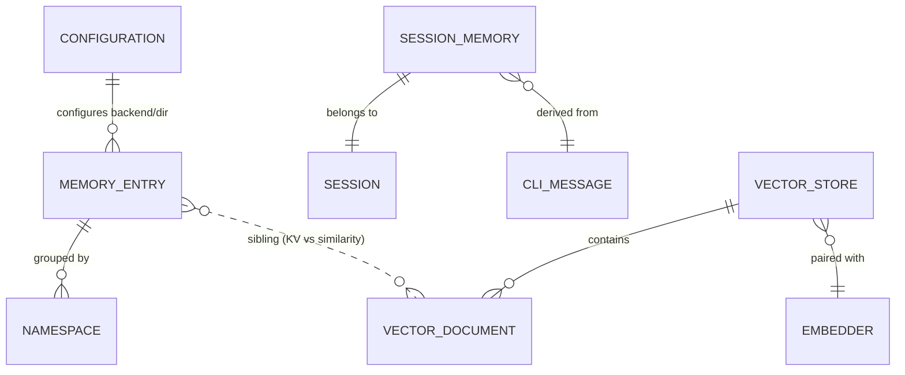

# memory 领域 Models

> 本文件给出本领域四个实体的用途、关键属性与关系。**完整字段清单与权威定义** 引用 [vv-prd/models/core/memory/](../../../../vv-prd/models/core/memory/);本文件只固化领域 spec 需要的属性与业务语义类型,不复述能从源码/PRD 恢复的细节。属性类型用业务语义类型(text / number / datetime / enum / reference / list / map)。

## Memory Entry

**用途**:持久记忆中的单条长期知识,按 `namespace` 分组、`key` 在 namespace 内唯一,跨会话与重启长存。为代理提供可复用的项目知识、用户偏好与约定。权威:[model-memory-entry.md](../../../../vv-prd/models/core/memory/model-memory-entry.md)。

| 属性 | 语义类型 | 约束 | 说明 |
|------|---------|------|------|
| key | text | 必填,namespace 内唯一;仅字母数字/连字符/下划线 | 如 `go-style-guide` |
| namespace | enum(Memory Namespace) | 必填 | 共享枚举或会话私有;见 [dictionary-memory-namespace](../../../../vv-prd/dictionaries/core/dictionary-memory-namespace.md) |
| session_id | text | 可空 | 共享条目与 legacy 记录为空;会话私有写入时由框架(`WithSessionID`)标记 |
| content | text | 必填 | 自由文本知识 |
| ttl | number(秒) | 默认 0 | 0=永不过期;>0 为惰性 on-read 过期(`now-updated_at>ttl`) |
| created_at | datetime | 必填 | 创建时间 |
| updated_at | datetime | 必填 | 末次修改;覆盖时刷新 |

**关系**:由 configuration 配置存储目录与后端;与 Vector Document 为 sibling(同为持久知识,精确 KV 召回 vs 相似度召回)。

## Session Memory

**用途**:单次会话期间维护的对话级上下文,持有抽取的 facts、对话摘要与 token 估算。历史超 token budget 时摘要早期内容以腾出 token。权威:[model-session-memory.md](../../../../vv-prd/models/core/memory/model-session-memory.md)。

| 属性 | 语义类型 | 约束 | 说明 |
|------|---------|------|------|
| session_id | reference(CLI Session / HTTP conversation) | 必填 | 所属会话 |
| facts | list&lt;text&gt; | 必填(可空表) | 随对话增量追加:decisions / 文件改动 / 项目知识 / 用户偏好 |
| summary | text | 可空 | 历史超 budget 阈值时生成的早期内容摘要 |
| token_count | number | 必填 | session memory 内容的 token 估算,用于预算管理 |

**关系**:每个 CLI Session 对应一个 Session Memory(belongs to);facts/summary 派生自 CLI Message(derived from)。生命周期与状态迁移见 [spec.md](spec.md) § States。

## Vector Store

**用途**:相似度召回基底——与 Memory Entry 的精确 KV 查不同,提供"找与查询最相似的 top-k 文档"(cosine)。是 Retrieval-Augmented Context 的基底:Embedder 把意图转查询向量,store 返回最相关文档,`VectorRecallSource` 渲染为单条 system 消息。框架自带 in-process `MapVectorStore` 并标准化 `VectorStore` 接口供真实后端实现。权威:[model-vector-store.md](../../../../vv-prd/models/core/memory/model-vector-store.md)。

| 属性 | 语义类型 | 约束 | 说明 |
|------|---------|------|------|
| locked_dimension | number | 必填 | 首个 Add 或构造选项锁定;后续维度不符返回 `ErrDimensionMismatch` |
| default_top_k | number | 必填 | `SearchOptions.TopK` 未设时返回的命中数(MapVectorStore 默认 5) |
| similarity_metric | enum | 必填 | MapVectorStore=cosine;真实后端自述 |

**关系**:contains 多个 Vector Document;与 Embedder paired with(须产出 store 锁定维度的向量);与 Session 可选 scope(一 scope 一 store 实例,框架不强制 namespace);与 Persistent Memory complementary(精确召回 vs 语义召回)。

## Vector Document

**用途**:向量库中的单条索引项,把人类可读文本与其高维 embedding 配对以支持语义相似度检索。由 Embedder(外部 API 或 in-process `HashEmbedder`)产出,`VectorRecallSource` 在上下文构建期消费。权威:[model-vector-document.md](../../../../vv-prd/models/core/memory/model-vector-document.md)。

| 属性 | 语义类型 | 约束 | 说明 |
|------|---------|------|------|
| id | text | 必填,caller 提供 | 用于 replace / delete |
| text | text | 必填 | 返回给 LLM 的可读载荷,作为 recall 消息一部分渲染 |
| embedding | list&lt;float32&gt; | 必填 | 长度须匹配 store 的 locked_dimension |
| metadata | map&lt;string,any&gt; | 可空 | 用于 `MetadataEquals` 声明式过滤与 ad-hoc Predicate 过滤 |
| created_at | datetime | 必填 | Add 时若为零则由 store 标记 |

**关系**:stored in Vector Store(经相似度搜索检索);与 Memory Entry sibling(同为持久知识,KV vs 相似度召回);metadata 可引用 session id 实现会话级 recall(optionally associated with Session)。

## 实体关系总览

