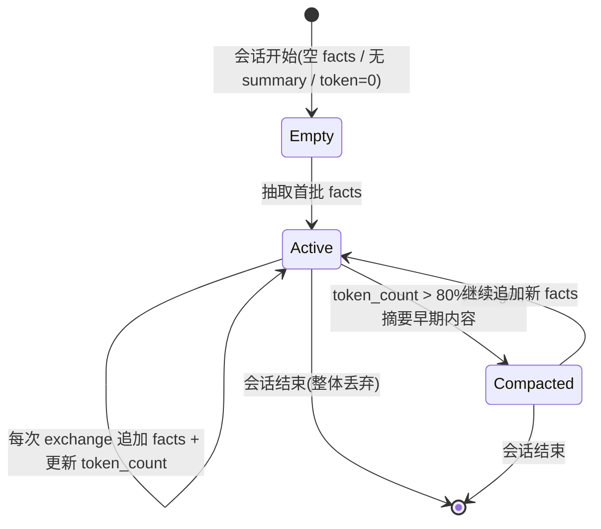
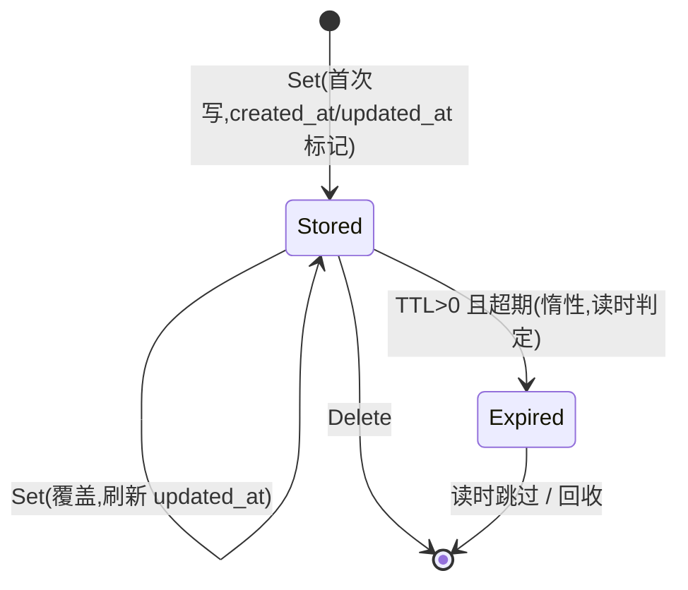
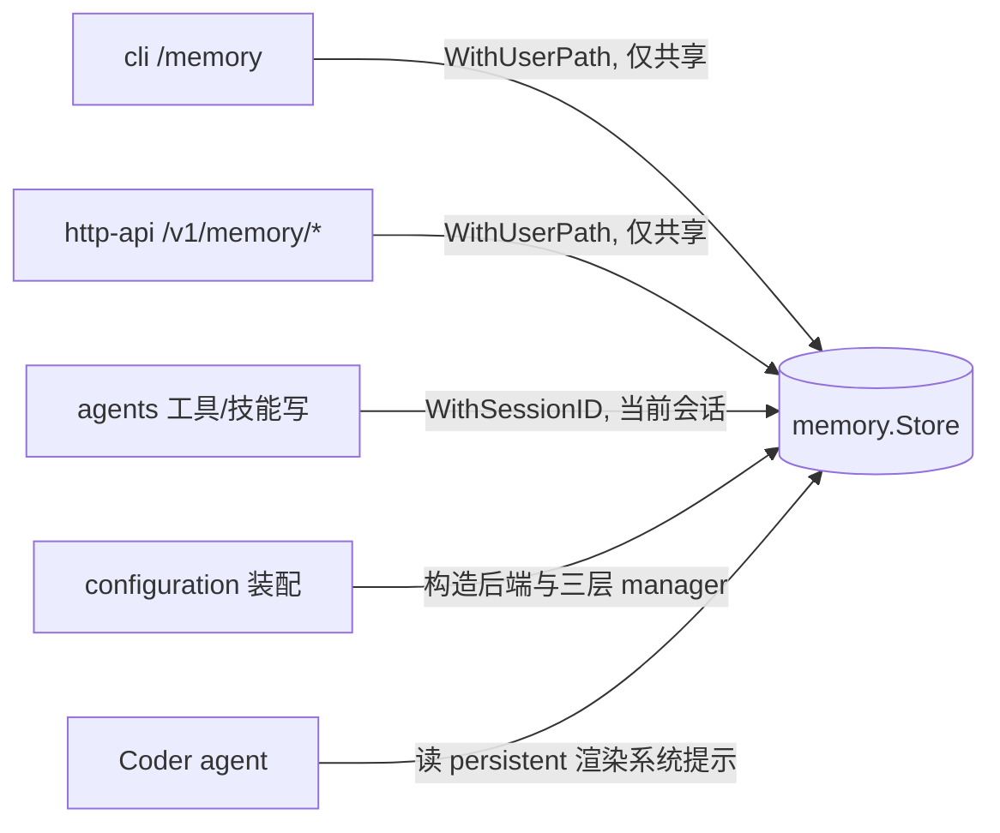

# memory 领域 Spec

> 本文件写 **WHAT / WHY**:三层记忆的职责边界、访问控制不变量与状态语义。实现细节(磁盘布局、后端、压缩算法)见 [design.md](design.md);字段全清单见 [models.md](models.md)。

## Overview

memory 领域把 vage 的记忆抽象组合为 **三层记忆**,并叠加 vv 特有的会话私有访问控制。它解决两个问题:

1. **上下文从哪来**——每轮 ReAct 循环交给模型的上下文,是 working / session / persistent 三层经组合 + 压缩后的视图。
2. **谁能动哪条记忆**——持久记忆按 namespace 分共享(跨会话长期事实)与会话私有(绑定 `session_id`),不同入口(agent-path / user-path)的可写范围不同。

记忆系统与 session 领域 **正交**:关掉 session 子系统则事件流不落盘但 persistent 仍工作;关掉 persistent 不影响事件流。二者共用 vage 抽象,各有独立后端与开关。

## Core entities

完整属性见 [models.md](models.md)。

| 实体 | 所属层 | 一句话用途 |
|------|--------|-----------|
| **Memory Entry** | persistent | 跨会话的单条 KV 知识(`namespace` + `key` 唯一),精确召回 |
| **Session Memory** | session | 单会话的事实清单 + 摘要 + token 估算,随对话增量维护 |
| **Vector Store** | persistent(可选) | 相似度召回基底:top-k cosine,语义召回 |
| **Vector Document** | persistent(可选) | 向量库中的单条文档:文本 + embedding + metadata |

> **三层记忆**(见 [glossary](../../../glossary.md)):working = 每请求,运行时管理,请求结束即弃;session = 每对话,事实抽取 + 摘要;persistent = 跨会话,file 或 sqlite 后端。三层职责边界见 MEM-R1。

## Business rules

> 规则 ID 以 `MEM-R*` 标注供 feature spec / 测试引用。底层逐步规则(MEM-01…MEM-13)不在本表展开,本表只固化 **不变量与边界**,不复述步骤。

| ID | 规则 | 为什么 |
|----|------|--------|
| **MEM-R1** | **三层职责边界**:working 仅存活于单次请求执行,结束即弃,不落盘;session 存活于一次会话,持有事实 + 摘要;persistent 跨会话与重启长存。上层不得把某层用作另一层(如把每请求中间结果写入 persistent)。 | 三层寿命与范围不同;混用会污染长期记忆或丢失上下文 |
| **MEM-R2** | **共享 vs 会话私有 namespace**:共享 namespace 是 **约定枚举**(`project` / `user` / `conventions` / `notes` / `default`),跨会话可读;任何不在此清单的 namespace 一律视为会话私有。namespace 名字是约定而非自由文本。 | 防止"每个代理自己起名"导致碎片化;让 user-path 能静态判定可写范围 |
| **MEM-R3** | **会话私有访问控制不变量**(宪法 § 4):会话私有条目绑定写入时的 `session_id`;其他会话读返回 `not-found`,改/删返回 `ErrSessionForbidden`。代理仅能写当前会话(context 携带 `WithSessionID`)。 | 安全与隔离 > 功能;一个会话不得窥探/篡改另一会话的私有记忆 |
| **MEM-R4** | **user-path 仅共享**:CLI `/memory` 与 HTTP `/v1/memory/*` 走 user-path(`WithUserPath`),只能 CRUD 共享 namespace;对会话私有 namespace 的写/删返回 forbidden(HTTP 403 / CLI forbidden 消息)。 | 避免前端误改某会话的私有内存;user-path 无会话身份,不能伪装成某会话 |
| **MEM-R5** | **Clear 仅 user-path**:`Clear` 清空整个记忆目录,仅 user-path 可调;agent-path 调用返回 `ErrSessionForbidden`。 | 破坏性全量删除不能被代理触发 |
| **MEM-R6** | **legacy 记录保护**:会话私有 namespace 下存在的旧式无 `session_id` 记录(legacy shared),允许被任一会话与 user-path 读取,但 **不可被某会话的写入覆盖**(返回 forbidden)。 | 向后兼容旧布局,同时不让新会话静默吞掉历史记录 |
| **MEM-R7** | **后端不自动迁移**:`memory.backend` 在 `file`(默认)与 `sqlite` 间切换不触发数据迁移;切换后旧后端的数据对新后端不可见。两后端 session/namespace 语义一致,切换是配置变更而非行为变更。 | 自动迁移的失败面/数据丢失风险高于其价值;迁移留给显式工具 |
| **MEM-R8** | **压缩时机与受保护轮次**:session 层超过 token budget 的 80% 时,滑动窗口压缩器把早期对话摘要为紧凑文本;最新 N 个 turn(protected turns)不动。working/session 视图组装还含主动 auto-compact(逼近模型上限)、反应式 emergency compact(溢出错误)与工具输出截断。压缩输入限制在模型上下文的 80% 以内。 | 保留对当前推理最重要的最新轮次;避免摘要请求自身溢出 |

### 上下文组装优先级

组装交给代理的上下文时:**persistent 记忆 → session 摘要 → 近期 facts**。仅 Coder 默认渲染 persistent 条目(项目级约定),其他代理默认不读以避免 prompt 膨胀(实现见 design.md)。

## States & transitions

### Session Memory 生命周期

### Memory Entry 生命周期

> TTL 为惰性过期:仅在读取时判定 `now - updated_at > ttl`,无后台扫描。当前 TTL 默认 0(永不过期);自动过期属"按需扩展"。

## Domain events

memory 领域 **不** 自有事件总线主题;其状态变更通过宿主子系统旁路体现:

| 触发 | 体现位置 |
|------|----------|
| 持久记忆写/删(user-path,破坏性) | 经 session/事件总线发出可观测事件(宪法 § 3「特权操作可审计」) |
| session 摘要触发 | 反映在 session 事件流与 token 统计 |

## Interactions

- **被 cli / http-api 管理**:经 user-path,仅共享 namespace,Clear 仅此路径。
- **被 agents 读写**:经 agent-path(`WithSessionID`),可写当前会话私有 + 共享。
- **依赖 configuration**:后端选择(`memory.backend`)、目录、三层 manager 均由装配中心构造,DB 句柄经 `setup.Init` 持有、`Shutdown` 关闭(见 design.md)。

## Non-goals

- **无自动事实抽取的"智能"保证**:facts 抽取是尽力而为(decisions / 文件改动 / 项目知识 / 用户偏好);抽取失败保留未摘要 facts 并下次重试,不阻断会话。
- **无加密**:记忆以明文 JSON / SQLite 落盘;不提供静态加密或字段级脱敏(凭据脱敏是 tools/mcp 领域的边界,不在此)。
- **无内置向量化检索强制**:Vector Store 是可选基底(默认 in-process MapVectorStore),不强制为 persistent KV 提供相似度检索。
- **无多租户隔离**:同一进程共享一份持久记忆;租户维度属"按需扩展"。
- **无 file↔sqlite 自动迁移**(见 MEM-R7)。

## Anti-scenario

> 必须永不发生:

- **一个会话读到另一会话的私有记忆**:会话 A 以 `WithSessionID("A")` 写入私有 namespace `scratch` 的条目,会话 B(`WithSessionID("B")`)读同一 `namespace:key` 必须得到 `not-found`,改/删必须得到 `ErrSessionForbidden`——绝不返回 A 的内容或静默覆盖。
- **user-path 写会话私有 namespace**:CLI/HTTP 对非共享 namespace 的写/删必须 403 / forbidden,绝不落盘。
- **agent-path 触发 Clear**:代理调用 `Clear` 必须 `ErrSessionForbidden`,绝不清空目录。

## Data dictionary

仅本领域内部术语;跨域术语见 [glossary](../../../glossary.md)。

| 术语 | 定义 |
|------|------|
| **agent-path** | 代理侧调用路径,context 经 `WithSessionID` 携带当前会话身份;可写当前会话私有 + 共享 namespace |
| **user-path** | 用户直连路径(CLI `/memory` / HTTP `/v1/memory/*`),context 经 `WithUserPath` 标记,无会话身份,仅限共享 namespace |
| **shared namespace** | 约定枚举 `project/user/conventions/notes/default`,跨会话可读、user-path 可写 |
| **session-private namespace** | 不在共享清单中的任何 namespace,绑定 `session_id`,仅 agent-path 当前会话可写 |
| **legacy record** | 会话私有布局下无 `session_id` 的旧式记录,只读、不可被会话写覆盖(MEM-R6) |
| **protected turns** | 压缩时保留不动的最新 N 个 turn(MEM-R8) |
| **auto-compact / emergency compact** | 主动(逼近模型上限)/ 反应式(溢出错误)的上下文压缩(MEM-R8) |
