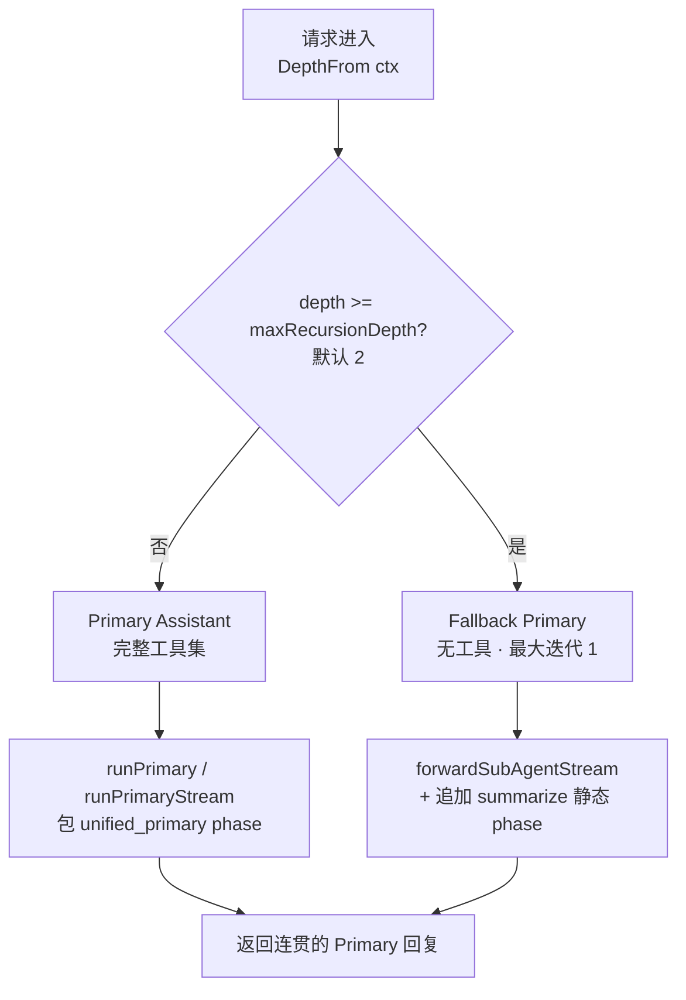
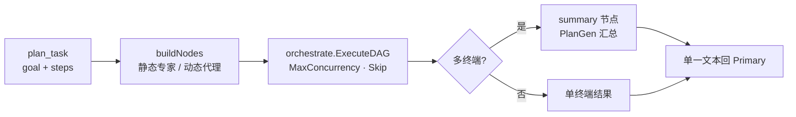

# orchestration 领域设计(design)

> 本文件描述 **HOW**:薄分发的物理实现、Primary 的动作集、委派与规划语义、动态规格装配、流式 phase 事件、递归预算传递、Session Tree 镜像、与 vage 的边界。业务不变量(ORCH-R*)见 [spec.md](spec.md);实体字段见 [models.md](models.md)。
>
> 源码对照:`vv/dispatches/`。

## 薄分发设计与三段管道废弃史

Dispatcher 对外是一个普通的 `agent.StreamAgent`,对内只做一件事:**把请求转交给 Primary,必要时切换到 Fallback Primary**。它不做意图分类、不做总结、不做策略选择 —— 所有这些都被下放到 Primary 的工具调用里。

这种"薄分发"是从早期 **`intent → execute → summarize` 三段管道** 演化而来的设计简化:

| 维度 | 旧三段管道(已废弃) | 当前统一 Primary |
|------|---------------------|-----------------|
| 路由 | 独立 intent 识别 LLM 调用(含 fast-path 启发式短路) | Primary 在 ReAct 循环里一次工具选择 |
| 执行 | 路由后分发到固定子代理 | Primary 自行决定直答/探查/委派/规划 |
| 汇总 | 独立 summarize LLM 调用 | Primary 就地把结果折叠进回复 |
| LLM 调用次数 | 每段一次额外调用 | 合并进 Primary 自己的循环 |

原管道在每一段都需要一次额外的 LLM 调用,而 Primary 把这些合并到自己的 ReAct 循环里,由模型自行决定走哪一条路径。代码中残留的 `ClassifyResult` / `IntentResult` / `SummaryPolicy` 等类型是历史兼容遗留(`vv/dispatches/types.go`),当前主路径不再驱动它们;`Dispatcher.Run` / `RunStream` 在 Primary 缺失时直接报错"classical pipeline removed"。

> 注:`vv-prd/procedures/core/orchestration/procedure-orchestration.md` 仍以旧三段管道(intent 识别、Step 1.5 fast-path、Step 2–8)描述流程,与当前实现 **不一致**;以本设计为准,该 procedure 文档待回填。

## 两条物理路径

请求进入后,Dispatcher 只根据递归深度二选一:

Fallback 路径存在的唯一目的是 **防止递归失控**:达到深度上限后,物理上消除"再次委派/再次规划"的可能,保证在有限步骤内必定回应用户。Fallback Primary 共享 Primary 的人格和系统提示,所以用户看不出切换;但它无论如何都只能直答。

> 技术取舍:用"无工具的代理实例"实现阀门,而非在 Primary 内部加 try/limit 计数。无工具实例从能力维度根除了递归动作,比计数判断更难被 prompt 绕过 —— 这是"物理消除"而非"逻辑禁止"。

## Primary 的四种选择

Primary 是一个 ReAct 循环。每一轮 LLM 给出一次响应,从下面的"动作集合"里选一个:

| 动作 | 触发的工具 | 何时使用 |
|------|-----------|---------|
| 直答 | 无 | 闲聊、定义、不依赖项目的计算 |
| 只读探查 | `read` / `glob` / `grep` / `web_fetch` / `web_search` | 需要看代码或公网资料后再回答 |
| 委派 | `delegate_to_<专家>` | 任务能干净地映射到某个专家 |
| 规划 | `plan_task` | 任务跨多个专家能力域 |

辅助动作还有:

- 进度记录:`todo_write`(同一会话内可见的检查清单)。
- 跨会话规划:`plan_update` / `notes_*`(持久化到 Plan Workspace,属 `session` 领域)。
- 长任务结构化记忆:`tree_add` / `tree_update` / `tree_promote` 等(启用 Session Tree 时)。
- 一次澄清:`ask_user`(用户意图真的歧义且代价巨大时)。

Primary 的系统提示明确禁止它自己改写文件 —— 它没有写工具,所有 mutation 必须经由 `delegate_to_coder`(对应不变量 [spec.md](spec.md) ORCH-R2)。

## 委派的语义

`delegate_to_<agent>` 是 Primary 的核心工具家族:每个 dispatchable 专家都有对应的一只。调用它时:

1. 递归深度 +1,传递给被委派的子代理(`IncrementDepth(ctx)`)。
2. Primary 提供任务描述与可选的"已收集到的背景"。
3. 子代理在自己的 ReAct 循环中独立完成任务,结果以工具结果形式回到 Primary。
4. Primary 把子代理的回答 **折叠** 进自己的最终回复 —— 而不是原样转发,这样用户始终看到一个连贯的 Primary 视角。

子代理失败不会冒泡为 Run 错误,而是以 `IsError=true` 的工具结果返回。这让 Primary 能基于错误内容继续决策(例如改派另一个专家、改用直答、向用户澄清),而不是让整轮请求 abort(ORCH-R6)。

## 规划的语义

`plan_task` 触发 DAG 编排:

1. Primary 给出 goal + steps;每个 step 指定执行的专家名与依赖。
2. Dispatcher 构造 DAG:无依赖的 step 并行执行(受 `maxConcurrency` 限制),有依赖的等待上游。
3. 多终端结果由 **PlanGen** 汇总成单一文本返回 Primary。
4. 整个 DAG 共享一个递归预算(在 Primary 的预算上 +1,对应 ORCH-R7)。

DAG 节点也支持 **动态规格** —— 某 step 的执行者由 spec 临时构造(指定 base type + 工具子集 + 自定义系统提示),用于"为这一步定制一个稍有差异的代理"的场景。

实现要点(`vv/dispatches/dag.go`):

- `RunPlan` 是 `PlanExecutor` 接口的实现,Primary 的 `plan_task` 工具持有 Dispatcher 句柄并经此驱动同一套 DAG 机制(单一真相源)。
- DAG 配置:`ErrorStrategy = Skip`、节点 `Optional = true` —— 单 step 失败不中断,其下游被 skip,已完成结果仍汇总(对应 [spec.md](spec.md) Plan Step 状态机的 `skipped` 转移)。
- 当 DAG 有 **多个终端节点** 时,自动追加一个 `summary` 节点(执行者 = PlanGen),把各终端结果拼成汇总 prompt 后产出单一回复;只有一个终端时直接返回该结果。
- DAG 执行模型(就绪判定、并发调度、聚合)复用 vage `orchestrate.ExecuteDAG`。
- **静态 step 的执行者解析**(`resolveStaticAgent`)顺序固定:① 按 `step.Agent` 在 `subAgents` 精确匹配,命中即用;② 未命中且 Dispatcher 配置了 **DAG 默认代理 ID**(`WithDAGDefaultAgentID`,只保存 ID,执行者仍从 `subAgents` 查)时,查该默认 ID;③ 仍未命中则 `buildNodes` 返回可诊断错误——错误必标明原始 `step.Agent`,若默认 ID 也未注册则同时标明默认 ID,以区分「Plan 引用未知代理」与「Dispatcher 默认配置无效」。默认代理 **默认禁用**(零值):生产装配不隐式指定,历史上依赖静默兜底的 plan 会在构建期显式失败。精确匹配始终优先,默认代理不覆盖有效的 `step.Agent`;`DynamicSpec` 存在时走动态分支,不读取该默认 ID。
- 该 DAG 默认代理与 **递归超限 Fallback Primary**(`fallbackAgent`)语义不同、不复用:后者是递归深度超限及 DAG 构建失败降级路径中的可执行代理;前者仅是静态 step 未命中时可选的 `subAgents` 查找目标。

## 动态规格(Dynamic Agent Spec)

`buildDynamicAgent` 在 step 执行前临时构造一个 `taskagent`(`vv/dispatches/dag.go`):

1. 经注册表用 `base_type` 取基础类型描述符(决定默认系统提示与 ToolProfile)。
2. 工具集:`tool_access` 指定则用对应 ToolProfile,否则继承 base type 的默认 profile;由 profile 构建工具子集 registry(对应 ORCH-R8 工具子集)。
3. 系统提示:`system_prompt` 指定则覆盖默认,并追加项目级指令。
4. 模型 / 最大迭代:spec 覆盖优先,否则取 Dispatcher 默认。
5. 产出 `dynamic_<base_type>_<step_id>` 命名的临时代理,执行后即弃,**不注册** 到代理注册表(ORCH-R8 即用即弃)。

校验约束(`types.go`):base type 必须经 `registry.ValidateRef` 校验;若 step 同时给了 `agent` 与 `dynamic_spec`,二者 base type 必须一致;`tool_access` 必须是合法 ProfileByName。

## 流式 phase 事件

每次请求会发出一对 phase 事件包住 Primary 的整个执行:

- `EventPhaseStart{Phase:"unified_primary", PhaseIndex:1, TotalPhase:1}`
- `EventPhaseEnd{Phase:"unified_primary", Duration, ToolCalls, PromptTokens, CompletionTokens}`

`phaseTracker` 拦截内层事件流累加统计:`EventToolCallStart` 累加工具调用数,`EventLLMCallEnd` 累加 prompt / completion tokens,使 cost 仪表盘在统一前门下继续工作。

Fallback 路径上额外发一对 `summarize` 静态 phase 事件(零 LLM 调用,Summary 为固定 sentinel `"fallback path: no summarization performed"`),让 SSE 消费者不需要分支判断走的哪条物理路径(对应 ORCH-R10)。

## 递归预算的传递

预算通过请求上下文(`depthKey`)承载,途径:

- Dispatcher 入口处读一次(`DepthFrom(ctx)`),与 `maxRecursionDepth`(默认 2)比较。
- `delegate_to_*` 与 `plan_task` 的处理逻辑各自 `IncrementDepth` 后传给下层。
- 下层若再次进入 Dispatcher(专家自己又触发分发器,例如通过 ask_user 链),同一个上限会再次生效,不可能突破(对应 ORCH-R3 / ORCH-R4 与 Anti-scenario「递归突破上限」)。

## Session Tree 镜像

启用 Session Tree 且打开"分发器写树"开关(`writeTree`,默认 false,opt-in)时,每次 `plan_task` 都会把 plan 镜像为树节点:第一次创建 goal 根,后续追加为子树(`maybeMirrorPlanToTree`)。失败仅记录告警,不阻塞 DAG 执行 —— 树是辅助视图,不是关键路径(对应 ORCH-R9 与 Anti-scenario「写树失败阻塞业务」)。

## 与 vage 的边界

- Dispatcher 实现 vage 的 `agent.Agent` / `agent.StreamAgent` 接口,所以它可以被 HTTP service 当作普通代理注册(ID `orchestrator`)。
- DAG 执行复用 vage 的 `orchestrate` 包,Dispatcher 只提供 step 列表(`buildNodes`)与节点的输入映射器(`BuildInputMapper`)。
- 事件流复用 vage 的 schema 事件类型,没有 vv 私有事件。
- 动态代理复用 vage `taskagent`;工具子集复用 vv `registries` 的 ToolProfile。

## 技术取舍小结

| 取舍 | 选择 | 理由 |
|------|------|------|
| 路由放在哪 | Primary 的工具调用,而非独立分类器 | 省去每段一次额外 LLM 调用;新增专家零改 Dispatcher;失败回退路径单一 |
| 递归阀门怎么实现 | 无工具 Fallback 实例 | 从能力维度物理根除递归,比计数判断更可靠、更难被 prompt 绕过 |
| 子代理失败如何呈现 | `IsError=true` 工具结果,不冒泡 | 让 Primary 据错误继续决策,而非整轮 abort |
| DAG 谁来执行 | 复用 vage `orchestrate`,vv 只供 step + 映射器 | 避免在应用层重造编排引擎;基础库不绑死特定应用形态 |
| 写树是否阻塞 | 辅助视图,失败仅告警 | 可观测能力不应影响业务关键路径(零成本默认原则) |
| Fallback 的 summarize | 零调用静态 phase 占位 | SSE 消费者无需为两条物理路径写分支 |
