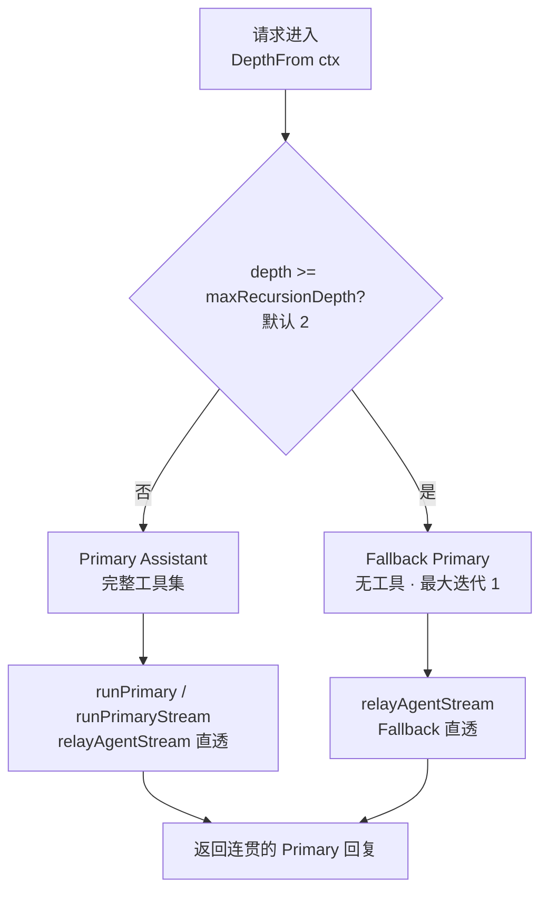
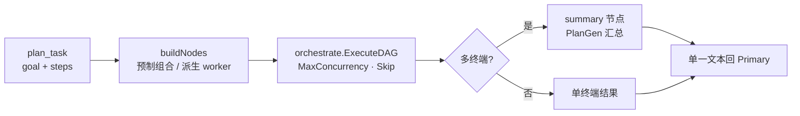

# orchestration 领域设计(design)

> 本文件描述 **HOW**:薄分发的物理实现、Primary 的动作集、派生与规划语义、Worker Spec 装配、流式 phase 事件、递归预算传递、Session Tree 镜像、与 vage 的边界。业务不变量(ORCH-R*)见 [spec.md](spec.md);实体字段见 [models.md](models.md)。
>
> 源码对照:`vv/dispatches/`。

## 薄分发设计与三段管道废弃史

Dispatcher 对外是一个普通的 `agent.StreamAgent`,对内只做一件事:**把请求转交给 Primary,必要时切换到 Fallback Primary**。它不做意图分类、不做总结、不做策略选择 —— 所有这些都被下放到 Primary 的工具调用里。

这种"薄分发"是从早期 **`intent → execute → summarize` 三段管道** 演化而来的设计简化:

| 维度 | 旧三段管道(已废弃) | 当前统一 Primary |
|------|---------------------|-----------------|
| 路由 | 独立 intent 识别 LLM 调用(含 fast-path 启发式短路) | Primary 在 ReAct 循环里一次工具选择 |
| 执行 | 路由后分发到固定子代理 | Primary 自行决定直答/探查/委派/规划 |
| 汇总 | 独立 summarize LLM 调用 | Primary 就地把结果折叠进回复 |
| LLM 调用次数 | 每段一次额外调用 | 合并进 Primary 自己的循环 |

原管道在每一段都需要一次额外的 LLM 调用,而 Primary 把这些合并到自己的 ReAct 循环里,由模型自行决定走哪一条路径。代码中残留的 `ClassifyResult` / `IntentResult` / `SummaryPolicy` 等类型是历史兼容遗留(`vv/dispatches/types.go`),当前主路径不再驱动它们;`Dispatcher.Run` / `RunStream` 在 Primary 缺失时直接报错"classical pipeline removed"。

## 两条物理路径

请求进入后,Dispatcher 只根据递归深度二选一:


```mermaid
flowchart TD
    A[请求进入<br/>DepthFrom ctx] --> B{depth &gt;= maxRecursionDepth?<br/>默认 2}
    B -->|否| C[Primary Assistant<br/>完整工具集]
    B -->|是| D[Fallback Primary<br/>无工具 · 最大迭代 1]
    C --> E[runPrimary / runPrimaryStream<br/>relayAgentStream 直透]
    D --> F[relayAgentStream<br/>Fallback 直透]
    E --> G[返回连贯的 Primary 回复]
    F --> G
```

Fallback 路径存在的唯一目的是 **防止递归失控**:达到深度上限后,物理上消除"再次委派/再次规划"的可能,保证在有限步骤内必定回应用户。Fallback Primary 共享 Primary 的人格和系统提示,所以用户看不出切换;但它无论如何都只能直答。

> 技术取舍:用"无工具的代理实例"实现阀门,而非在 Primary 内部加 try/limit 计数。无工具实例从能力维度根除了递归动作,比计数判断更难被 prompt 绕过 —— 这是"物理消除"而非"逻辑禁止"。

## Primary 的四种选择

Primary 是一个 ReAct 循环,也是**与用户直接协作的主执行 agent**——不是只读路由员。每一轮 LLM 给出一次响应,从下面的"动作集合"里选一个:

| 动作 | 触发的工具 | 何时使用 |
|------|-----------|---------|
| 直答 | 无 | 闲聊、定义、不依赖项目的计算 |
| 内联执行 | `read` / `glob` / `grep` / `web_fetch` / `web_search`(+ 写工具,视 execution model) | 与当前上下文共享的工作:探查、修改、验证一个循环内完成 |
| 派生 worker | `spawn_worker`(或预制组合快捷方式 `delegate_to_<id>`) | 需要隔离上下文、独立评审、专项调研或并行 |
| 规划 | `plan_task` | **高级路径**:同时满足四项门槛(见「规划的语义」)才启用 |

> **顺序执行是默认值**:能在当前上下文完成的普通任务由 Primary 自己逐步做完,用 `todo_write` 呈现进度,而不是为了展示结构去构造 DAG。"有多个步骤"或"涉及多个能力域"本身 **不构成** 规划理由 —— 普通 bug fix、单文件/单符号修改、只需顺序检查清单的任务都不走 `plan_task`。

辅助动作还有:

- 进度记录:`todo_write`(同一会话内可见的检查清单)。
- 跨会话规划:`plan_update` / `notes_*`(持久化到 Plan Workspace,属 `session` 领域)。
- 长任务结构化记忆:`tree_add` / `tree_update` / `tree_promote` 等(启用 Session Tree 时)。
- 一次澄清:`ask_user`(用户意图真的歧义且代价巨大时)。

Primary 在**所有** execution model 下都持有 Full 工具(read/glob/grep + write/edit + bash):前门承接每一条"建这个文件""改这一行""跑一下测试"的请求,只读的前门无法满足其中任何一条——要么把迭代预算烧在探查上最终交付为零,要么把单文件修改绕成一次完整委派往返。mutation 的边界由真正执行边界的层负责(permission 确认链 / path guard / bash guardian),不靠"不给工具"来实现。`orchestrate.primary_allow_bash` 因此降级为**惰性兼容键**(解析但不改变行为)。

execution model 现在只决定**是否挂载 `delegate_to_coder`**:`delegated`(默认)与 `hybrid` 挂载,`direct` 不挂(仅保留 researcher / reviewer)。Fallback Primary 始终无工具。委派的理由随之改变——为隔离上下文、独立评审、专项研究而委派,而不是因为"这件事要改文件"(对应 [spec.md](spec.md) ORCH-R2)。

```yaml
orchestrate:
  execution_model: hybrid # delegated | hybrid | direct
```

也可用 `VV_EXECUTION_MODEL` 覆盖。未知值在启动期报错,避免拼写错误静默改变权限面。

> `spawn_worker` 在三种模式下都可用,且不受 `delegate_to_coder` 是否挂载影响:`direct` 下 Primary 本就持有 Full 工具,派生一个持写工具的 worker **不构成提权**,只是换取隔离与并行;`delegated` 下派生写 worker 与 `delegate_to_coder` 等价,同样受同一 permission / path guard / sandbox 约束。执行模型约束的是"Primary 自己有没有写工具",不是"能不能把写工作交出去"。

## 派生与委派的语义

`spawn_worker` 是通用派生入口;`delegate_to_<agent>` 是预制组合的快捷方式(每个 dispatchable 组合一只)。两者调用时:

1. 递归深度 +1,传递给被委派的子代理(`IncrementDepth(ctx)`)。
2. Primary 提供任务描述与可选的"已收集到的背景"。
3. 子代理在自己的 ReAct 循环中独立完成任务,结果以工具结果形式回到 Primary。
4. Primary 把子代理的回答 **折叠** 进自己的最终回复 —— 而不是原样转发,这样用户始终看到一个连贯的 Primary 视角。

流式请求中,`delegate_to_*` 从工具执行 `context` 取得当前 `Emitter`,优先调用专家的 `RunStream`:先发出 `SubAgentStart`,随后原样转发专家的 tool / text / usage 等事件,最后发出带聚合统计的 `SubAgentEnd`;同时从专家的 `AgentEnd.Message` 聚合工具结果供 Primary 折叠。非流式请求以及不实现 `StreamAgent` 的专家保留同步回退。工具处理器不得直接写 console,CLI / HTTP SSE 只消费同一条结构化事件流。

子代理失败不会冒泡为 Run 错误,而是以 `IsError=true` 的工具结果返回。这让 Primary 能基于错误内容继续决策(例如改派另一个专家、改用直答、向用户澄清),而不是让整轮请求 abort(ORCH-R6)。

## 预算耗尽的收尾

ReAct 循环撞到迭代或 token 上限时,框架在最后一批工具调用之后直接返回:没有"最后一轮不给工具、强制产出"的机制,于是这一轮对用户而言 **只有工具噪音,没有回复**。Dispatcher 因此在两条 Primary 入口都做收尾(ORCH-R14):

- **流式**:用一个观察器旁路记录中继事件(stop reason、工具调用轨迹、是否出现过正文),事件流本身原样透传;运行结束且 stop reason 属"预算耗尽"类时,追加收尾正文与一条携带 **原 stop reason** 的 `AgentEnd`。
- **同步**:检测 `RunResponse.StopReason`,把收尾正文追加为一条 assistant 消息,`StopReason` 保持不变。

收尾复用 **Fallback Primary**(无工具、单轮):这一轮已经证明它在预算内完不成,再给工具只会重启烧光预算的那个循环。收尾提示带上工具轨迹,要求回答"已查明什么 / 还差什么 / 下一步",且明确禁止编造。收尾运行以 run tag 落到 `subagents/`,不进入 `--resume` 恢复时间线。

stop reason 一路保留到 UI:CLI 对非 `complete` 的结束渲染 `task incomplete — …` 并指出该调哪个上限,不再对截断的运行打印 `task complete`。

## 规划的语义

### 触发门槛(显式高级能力)

`plan_task` 是 **显式高级能力**,不是多步任务的常规路径。Primary 只有在 **四项条件同时成立** 时才调用它(对应 [spec.md](spec.md) ORCH-R11):

1. 至少存在 **两个真正独立** 的工作流,而不是同一次修改被人为切成的连续片段;
2. 并行执行能带来 **实际墙钟时间收益**;
3. 工作流之间的次序清晰到可用 `depends_on` 表达,或分支之间根本无依赖;
4. 用户 **明确要求并行执行**,或要求把长任务放到后台跑。

典型适用场景:全仓迁移、彼此独立的模块并行实现、研究 + 实现 + 审查并行推进。反例:普通 bug fix、单文件/单符号修改、只需顺序检查清单的任务 —— 这些由 Primary 顺序完成并用 `todo_write` 追踪。

这一门槛写在 **两处提示契约** 里且必须保持一致:Primary 系统提示(`agents.PrimarySystemPrompt` 的第 4 个动作与 Rules)和 `plan_task` 的工具描述与 `steps` 参数说明(`dispatches.PlanTaskToolDescription` / `planTaskParameters`)。任何一处放宽都会抵消另一处的收窄,故由 `setup` 包的漂移守卫单测同时断言两者。

> 门槛是 **提示层的决策契约,不是运行时拒绝规则**:调用方若提交了一个有效 DAG,执行器照常执行,不新增"是否值得并行"的硬校验、启发式评分器或前置分类器 —— 是否规划仍由统一前门中的 Primary 以工具调用承担(ORCH-R1)。代价是少数本可并行的任务被保守地顺序执行,换取多数普通任务更低的延迟、token 消耗与失败面(Skip 策略下的下游跳过)。

### 执行流程

满足门槛后,`plan_task` 触发 DAG 编排:

1. Primary 给出 goal + steps;每个 step 指定执行的专家名与依赖。
2. Dispatcher 构造 DAG:无依赖的 step 并行执行(受 `maxConcurrency` 限制),有依赖的等待上游。
3. 多终端结果由 **PlanGen** 汇总成单一文本返回 Primary。
4. 整个 DAG 共享一个递归预算(在 Primary 的预算上 +1,对应 ORCH-R7)。

DAG 节点也支持 **Worker Spec** —— 某 step 的执行者由 spec 临时构造(base type + 工具子集 + skills + 只读上下文),用于"为这一步定制一个能力组合"的场景;它与 `spawn_worker` 共用同一构造路径,详见下一节。

实现要点(`vv/dispatches/dag.go`):

- `RunPlan` 是 `PlanExecutor` 接口的实现,Primary 的 `plan_task` 工具持有 Dispatcher 句柄并经此驱动同一套 DAG 机制(单一真相源)。
- DAG 配置:`ErrorStrategy = Skip`、节点 `Optional = true` —— 单 step 失败不中断,其下游被 skip,已完成结果仍汇总(对应 [spec.md](spec.md) Plan Step 状态机的 `skipped` 转移)。
- 当 DAG 有 **多个终端节点** 时,自动追加一个 `summary` 节点(执行者 = PlanGen),把各终端结果拼成汇总 prompt 后产出单一回复;只有一个终端时直接返回该结果。
- DAG 执行模型(就绪判定、并发调度、聚合)复用 vage `orchestrate.ExecuteDAG`。
- **静态 step 的执行者解析**(`resolveStaticAgent`)顺序固定:① 按 `step.Agent` 在 `subAgents` 精确匹配,命中即用;② 未命中且 Dispatcher 配置了 **DAG 默认代理 ID**(`WithDAGDefaultAgentID`,只保存 ID,执行者仍从 `subAgents` 查)时,查该默认 ID;③ 仍未命中则 `buildNodes` 返回可诊断错误——错误必标明原始 `step.Agent`,若默认 ID 也未注册则同时标明默认 ID,以区分「Plan 引用未知代理」与「Dispatcher 默认配置无效」。默认代理 **默认禁用**(零值):生产装配不隐式指定,历史上依赖静默兜底的 plan 会在构建期显式失败。精确匹配始终优先,默认代理不覆盖有效的 `step.Agent`;`DynamicSpec` 存在时走动态分支,不读取该默认 ID。
- 该 DAG 默认代理与 **递归超限 Fallback Primary**(`fallbackAgent`)语义不同、不复用:后者是递归深度超限及 DAG 构建失败降级路径中的可执行代理;前者仅是静态 step 未命中时可选的 `subAgents` 查找目标。


```mermaid
flowchart LR
    P[plan_task<br/>goal + steps] --> B[buildNodes<br/>预制组合 / 派生 worker]
    B --> D[orchestrate.ExecuteDAG<br/>MaxConcurrency · Skip]
    D --> S{多终端?}
    S -->|是| AGG[summary 节点<br/>PlanGen 汇总]
    S -->|否| ONE[单终端结果]
    AGG --> R[单一文本回 Primary]
    ONE --> R
```

## worker 派生(Worker Spec + spawn_worker)

派生 worker 是"临时组一个执行者"的通用机制,有两个入口、一条构造路径:

- **`spawn_worker` 工具**(`vv/dispatches/worker_tool.go`):Primary 在任意时刻按能力组合派生一个单次 worker。
- **DAG 动态节点**(plan step 的 `dynamic_spec`):`buildDynamicAgent` 只是把 step ID 拼成实例名后转调同一个构造器。

两者共用 `Dispatcher.buildWorker`(`vv/dispatches/worker.go`),这不是去重洁癖:**两个入口若各自装配,就会各自演化出不同的权限面**,而"这个执行者能干什么"必须只有一个答案。

构造顺序(任一步失败即中止,不产生 worker):

1. **全量校验** spec:base type 必填且 `registry.ValidateRef` 通过;`tool_access` 必须 `ProfileByName` 可解析;每个 skill / context source 必须已注册;isolation ∈ {isolated, shared}(ORCH-R12)。
2. **runtime**:经注册表用 `base_type` 取描述符(决定默认系统提示与默认 ToolProfile)。
3. **工具集**:`tool_access` 指定则用对应 ToolProfile,否则继承 base descriptor 的 profile;由 profile 构建工具子集,并**注入装配层的 path guard / guardian**,再套上与注册子代理相同的 permission → 截断 → debug 包装链。包装层只能拒绝或改写已装配工具的调用,**永远不新增工具**。
4. **系统提示**:`system_prompt` 指定则覆盖 base 默认;当显式 `tool_access` 把 profile 从 base 默认**收窄**时,在 base 提示后追加一段「Effective tool access」清单,写明本次实际可用的工具、并明确提示 base 提示里提到的其它工具(尤其 write/edit)**不可用**——否则 base runtime 的提示会向模型广告它没有的工具,模型会反复尝试调用而失败。随后追加所有 skill 的 instructions,最后追加项目级指令。自定义 `system_prompt` 时不再追加该清单(提示词由调用方负责描述任务)。
5. **模型 / 最大迭代 / token 预算**:spec 覆盖优先,否则取 Dispatcher 默认。
6. **隔离模式**:`shared` 附加共享会话记忆(与预制组合同源);`isolated`(默认)不附加。
7. **上下文来源**:按 spec 顺序解析为 `## Context: <id> (read-only)` 块,拼在任务指令之前。provider 失败 → 中止派生。
8. 产出临时 `taskagent`(`spawn_worker` 命名 `worker_<base_type>_<n>`,DAG 节点沿用 `dynamic_<base_type>_<step_id>`),执行后即弃,**不注册** 到代理注册表(ORCH-R8 即用即弃)。

执行走 `runSubAgentTask`——与 `delegate_to_*` **同一条路径**:递归深度 +1、透传 session ID、`sessionlogs.WithRun` 打标(落到 `subagents/<agent>-<n>.jsonl`)、流式模式下用 `SubAgentStart/End` 包住子级原生事件。父 context 取消随之传入 worker,取消后其模型与工具执行停止,生命周期正常闭合。

校验约束补充(`types.go`):若 step 同时给了 `agent` 与 `dynamic_spec`,二者 base type 必须一致。

### code-review:一个组合,而不是一个新角色

```json
{"base_type": "coder", "tool_access": "review", "skills": ["review"], "context_sources": ["diff"]}
```

同一个 coding runtime,换上 review 纪律、Review 能力档(read/search/execute,**无 write/edit**)与只读 diff 上下文。即便 prompt 或 diff 内容要求改文件,ToolProfile 装配与 guard/sandbox 仍共同阻止写入——review skill 只改变评审目标与输出约束,不改变权限。

### 兼容:预制组合适配器

`delegate_to_coder/researcher/reviewer` 保留原有参数与可观察结果。它们与等价 Worker Spec 的工具面相同(有测试断言),共享上述执行路径;差别仅在由**启动期实例**执行,从而保留 memory / PersistentMemory / IterationStore / ExtraContextSources 等装配——若改为每次现构 worker,这些会静默丢失,属于可观察行为回退(ORCH-R13)。

## 流式事件

Primary 与 Fallback Primary 是用户可见的入口 agent,Dispatcher 通过 `relayAgentStream` **原样转发** 其事件流 —— 不包 `unified_primary` phase,也不发 SubAgentStart/End。CLI / SSE 因此顶层直接呈现 Primary 的工具调用与文本输出;`task complete` 行汇总整轮 token 与耗时。

真正委派出去的专家仍由 `runDelegateStream` 发出 SubAgentStart/End,形成 UI 嵌套边界(对应 ORCH-R10)。

## 递归预算的传递

预算通过请求上下文(`depthKey`)承载,途径:

- Dispatcher 入口处读一次(`DepthFrom(ctx)`),与 `maxRecursionDepth`(默认 2)比较。
- `delegate_to_*` 与 `plan_task` 的处理逻辑各自 `IncrementDepth` 后传给下层。
- 下层若再次进入 Dispatcher(专家自己又触发分发器,例如通过 ask_user 链),同一个上限会再次生效,不可能突破(对应 ORCH-R3 / ORCH-R4 与 Anti-scenario「递归突破上限」)。

## Session Tree 镜像

启用 Session Tree 且打开"分发器写树"开关(`writeTree`,默认 false,opt-in)时,每次 `plan_task` 都会把 plan 镜像为树节点:第一次创建 goal 根,后续追加为子树(`maybeMirrorPlanToTree`)。失败仅记录告警,不阻塞 DAG 执行 —— 树是辅助视图,不是关键路径(对应 ORCH-R9 与 Anti-scenario「写树失败阻塞业务」)。

## 与 vage 的边界

- Dispatcher 实现 vage 的 `agent.Agent` / `agent.StreamAgent` 接口,所以它可以被 HTTP service 当作普通代理注册(ID `orchestrator`)。
- DAG 执行复用 vage 的 `orchestrate` 包,Dispatcher 只提供 step 列表(`buildNodes`)与节点的输入映射器(`BuildInputMapper`)。
- 事件流复用 vage 的 schema 事件类型,没有 vv 私有事件。
- 派生 worker 复用 vage `taskagent`;工具子集复用 vv `registries` 的 ToolProfile,skill / 上下文来源复用其 SkillRegistry / ContextSourceRegistry。
- Durable HITL 复用 vage `interrupt`(独立于 checkpoint)。vv 只在 Primary / coder 上装配 `WithInterrupt` + `NewDangerousBashPolicy`;HTTP 三端点适配 store 与 `ResumeInterrupt`,不在 vv 重写状态机。派生 worker 不装配(ORCH-R15)。

## 技术取舍小结

| 取舍 | 选择 | 理由 |
|------|------|------|
| 路由放在哪 | Primary 的工具调用,而非独立分类器 | 省去每段一次额外 LLM 调用;新增专家零改 Dispatcher;失败回退路径单一 |
| 递归阀门怎么实现 | 无工具 Fallback 实例 | 从能力维度物理根除递归,比计数判断更可靠、更难被 prompt 绕过 |
| 子代理失败如何呈现 | `IsError=true` 工具结果,不冒泡 | 让 Primary 据错误继续决策,而非整轮 abort |
| DAG 谁来执行 | 复用 vage `orchestrate`,vv 只供 step + 映射器 | 避免在应用层重造编排引擎;基础库不绑死特定应用形态 |
| 写树是否阻塞 | 辅助视图,失败仅告警 | 可观测能力不应影响业务关键路径(零成本默认原则) |
| Fallback 的 summarize | 零调用静态 phase 占位 | SSE 消费者无需为两条物理路径写分支 |
