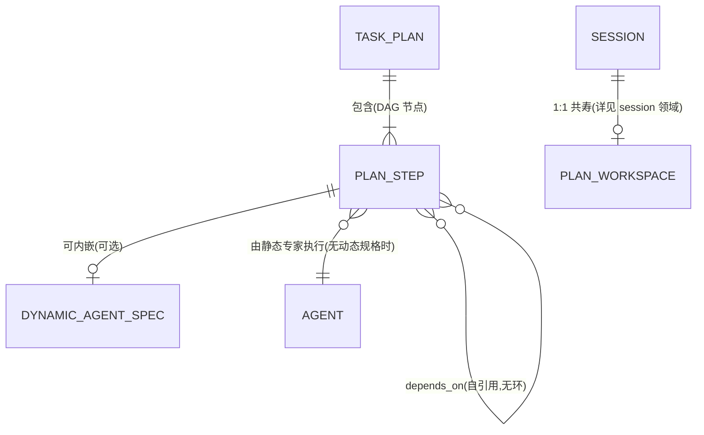

# orchestration 领域模型(models)

> 本文件给出本领域核心实体的用途、属性、关系与状态摘要。源码结构对照 `vv/dispatches/types.go`。业务不变量见 [spec.md](spec.md);装配实现见 [design.md](design.md)。

实体关系概览:

> Task Plan / Plan Step / Dynamic Agent Spec 均为 **瞬态**:仅存活于一次 `plan_task` 触发的 DAG 执行期,不持久化。Plan Workspace 则是 **持久化** 的、属 `session` 领域,本领域仅引用。

---

## Task Plan(任务计划)

- **用途**:一次复杂用户请求被 Primary 拆解成的 DAG;Primary 调 `plan_task` 时构造,描述 goal 与一组形成有向无环图的 step,并跟踪整体进度。
- **性质**:聚合根,瞬态(不跨请求存活)。

| 属性 | 业务类型 | 必填 | 说明 |
|------|---------|------|------|
| plan_id / goal | text | 是 | 计划标识与高层目标(源自用户请求) |
| steps | list&lt;Plan Step&gt; | 是 | 形成有效 DAG(无环);受 `maxConcurrency` 调度 |
| status | enum(Plan Status) | 是 | pending / executing / completed / failed / cancelled |
| created_at / completed_at | datetime | 是 / 否 | 生成时间;终态时置完成时间 |

- **关系**:Has many Plan Step;由 Primary(经 `plan_task`)创建。
- **状态**:见 [spec.md](spec.md)「Task Plan 状态机」。

---

## Plan Step(计划步骤)

- **用途**:Task Plan DAG 中的一个工作单元 / 节点。含要完成什么的描述、执行者(静态专家或内嵌动态规格)、对其他 step 的可选依赖、状态与结果。
- **性质**:实体,瞬态。

| 属性 | 业务类型 | 必填 | 说明 |
|------|---------|------|------|
| step_id / description | text | 是 | 步骤标识;描述作为任务下发给执行者 |
| agent | reference(Agent) | 条件 | 无动态规格时必填;通常 coder / researcher / reviewer |
| dynamic_agent_spec | Dynamic Agent Spec | 否 | 提供时临时构造执行者;**优先于** agent 字段(二者 base type 须一致) |
| dependencies(depends_on) | list&lt;Plan Step&gt; | 否 | 空 = 无依赖可立即执行;不得成环 |
| status | enum(Plan Step Status) | 是 | pending / running / completed / failed / skipped |
| result | text | 否 | 执行完成后填充 |
| started_at / completed_at | datetime | 否 | 状态转移时置 |

- **关系**:Belongs to 一个 Task Plan;自引用 depends_on(同一 plan 内);由静态 Agent 执行或内嵌一个 Dynamic Agent Spec。
- **状态**:见 [spec.md](spec.md)「Plan Step 状态机」。DAG 当前以 `Skip` 策略 + `Optional` 节点执行,单步失败致下游 `skipped`。

---

## Dynamic Agent Spec(动态代理规格)

- **用途**:为某个 Plan Step 临时构造执行者(ephemeral sub-agent)的配置。让 Primary 把代理行为裁剪到该 step 的精确需要,而非用预注册的静态专家。
- **性质**:值对象,内嵌于 Plan Step,无独立生命周期。

| 属性 | 业务类型 | 必填 | 说明 |
|------|---------|------|------|
| base_type | enum(Agent Type) | 是 | 决定基础行为;须为已注册类型(经 registry 校验) |
| system_prompt | text | 是* | 特化该 step 的自定义系统提示;为空则继承 base type 默认(*PRD 标必填,实现允许空回退) |
| tool_access_level | enum(Tool Access Level / ToolProfile) | 是 | 决定工具子集(full / read_only / review / none);为空继承 base type 默认 profile |
| model / max_iterations / temperature | text / number | 否 | 覆盖项;未指定则用系统默认 |

- **关系**:Belongs to(embedded)Plan Step。
- **生命周期**:执行前由 `buildDynamicAgent` 构造为 `dynamic_<base_type>_<step_id>` 命名的 `taskagent`,执行后即弃,**不注册** 到代理注册表(见 [spec.md](spec.md) ORCH-R8、[design.md](design.md)「动态规格」)。

---

## Plan Workspace(计划工作区)— 仅引用

- **用途**:每个 Persistent Session 持有的 **持久化记事板**(plan.md + notes/),把"任务在做什么、做到哪一步、有哪些关键事实"从短期 prompt 剥离到磁盘,使 LLM 跨 run / 跨进程恢复时立即看到上次进度。
- **与本领域的关系**:Primary 经辅助动作 `plan_update` / `notes_write` / `notes_read` 读写;所有 dispatchable agent 经 `WorkspaceSource` 只读注入 prompt。它是 Primary 跨会话规划的载体,但 **存储、容量约束、生命周期、删除一致性均属 `session` 领域**,本领域不重复定义。
- **与瞬态 Task Plan 的区别**:Task Plan 是一次请求内的 DAG 执行结构(瞬态);Plan Workspace 的 plan.md 是跨会话存活的人类可读任务大纲(持久化)。二者不同名同概念,勿混。
- **领域归属**:见 `specs/domains/core/session/`。
