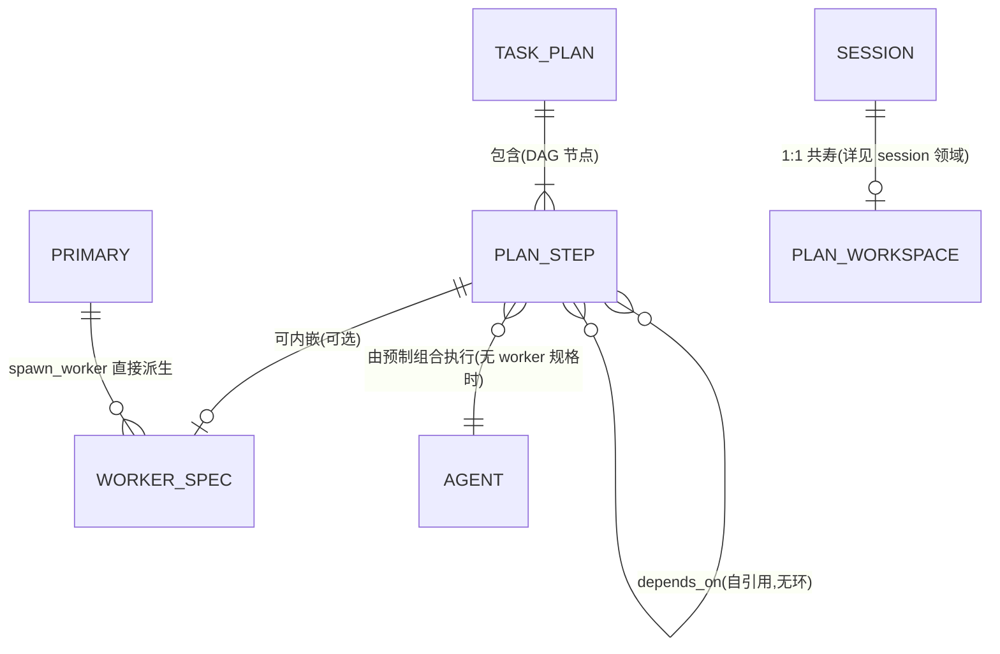

# orchestration 领域模型(models)

> 本文件给出本领域核心实体的用途、属性、关系与状态摘要。源码结构对照 `vv/dispatches/types.go`。业务不变量见 [spec.md](spec.md);装配实现见 [design.md](design.md)。

实体关系概览:

```mermaid
erDiagram
    TASK_PLAN ||--|{ PLAN_STEP : "包含(DAG 节点)"
    PLAN_STEP }o--o{ PLAN_STEP : "depends_on(自引用,无环)"
    PLAN_STEP ||--o| WORKER_SPEC : "可内嵌(可选)"
    PRIMARY ||--o{ WORKER_SPEC : "spawn_worker 直接派生"
    PLAN_STEP }o--|| AGENT : "由预制组合执行(无 worker 规格时)"
    SESSION ||--o| PLAN_WORKSPACE : "1:1 共寿(详见 session 领域)"
```

> Task Plan / Plan Step / Worker Spec 均为 **瞬态**:仅存活于一次 `plan_task` 触发的 DAG 执行期,不持久化。Plan Workspace 则是 **持久化** 的、属 `session` 领域,本领域仅引用。

---

## Task Plan(任务计划)

- **用途**:一次复杂用户请求被 Primary 拆解成的 DAG;Primary 调 `plan_task` 时构造,描述 goal 与一组形成有向无环图的 step,并跟踪整体进度。
- **性质**:聚合根,瞬态(不跨请求存活)。

| 属性 | 业务类型 | 必填 | 说明 |
|------|---------|------|------|
| plan_id / goal | text | 是 | 计划标识与高层目标(源自用户请求) |
| steps | list&lt;Plan Step&gt; | 是 | 形成有效 DAG(无环);受 `maxConcurrency` 调度 |
| status | enum(Plan Status) | 是 | pending / executing / completed / failed / cancelled |
| created_at / completed_at | datetime | 是 / 否 | 生成时间;终态时置完成时间 |

- **关系**:Has many Plan Step;由 Primary(经 `plan_task`)创建。
- **状态**:见 [spec.md](spec.md)「Task Plan 状态机」。

---

## Plan Step(计划步骤)

- **用途**:Task Plan DAG 中的一个工作单元 / 节点。含要完成什么的描述、执行者(预制组合或内嵌 worker 规格)、对其他 step 的可选依赖、状态与结果。
- **性质**:实体,瞬态。

| 属性 | 业务类型 | 必填 | 说明 |
|------|---------|------|------|
| step_id / description | text | 是 | 步骤标识;描述作为任务下发给执行者 |
| agent | reference(Agent) | 条件 | 无 worker 规格时必填;通常 coder / researcher / reviewer |
| dynamic_spec | Worker Spec | 否 | 提供时临时构造执行者;**优先于** agent 字段(二者 base type 须一致) |
| dependencies(depends_on) | list&lt;Plan Step&gt; | 否 | 空 = 无依赖可立即执行;不得成环 |
| status | enum(Plan Step Status) | 是 | pending / running / completed / failed / skipped |
| result | text | 否 | 执行完成后填充 |
| started_at / completed_at | datetime | 否 | 状态转移时置 |

- **关系**:Belongs to 一个 Task Plan;自引用 depends_on(同一 plan 内);由预制组合执行或内嵌一个 Worker Spec。
- **状态**:见 [spec.md](spec.md)「Plan Step 状态机」。DAG 当前以 `Skip` 策略 + `Optional` 节点执行,单步失败致下游 `skipped`。

---

## Worker Spec(worker 规格,旧称 Dynamic Agent Spec)

- **用途**:派生执行者(ephemeral worker)的能力契约。让 Primary 把执行者裁剪到任务的精确需要——**声明能力组合,而不是挑一个人格**。
- **性质**:值对象,无独立生命周期。两个入口共用同一契约:内嵌于 Plan Step(`dynamic_spec`),或作为 `spawn_worker` 的入参。
- **JSON 兼容**:字段名未变,新增项全部可选;既有 DAG 计划与既有 `base_type` / `system_prompt` / `tool_access` / `model` 取值继续解析、行为不变。

| 属性 | 业务类型 | 必填 | 说明 |
|------|---------|------|------|
| base_type | enum(Agent Type) | 是 | **Agent runtime** 维度:决定 Factory 与基础行为;须为已注册类型(经 registry 校验) |
| tool_access | enum(ToolProfile) | 否 | **ToolProfile** 维度:full / review / read-only / none;为空继承 base type 默认 profile。唯一的权限授予轴 |
| skills | list&lt;Skill ID&gt; | 否 | **Skills** 维度:已注册 skill(如 `review`);只追加提示,**不授予工具** |
| context(context_sources) | list&lt;ContextSource ID&gt; | 否 | **ContextSources** 维度:已注册只读来源(如 `diff`),渲染为只读块置于任务指令之前 |
| system_prompt | text | 否 | 特化行为的自定义系统提示;为空则继承 base type 默认。不能扩大工具面 |
| model | text | 否 | **ModelPolicy** 维度:覆盖项;未指定则继承系统配置的模型 |
| isolation | enum | 否 | **IsolationMode** 维度:`isolated`(默认,全新子上下文)/ `shared`(共享会话任务背景) |

> PermissionPolicy 刻意**不是** spec 字段:permission / path guard / sandbox 由装配层统一施加于每个 worker,只能缩减 `tool_access` 装配出的集合,规格无从声明、也无从放宽。

- **关系**:Belongs to(embedded)Plan Step,或独立作为 `spawn_worker` 入参;按 ID 引用 agents 领域的 AgentDescriptor / ToolProfile / Skill / ContextSource。
- **生命周期**:执行前由 `Dispatcher.buildWorker` 构造为 `worker_<base_type>_<n>`(spawn_worker)或 `dynamic_<base_type>_<step_id>`(DAG 节点)命名的 `taskagent`,单次执行后即弃,**不注册** 到代理注册表(见 [spec.md](spec.md) ORCH-R8/R11、[design.md](design.md)「worker 派生」)。实例 ID 在一次进程运行内可关联,不承诺跨运行稳定。

---

## Plan Workspace(计划工作区)— 仅引用

- **用途**:每个 Persistent Session 持有的 **持久化记事板**(plan.md + notes/),把"任务在做什么、做到哪一步、有哪些关键事实"从短期 prompt 剥离到磁盘,使 LLM 跨 run / 跨进程恢复时立即看到上次进度。
- **与本领域的关系**:Primary 经辅助动作 `plan_update` / `notes_write` / `notes_read` 读写;所有 dispatchable agent 经 `WorkspaceSource` 只读注入 prompt。它是 Primary 跨会话规划的载体,但 **存储、容量约束、生命周期、删除一致性均属 `session` 领域**,本领域不重复定义。
- **与瞬态 Task Plan 的区别**:Task Plan 是一次请求内的 DAG 执行结构(瞬态);Plan Workspace 的 plan.md 是跨会话存活的人类可读任务大纲(持久化)。二者不同名同概念,勿混。
- **领域归属**:见 `doc/domains/core/session/`。
