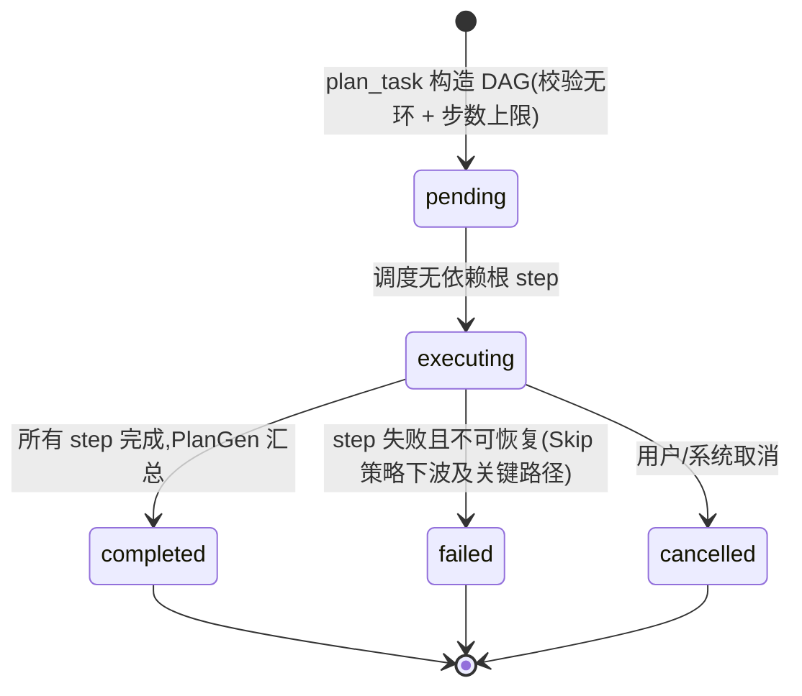
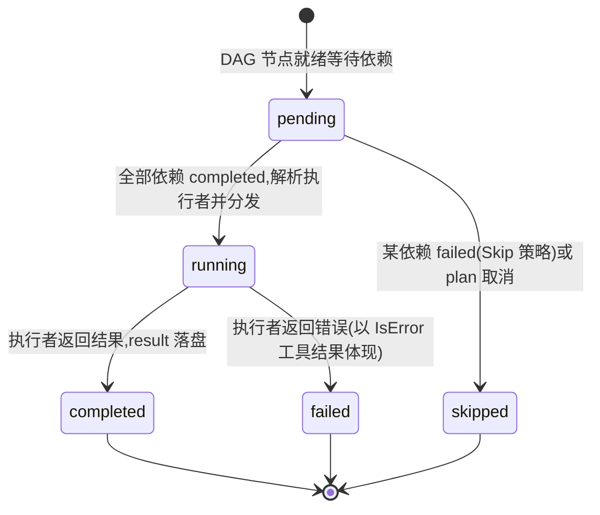

# orchestration 领域规格(spec)

> 本文件描述 **WHAT / WHY**:核心实体、不变量、状态机、领域事件、边界。技术实现(两条物理路径、DAG 构建、worker 派生与装配)见 [design.md](design.md);实体字段见 [models.md](models.md)。DAG 执行模型属 vage。

## Overview

orchestration 是 vv 的核心领域,贯彻 **统一前门、内部分工**:每次用户请求都进入同一个 Dispatcher,由它转交给唯一的 Primary Assistant。Primary 以 ReAct 循环自行决定如何回应 —— 不存在前置的意图分类器或路由器,所有路由决策由 Primary 通过工具调用完成。

领域职责边界:
- **拥有**:Primary / Fallback Primary 的角色契约、Dispatcher 的转发与递归阀门语义、Task Plan / Plan Step / Worker Spec 的生命周期、通用 worker 派生入口(`spawn_worker`)、规划触发的 DAG 编排与汇总、phase 流式事件。
- **不拥有**:专家代理的内部实现与 ToolProfile(属 `agents`)、DAG 通用执行引擎(属 vage `orchestrate`)、Plan Workspace 的存储(属 `session`)、记忆装配(属 `memory`)。

术语(Primary / Fallback Primary / Dispatcher / Dispatchable Agent / 派生 worker)见 [../../../glossary.md](../../../glossary.md);架构不变量(统一前门 / 递归预算)见 [../../../architecture/architecture.md](../../../architecture/architecture.md)。

## Core entities

| 实体 | 性质 | 说明 | 详见 |
|------|------|------|------|
| **Dispatcher** | 单例代理 | 对外单一 `agent.StreamAgent`;对内只"转发到 Primary 或 Fallback"。无意图分类、无总结、无策略选择。 | [models.md](models.md) |
<<<<<<< HEAD
| **Primary Assistant** | 单例代理 | 统一前门,也是**与用户直接协作的主执行 agent**。ReAct 循环,每轮从动作集选一(直答/内联执行/派生 worker/规划);skill、上下文与工具按需激活。工具能力由 execution model 决定。 | [design.md](design.md) |
| **Fallback Primary** | 单例代理 | 与 Primary 共享人格与系统提示,但 **无任何工具**、最大迭代 1。仅在递归超限时使用。 | [design.md](design.md) |
| **Task Plan** | 聚合根(瞬态) | 一次复杂请求被拆解成的 DAG;`plan_task` 触发时构造。 | [models.md](models.md) |
| **Plan Step** | 实体 | DAG 节点;含描述、执行者(预制组合或 worker 规格)、依赖、状态、结果。 | [models.md](models.md) |
| **Worker Spec**(旧称 Dynamic Agent Spec) | 值对象 | 派生执行者的能力契约:base type + 工具子集 + skills + 只读上下文 + 模型 + 隔离模式。既可内嵌于 Plan Step,也可作为 `spawn_worker` 的入参——**同一个契约,两个入口**。 | [models.md](models.md) |
=======
| **Primary Assistant** | 单例代理 | 统一前门。ReAct 循环,每轮从动作集选一(直答/执行/委派/规划);**默认顺序执行**,规划仅在满足 ORCH-R11 时启用。工具能力由 execution model 决定。 | [design.md](design.md) |
| **Fallback Primary** | 单例代理 | 与 Primary 共享人格与系统提示,但 **无任何工具**、最大迭代 1。仅在递归超限时使用。 | [design.md](design.md) |
| **Task Plan** | 聚合根(瞬态) | 一次 **满足规划门槛**(ORCH-R11)的请求被拆解成的 DAG;`plan_task` 触发时构造。 | [models.md](models.md) |
| **Plan Step** | 实体 | DAG 节点;含描述、执行者(静态专家或动态规格)、依赖、状态、结果。 | [models.md](models.md) |
| **Dynamic Agent Spec** | 值对象(内嵌于 Plan Step) | 临时构造执行者的规格:base type + 工具子集 + 自定义系统提示。 | [models.md](models.md) |
>>>>>>> origin/main

> Task Plan / Plan Step / Worker Spec 是 **瞬态** 的:仅存活于一次请求(或一次 DAG 执行期),不持久化(可观测视图经 Session Tree 镜像,见 ORCH-R9)。需要跨会话存活的"任务大纲"是 Plan Workspace 的 plan.md,属 `session` 领域。

## Business rules

| Rule ID | 名称 | 描述 |
|---------|------|------|
| **ORCH-R1** | 统一前门 | 对外只暴露一个 Dispatcher。它不做意图分类、不做总结、不做策略选择;所有路由决策由 Primary 以工具调用承担。新增任务形态 = Primary 声明一种能力组合(`spawn_worker`),不新增角色类型、不改 Dispatcher;值得具名的组合可额外注册为预制组合并获得 `delegate_to_<id>` 快捷方式。 |
| **ORCH-R2** | 执行模型 | `delegated`(默认)下 Primary 不持有写工具,mutation 经 coder;`hybrid` 下 Primary 持有 Full 工具且保留 coder 供隔离/并行;`direct` 下 Primary 持有 Full 工具且不挂 `delegate_to_coder`。Fallback Primary 始终无工具。所有模式共享 permission / path guard / sandbox。 |
| **ORCH-R3** | 递归硬阀门 | 递归深度经 `context` 携带。Dispatcher 入口统一检查:`depth >= maxRecursionDepth`(默认 2)时强制切换到无工具的 Fallback Primary,**物理上**消除再次委派/再次规划的可能。这是硬阀门,不是计数式 try/limit。 |
| **ORCH-R4** | 派生 +1 | 任何派生执行(`spawn_worker` 或 `delegate_to_<id>`)触发时,递归深度 +1 后传给被派生执行者。它在自己的 ReAct 循环中独立完成;若再次进入 Dispatcher(例如经 ask_user 链),同一上限再次生效,不可能突破。调用方 `context`、session ID 与取消信号必须一并传入:父请求取消后 worker 必须停止模型与工具执行,并正常闭合可观测生命周期。 |
| **ORCH-R5** | 子代理结果折叠 | 子代理的回答以 **工具结果** 形式回到 Primary,被 Primary 折叠进自己的最终回复 —— 而非原样转发。用户始终看到一个连贯的 Primary 视角。 |
| **ORCH-R6** | 子代理失败不冒泡 | 子代理失败 **不** 冒泡为 Run 错误,而是以 `IsError=true` 的工具结果返回 Primary。Primary 据此继续决策(改派、改直答、向用户澄清),整轮请求不 abort。 |
| **ORCH-R7** | DAG 共享递归预算 | `plan_task` 触发的整个 DAG 共享一个递归预算(在 Primary 预算上 +1)。所有 step(含并行 step、派生 worker step)落在同一上限之内。 |
| **ORCH-R8** | 派生 worker 能力组合 | **任意 Primary 派生(`spawn_worker`)或 DAG 动态节点** 都可由 Worker Spec 临时构造执行者:base type 决定 runtime,`tool_access`(ToolProfile)决定工具子集,skills 决定产出纪律,context 决定注入的只读上下文,isolation 决定是否共享任务背景。两个入口 **共用同一构造路径**,因而权限面必然一致。派生 worker **即用即弃**,不注册到代理注册表、不出现在 HTTP 子端点或 MCP 暴露列表中。 |
| **ORCH-R9** | 写树镜像失败不阻塞 | 启用 Session Tree 且打开"分发器写树"开关时,每次 `plan_task` 把 plan 镜像为树节点(首次建 goal 根,后续追加子树)。镜像 **失败仅记告警,不阻塞 DAG 执行** —— 树是辅助视图,不是关键路径。 |
| **ORCH-R10** | 单一 phase 信封 | 每次请求发出一对 phase 事件包住 Primary 整个执行(`unified_primary`);Fallback 路径额外发一对 `summarize` 静态 phase(零 LLM 调用),使 SSE 消费者无需分支判断走了哪条物理路径。 |
<<<<<<< HEAD
| **ORCH-R11** | 规格校验前置且全量 | Worker Spec 的 base type(必填且已注册)、`tool_access`(合法 ProfileByName)、skills、context source、isolation 全部在构造前校验;任一不合法 → **不产生 worker**,以可诊断的工具错误回到 Primary。context source provider 失败同样中止派生,绝不让 worker 在缺少既定上下文的情况下运行。 |
| **ORCH-R12** | 预制组合是快捷方式而非特权 | `delegate_to_coder/researcher/reviewer` 是预制组合的适配器:它们与等价 Worker Spec 的工具面相同,并共享同一执行路径(递归 +1、会话标记、流式 SubAgentStart/End、错误折叠)。差别只在"由启动期实例执行"(因而保留 memory / checkpoint / 上下文源装配),不在能力表达力。 |
=======
| **ORCH-R11** | 规划门槛(显式高级能力) | 顺序执行是默认路径;`plan_task` 是显式高级能力,仅在 **四项条件同时成立** 时启用:① 至少两个真正独立的工作流(非同一修改的连续切段);② 并行有实际墙钟收益;③ 次序可用 `depends_on` 表达或分支无依赖;④ 用户明确要求并行或要求长任务后台执行。普通 bug fix、单文件/单符号修改、只需顺序检查清单的任务 **不得** 走 `plan_task`。门槛是 **提示层决策契约**(系统提示与工具描述必须一致),**不是运行时拒绝规则**:执行器对已提交的有效 DAG 照常执行,不引入前置分类器或"是否值得并行"的硬校验。 |
>>>>>>> origin/main

> 规则刻意只保留 **不变量与边界**。逐步流程(哪轮选哪个动作、DAG 如何调度并行)由代码承载,不在此复述。

## States & transitions

Task Plan 与 Plan Step 的状态枚举为权威值;转移触发与后置动作见 [models.md](models.md)。

### Task Plan 状态机

```mermaid
stateDiagram-v2
    [*] --> pending: plan_task 构造 DAG(校验无环 + 步数上限)
    pending --> executing: 调度无依赖根 step
    executing --> completed: 所有 step 完成,PlanGen 汇总
    executing --> failed: step 失败且不可恢复(Skip 策略下波及关键路径)
    executing --> cancelled: 用户/系统取消
    completed --> [*]
    failed --> [*]
    cancelled --> [*]
```

### Plan Step 状态机

```mermaid
stateDiagram-v2
    [*] --> pending: DAG 节点就绪等待依赖
    pending --> running: 全部依赖 completed,解析执行者并分发
    pending --> skipped: 某依赖 failed(Skip 策略)或 plan 取消
    running --> completed: 执行者返回结果,result 落盘
    running --> failed: 执行者返回错误(以 IsError 工具结果体现)
    completed --> [*]
    failed --> [*]
    skipped --> [*]
```

> 当前 DAG 执行采用 `Skip` 错误策略且节点标记为 `Optional`:单个 step 失败不中断整个 DAG,其下游被 skip,已完成结果仍由 PlanGen 汇总。详见 [design.md](design.md)「规划语义」。

## Domain events

本领域不定义 vv 私有事件,复用 vage schema 事件类型(回链 [../../../glossary.md](../../../glossary.md))。orchestration 直接产出的 phase 事件:

| 事件 | Phase | 触发时机 | 载荷要点 | 消费者 |
|------|-------|---------|---------|--------|
| `EventPhaseStart` / `EventPhaseEnd` | `unified_primary` | 包住 Primary 整个执行(主路径) | duration、toolCalls、promptTokens、completionTokens(经 phaseTracker 累加) | SSE / TUI 流式输出、cost 仪表盘 |
| `EventPhaseStart` / `EventPhaseEnd` | `summarize` | Fallback 路径,Fallback 流之后追加 | 固定 sentinel 文本,零 LLM 调用 | 同上(无需分支判断路径) |

其余事件(`EventToolCallStart`、`EventLLMCallEnd`、子代理流事件)由 Primary / 子代理在其 ReAct 循环内产生并透传,经统一事件总线分发给 trace / session / budget / debug 等可选子系统。

## Interactions

| 协作方 | 关系 | 契约 |
|--------|------|------|
| `agents`(能力维度 + 预制组合) | 被派生 / 被 DAG 节点执行 | Primary 经 `spawn_worker` 按能力组合派生 worker,或经 `delegate_to_<id>` 使用预制组合(仅 coder/researcher/reviewer 三类 dispatchable;chat/explorer 已移除,Primary 内联承担);DAG step 引用预制组合或 worker 规格。ToolProfile / Skill / ContextSource 由 `agents` 定义,本领域只按 ID 引用与校验。 |
| `session`(Session Tree) | 镜像写入 | `plan_task` 把 plan 镜像为树节点(ORCH-R9),失败不阻塞。 |
| `session`(Plan Workspace) | 辅助记事板 | Primary 经 `plan_update` / `notes_*` 持久化跨会话任务结构(只读注入所有 dispatchable agent 的 prompt)。属 session 领域,本领域仅引用。 |
| `configuration` / routing | 装配 / 小模型 | routing 启用时为意图/汇总类调用构造指向 **更便宜小模型** 的独立 LLM 客户端;Dispatcher 经 setup 注入 Primary、Fallback、子代理、PlanGen 句柄。 |
| `cli` / `http-api` / `mcp` | 触发入口 | 三者把 Dispatcher 当普通 `agent.StreamAgent` 注册;初始递归深度 0。 |

## Non-goals

- **不做前置意图分类**:没有独立的 intent / router / planner 代理预判任务类型;路由是 Primary 在 ReAct 循环里的一次工具选择。旧 `intent → execute → summarize` 三段管道已彻底废弃(废弃史见 [design.md](design.md))。
- **用户不可定义代理**:Worker Spec 由 Primary 生成,**不** 暴露给终端用户自定义代理人格/工具集的入口。base type 必须是已注册类型,工具访问级别必须是合法 ToolProfile,skill / context source 必须已注册,模型只能取系统已配置值。自然语言可以影响 Primary 的判断,但不能成为绕过 allow-list 的通道。
- **不做运行期注册 / 热插拔 / 持久 worker**:派生实例始终单次执行、即用即弃;不新增自定义 Profile,四档名称与含义不变。
- **worker 不是第二个写者**:派生 worker 不获得 Primary 专属的 Plan Workspace / Session Tree 写工具;需要修改共享计划时返回建议,由 Primary 单写者处理(AGENTS-R8)。
- **不承诺跨进程 DAG 编排**:DAG 在单进程内执行;Task Plan 不持久化、不跨进程恢复(可观测镜像除外)。
- **Primary 不做总结管道**:Primary 不存在独立的"summarize 阶段";它把子代理结果就地折叠进回复。Fallback 路径的 `summarize` phase 是零调用的事件占位,不是真实汇总。

## Anti-scenarios(必须永不发生)

- **执行模型越权**:`delegated` 下 Primary 不得持有写工具;`direct` 下不得挂 `delegate_to_coder`;Fallback Primary 在任何模式下都不得持有工具。`hybrid` / `direct` 的 mutation 不得绕过 permission / path guard / sandbox。
- **派生 worker 绕过护栏**:worker 的工具**不得**跳过 path guard / guardian 与 permission 包装链;spec 的 skill、system_prompt、context 也**不得**扩大 `tool_access` 授予的集合。
- **半装配 worker 启动**:规格非法或上下文来源解析失败时,**不得**启动一个"部分装配"的 worker;必须以可诊断的工具错误回到 Primary。
- **脱缰 worker**:父请求取消后**不得**留下继续运行的 worker;也不得出现未闭合的 SubAgentStart(缺 SubAgentEnd)。
- **递归突破上限**:无论委派链多深、子代理是否再次触发 Dispatcher,递归深度 **不得** 超过 `maxRecursionDepth`。达到上限必落到无工具 Fallback Primary 并在有限步骤(最大迭代 1)内回应用户;任何"绕过深度检查继续递归"的路径都违反 ORCH-R3。
- **子代理失败 abort 整轮请求**:子代理执行失败 **不得** 表现为 Run 级错误使整轮请求崩溃 —— 必须以 `IsError=true` 工具结果回到 Primary(ORCH-R6)。
- **写树失败阻塞业务**:Session Tree 镜像失败 **不得** 中断 DAG 执行或使请求失败(ORCH-R9)。
- **把 DAG 当默认路径**:提示契约 **不得** 让"任务有多个步骤"或"涉及多个专家能力域"单独成为规划理由;普通 bug fix、单点修改被拆成多步 DAG 是过度规划(ORCH-R11)。反向亦禁止:**不得** 因为收窄触发条件就在执行器里加"是否值得并行"的运行时拒绝或前置分类器。

## Data dictionary

| 术语 | 定义 |
|------|------|
| **统一前门(unified front door)** | 对外只有一个 Dispatcher 入口的架构形态;策略由 Primary 内化。 |
<<<<<<< HEAD
| **派生(spawn)** | Primary 按 Worker Spec 临时构造一个单次执行者并交付子任务,递归深度 +1;执行完即弃。 |
| **委派(delegate)** | 派生的特例:目标固定为某个预制组合(`delegate_to_<id>`),由启动期实例执行。 |
| **规划(plan)** | Primary 经 `plan_task` 把跨多专家能力域的任务拆解为 DAG 并发执行。 |
=======
| **委派(delegate)** | Primary 经 `delegate_to_<专家>` 把一个干净映射到某专家的子任务交给该专家执行,递归深度 +1。 |
| **规划(plan)** | Primary 经 `plan_task` 把 **满足 ORCH-R11 四项门槛** 的任务拆解为 DAG 并发执行。属显式高级能力,非多步任务的默认路径;默认路径是 Primary 自己顺序执行(进度用 `todo_write` 呈现)。 |
>>>>>>> origin/main
| **折叠(fold)** | 子代理/DAG 的结果作为工具结果被 Primary 并入其连贯最终回复,而非原样转发。 |
| **递归深度(recursion depth)** | 经 `context` 携带的整数,记录当前委派/规划嵌套层数;Dispatcher 入口检查的硬阀门变量。 |
| **worker 规格(worker spec)** | 派生执行者的能力契约(旧称动态规格);由 `spawn_worker` 与 DAG 动态节点共同消费。 |
| **预制组合(preset combination)** | 启动期注册的具名能力组合:coder / researcher / reviewer。 |
| **PlanGen** | 把 DAG 多终端结果汇总为单一文本返回 Primary 的汇总器(可指向小模型)。 |
| **phase 信封** | 包住一段执行的一对 `EventPhaseStart` / `EventPhaseEnd` 事件。 |
