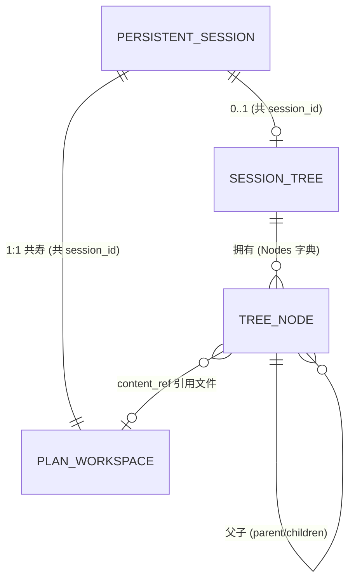

# session — Domain Models

本领域四个实体共用字符串 `session_id`、同一存储根。下表为业务语义视图。

实体关系总览:

## Persistent Session

**用途**:vv 端会话一等公民;把跨进程对话历史固化为文件系统实体,持有事实全集(元数据 + 全量事件 + 状态 KV)。

| 属性 | 语义类型 | 必填 | 说明 |
|------|---------|------|------|
| id | text | 是 | `^[A-Za-z0-9._-]{1,128}$`;三子系统共享 |
| agent_id | text | 否 | autoCreate 时取自首个事件 |
| user_id | text | 否 | 多租户预留 |
| title | text | 否 | 经 PATCH 设置 |
| state | enum | 是 | active/paused/completed/failed(元数据标签,非状态机) |
| metadata | map | 否 | 自由 KV;tags 约定放 `metadata["tags"]` |
| created_at | timestamp | 是 | Create 时盖戳 |
| updated_at | timestamp | 是 | metadata/state 变更时刷新;**不**反映事件追加 |

事件流(append-only)与状态 KV(覆盖语义)不内嵌,经独立 store 寻址,使 `Get` 保持 O(1)。

**关系**:1:1 共寿 Plan Workspace;0..1 拥有 Session Tree;承载全量 Trace Event(events.jsonl,行格式同 Trace File);与 Session Memory 共 session_id(正交)。

**状态**:`state` 是标签,任意切换不影响事件追加;真正生命周期由共根目录的存在与否表达(Delete 即一次 RemoveAll)。

## Plan Workspace

**用途**:每会话 1:1 的持久化记事板;把"在做什么、做到哪步、关键事实"从短期 prompt 剥离到磁盘。仅 Primary 可写,专家只读(SESS-R2)。非单一对象,而是隶属 Session 的一组文件资源。

| 属性 | 语义类型 | 必填 | 说明 |
|------|---------|------|------|
| session_id | text | 是 | 与 Session.id 一致 |
| plan_content | text | 否 | plan.md 全文;≤ 64 KiB;空 = 无 plan |
| notes | list\<Note\> | 否 | 每会话 ≤ 200 条 |

每个 Note:

| 属性 | 语义类型 | 必填 | 说明 |
|------|---------|------|------|
| name | text | 是 | `^[A-Za-z0-9._-]{1,64}$`,拒绝 `.`/`..` |
| content | text | 是 | ≤ 32 KiB;空 = 删除 |
| bytes | integer | 是 | ListNotes 时填充 |
| updated_at | timestamp | 是 | 由文件 ModTime 派生 |

**关系**:1:1 共寿 Persistent Session(共 session_id、共目录根、随 Session.Delete 一并删);写入触发 `workspace.plan_updated` / `workspace.note_written` 事件;与 Session Memory 共 session_id。

**状态**:懒创建(首次写触发);超 MaxPlanBytes 时注入 prompt 截断保留尾部;删除随共根 RemoveAll。

## Session Tree

**用途**:会话级层级化任务结构化记忆;长任务的目标-子任务图,支持折叠做渐进抽象。

| 属性 | 语义类型 | 必填 | 说明 |
|------|---------|------|------|
| session_id | text | 是 | 与 Session.id 同字符串 |
| root_id | text | 否 | 创建第一节点(CreateTree)时自动设置 |
| cursor | text | 否 | 当前焦点节点;空时 render 回落 root |
| nodes | map\<text, TreeNode\> | 是 | 节点字典;单棵 ≤ 1024,越界 `ErrTreeFull` |
| updated_at | timestamp | 是 | 任何写操作刷新 |

**关系**:与 Persistent Session 共 session_id、同根(DELETE 自动清理);拥有 Tree Node 字典(按 id 寻址);与 Plan Workspace 互补(plan.md 给人看,tree 给 LLM 导航,二者经 `vctx.Source` 注入 prompt)。

**状态**:折叠由 Promotion 驱动,触发器 `AnyOf(ChildrenCount, SubtreeBytes [, AllChildrenDone])`;auto-enable 门控控制是否渲染(SESS-R6)。事件:`session_tree.updated` / `.promotion.started|completed|failed`。

## Tree Node

**用途**:Session Tree 中单个可寻址节点;构成 root → subtask → fact/observation/artifact_ref 的树骨架。`title` 永驻 prompt(结构信号),`summary` 按预算驻留(浓缩信号),`content_ref` 指向 artifact(细节信号)。

| 属性 | 语义类型 | 必填 | 说明 |
|------|---------|------|------|
| id | text | 是 | `tn-<unix-nanos>-<8-hex>`,文件系统安全 |
| type | enum | 是 | goal/subtask/fact/observation/artifact_ref;**不可变** |
| status | enum | 是 | pending/active/done/blocked/superseded |
| title | text | 是 | ≤ 200 字节;永入 prompt |
| summary | text | 否 | ≤ 2 KiB;按 budget 决定是否入 prompt |
| content_ref | text | 否 | 指向 plan.md / notes/ / artifacts/(相对路径) |
| evidence | text[] | 否 | 支撑事件/观测 id;审计追踪 |
| supersedes | text[] | 否 | 替代的旧节点 id(增量校正不删,保可追溯) |
| pinned | bool | 否 | 默认 false;true 永不折叠 |
| promoted | bool | 否 | 默认 false;PromoteNode 设 true |
| promoted_at | timestamp | 否 | 仅 promoted=true 时非零 |
| parent | text | 否 | root 为空;**不可变** |
| children | text[] | 否 | store 维护(AddNode/DeleteNode 自动 patch) |
| depth | int | 是 | root=0 |
| created_at / updated_at | timestamp | 是 | store 设置 / mutation 刷新 |
| metadata | map | 否 | 约定 `summary_source`:user / promotion |

(`embedding_id` 为双索引扩展点,本期未实现自动写入。)

**关系**:属于 Session Tree(经 `Nodes[id]` 反查);父子(`parent`/`children`,root.parent="");`content_ref` 引用 Workspace File。

**状态**:两个正交维度——生命周期 `status`(由 LLM 经 `tree_*` 工具驱动)与折叠标志 `promoted`(状态机见 [spec.md](spec.md))。可变字段:title/summary/status/content_ref/embedding_id/evidence/supersedes/pinned/promoted/metadata;不可变:type/parent(改值返回 `ErrImmutableField`)。删除约束:仅叶节点可 DeleteNode(非叶 `ErrHasChildren`),root 经 DeleteTree 整棵清(幂等)。
