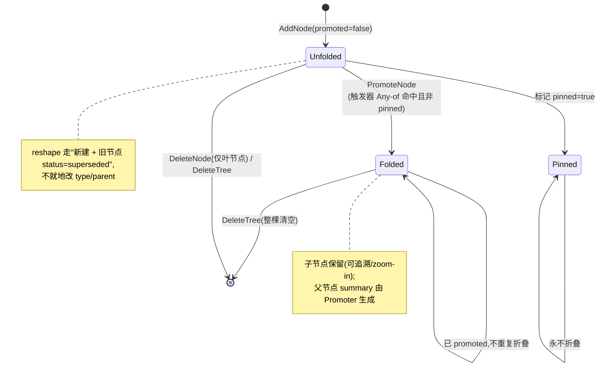

# session — Domain Spec

## Overview

session 领域把三个相互正交、却共享同一会话身份的 vage 子系统组合成 vv 端统一的"持久化任务状态"层:

1. **Persistent Session** —— 把跨进程的对话历史固化为文件系统实体:元数据 + append-only 事件流 + 状态 KV。
2. **Plan Workspace** —— 任务级的持久化记事板:人类可读的 `plan.md` + 长期事实 `notes/`。
3. **Session Tree** —— 长任务的结构化目标-子任务图,支持折叠(Promotion)做渐进抽象。

三者共用同一字符串 `session_id`、同一存储根目录 `<session-root>/<project>/<id>/`。这是本领域的核心设计取舍:**共根 → 删除一致性自动达成**(`DELETE` 一次目录递归删除清掉全部三套状态,无需跨子系统协调)。

**范围**:三子系统的业务语义、共享会话身份、启用关系、写者唯一协作模型、折叠语义、auto-enable 门控、写树镜像、共根删除一致性。

**边界**:本领域不实现底层文件存储协议(归 vage 的 `session`/`workspace`/`session/tree` 包);不负责把会话内容投影为 LLM prompt 的有损切片(那是 [memory](../memory/memory-overview.md) 领域的 Session Memory,二者仅共用 `session_id`);不实现镜像写树的触发源(归 [orchestration](../orchestration/orchestration-overview.md))。装配与启停决策归 [configuration](../configuration/configuration-overview.md)。

术语见 [../../../glossary.md](../../../glossary.md)。底层协议属 vage,本 spec 引用而不复述。

## Core entities

| 实体 | 职责 | 详见 |
|------|------|------|
| Persistent Session | 会话元数据 + append-only 事件流 + 状态 KV;事实全集 | [models.md](models.md) |
| Plan Workspace | 每会话 1:1 的持久记事板:plan.md + notes/;仅 Primary 可写 | [models.md](models.md) |
| Session Tree | 会话级层级化目标-子任务图;支持折叠 | [models.md](models.md) |
| Tree Node | Session Tree 中单个可寻址节点(goal/subtask/fact/observation/artifact_ref) | [models.md](models.md) |

完整字段引用 [vv-prd/models/core/session/](../../../../vv-prd/models/core/session/) 与 [workspace/](../../../../vv-prd/models/core/workspace/model-plan-workspace.md)。

## Business rules(不变量)

| ID | 规则 | 说明 |
|----|------|------|
| SESS-R1 | 共根删除一致性 | Session / Plan Workspace / Session Tree 共用 `<session-root>/<project>/<id>/` 目录根;`DELETE` 经一次 `os.RemoveAll(<root>/<id>)` 递归删除清掉全部三套状态,幂等,不留孤儿。对应 constitution § 4。 |
| SESS-R2 | 写者唯一 | Plan Workspace(plan.md + notes/)**只有 Primary Assistant 能写**;所有 dispatchable 专家代理通过 `WorkspaceSource` **只读**注入 prompt。专家需要 note 全文时由 Primary 调 `notes_read` 后回写到专家上下文。对应 constitution § 5。 |
| SESS-R3 | 启用关系强校验 | Session 默认开,显式关 → 三者全关;Plan Workspace 跟随 Session 不可单独控制;Session Tree 默认关,启用需"显式开 + Session 必须开"。`session_tree.enabled=true` 而 `session.enabled=false` 在装配阶段直接报错,不沉默忽略。对应 constitution § 6、CONFIG-R3。 |
| SESS-R4 | plan vs todo 边界 | plan 是**跨会话**的长策略(持久化到 plan.md);todo 是**仅当前 turn**的检查清单(内存级)。二者并存而非替代,不互相覆盖。 |
| SESS-R5 | 折叠语义有损可逆 | Promotion 把过载子树折叠为父节点 summary;子节点**保留**并标 `Promoted=true`,默认从渲染视图隐藏并加 `(folded: N children, M done)` 提示。`Pinned=true` 子节点永不折叠;`tree_zoom_in` 或 `?include_promoted=1` 可重新看到。 |
| SESS-R6 | auto-enable 门控 | Session Tree 启用后,在累积 N 个 agent 完成(AgentEnd)事件**之前不渲染** tree 视图(仍可手动激活);达阈值后才付出渲染成本。计数是**进程级**,重启清零(UX 提示而非审计事实)。 |
| SESS-R7 | 写树镜像失败不阻塞 | 启用 Session Tree 且打开"分发器写树"开关时,每次 `plan_task` 把 plan 镜像为 tree 节点(首次创建 goal 根,后续在根下追加子树);镜像失败**仅记录告警,不阻塞** DAG。对应 constitution § 5"失败不冒泡为 abort"。 |
| SESS-R8 | id-only 恢复 | MVP 仅复用 `session_id` 让记忆/plan/tree 共目录,**不重放对话历史**;完整 checkpoint+replay 在路线图中。会话不引入状态机:任何"当前状态"可由事件流回放计算得到。 |
| SESS-R9 | 容量上限即错误 | plan.md ≤ 64 KiB、单条 note ≤ 32 KiB、note 数 ≤ 200、单棵树节点 ≤ 1024。超限对 LLM surface 一个明确错误(`ErrTreeFull` 等),由模型决定如何分拆,避免 prompt 无限增长。 |

底层字段约束(IDPattern、节点不可变字段、删除约束)属 vage,见 [models.md](models.md) 与 vv-prd 模型,不在此复述。

## States & transitions

### Tree Node 折叠状态机

Tree Node 有两个正交维度:**生命周期 status**(pending/active/done/blocked/superseded)与**折叠标志 promoted**。下图聚焦折叠状态机(promoted 维度);status 流转由 LLM 经 `tree_*` 工具驱动,`type`/`parent` 创建后不可变。

折叠触发器组合 `AnyOf(ChildrenCount, SubtreeBytes [, AllChildrenDone])`,AddNode/UpdateNode 后同步判断、异步执行;per-(session, parent) singleflight 防重入。阈值见 [design.md](design.md)。

Persistent Session 的 state 字段(`active`/`paused`/`completed`/`failed`)是元数据标签而非状态机——切换不影响事件追加(SESS-R8)。

## Domain events

| 事件 | 触发 | 消费者 |
|------|------|--------|
| `workspace.plan_updated` | Primary 经 `plan_update` 写 plan.md | trace 落盘;写树镜像可据此追节点 |
| `workspace.note_written` | Primary 经 `notes_write` 写 note | trace 落盘 |
| `session_tree.updated` | CreateTree/AddNode/UpdateNode/DeleteNode/SetCursor/DeleteTree 完成 | trace;HTTP 查询读最新视图 |
| `session_tree.promotion.started` / `.completed` / `.failed` | PromoteNode 异步路径各阶段 | trace;`.failed` 仅告警不阻塞(SESS-R7) |
| (Persistent Session 事件) | 任意 agent/tool 事件经 SessionHook 落入 events.jsonl | 行格式与 Trace File 一致;由 [trace](../trace/trace-overview.md) 共用事件总线持久化 |

Persistent Session 自身不定义独立事件 schema;它**承载**全量 agent/tool 事件(append-only),与 trace 共用同一事件总线(constitution § 6"不污染主路径")。

## Interactions

| 协作领域 | 关系 |
|----------|------|
| [configuration](../configuration/configuration-overview.md) | 装配中心构造 SessionStore/Workspace/TreeStore/MetricsStore(均可为 nil);强校验启用关系(SESS-R3) |
| [orchestration](../orchestration/orchestration-overview.md) | Primary 经 `plan_update`/`notes_*` 写 Workspace(写者唯一);`plan_task` 被镜像为 tree 节点(SESS-R7) |
| [cli](../cli/cli-overview.md) / [http-api](../http-api/http-api-overview.md) | 查询会话列表/详情/事件、读 Plan Workspace 文件、Session Tree 节点 CRUD/折叠;HTTP `DELETE /v1/sessions/{id}` 触发共根删除(SESS-R1) |
| [trace](../trace/trace-overview.md) | 共用事件总线:SessionHook 与 TraceHook 同为旁路订阅者,异步落盘 |
| [memory](../memory/memory-overview.md) | 共用 `session_id`;Persistent Session 是事实全集,Session Memory 是 prompt 有损切片,二者正交 |

## Non-goals

- **不做 checkpoint + replay 重放**:MVP 为 id-only 恢复(SESS-R8),不重建对话历史。
- **不引入会话状态机**:state 字段是标签,不约束事件追加;当前状态由事件回放得到。
- **不做跨进程并发写保证**:Workspace 写入仅进程内 per-session mutex 串行化,跨进程不承诺。
- **不做 notes ↔ memory.Store 双写同步**:本期无 WorkspaceMemoryAdapter。
- **不实现底层文件存储协议**:归 vage 包,本领域只组合与赋予业务语义。
- **不持久化 auto-enable 计数**:进程级计数,重启清零(SESS-R6),不引入持久化复杂度。

## Anti-scenario(绝不能发生)

- **绝不**让专家代理(coder/researcher/reviewer)写 Plan Workspace。专家只有 `WorkspaceSource` 只读注入,无 `plan_update`/`notes_write` 工具;任何让专家直接落盘 plan/note 的设计违反写者唯一(SESS-R2),会导致多专家并发覆盖。
- **绝不**在 `session.enabled=false` 时构造 Workspace/Tree 或挂载其路由(违反零成本默认);也绝不在 Session 关闭时静默启用 Session Tree(必须启动期报错,SESS-R3)。
- **绝不**因写树镜像失败而中断 DAG(SESS-R7)。
- **绝不**让 `DELETE` 只清掉部分子系统而留下孤儿 plan/tree(违反共根删除一致性,SESS-R1)。

## Data dictionary

| 术语 | 语义类型 | 定义 |
|------|---------|------|
| session_id | text | 会话唯一标识,`^[A-Za-z0-9._-]{1,128}$`;三子系统共享 |
| session-root | 路径 | 会话存储根,默认 `~/.vv/sessions`,经 `session.dir`/`VV_SESSION_DIR` 覆盖 |
| project_path_name | text | 由工作目录派生的人类可读桶名(分隔符→`_`,其他→`-`,空→`default`) |
| 共根 | 概念 | 三子系统落于同一 `<root>/<project>/<id>/`,删除一致性自动达成 |
| 写者唯一 | 概念 | Plan Workspace 仅 Primary 可写,专家只读 |
| Promotion(折叠) | 概念 | 把过载子树折叠为父节点 summary;有损可逆,子节点保留 |
| Promoter(折叠器) | enum | `compressor`(默认零 LLM)/ `llm` / `noop` |
| auto-enable 门控 | 概念 | 累积 N 个 AgentEnd 前不渲染 tree;进程级计数,重启清零 |
| 写树镜像 | 概念 | `plan_task` 镜像为 tree 节点;失败仅告警不阻塞 |
| plan vs todo | 边界 | plan=跨会话长策略(持久);todo=当前 turn 检查清单(内存) |
| id-only 恢复 | 概念 | 复用 session_id 共目录但不重放对话历史 |
