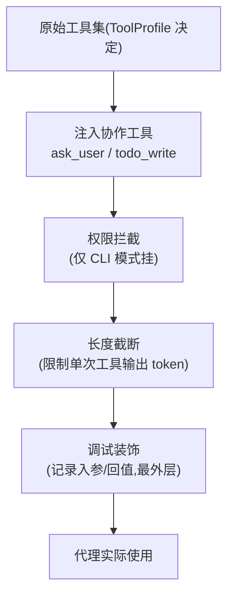
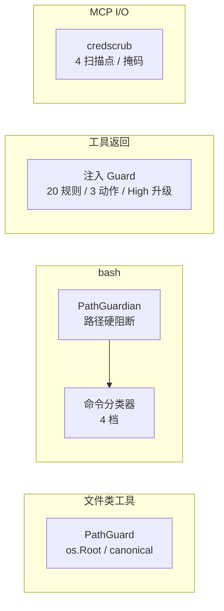

# tools 领域设计(design)

> HOW。业务行为见 [spec.md](spec.md);实体字段见 [models.md](models.md);量化安全约束见 [../../../non-functional/security.md](../../../non-functional/security.md)。能从代码恢复的细节(完整规则正则、工具参数)以链接承载,本文不复述。
>
> 源码:`vv/tools/`(工具注册与 web_search 工厂)、`vv/registries/tool_access.go`(ToolProfile 与能力分级)。

## 工具来源与归类

vv 不自实现工具实体——全部来自 vage 的 `tool/<name>` 子包(`bash`/`read`/`write`/`edit`/`glob`/`grep`/`webfetch`/`websearch`),`ask_user`/`todo_write` 在装配阶段注入。工具按 **来源与可见性** 分类:

| 类别 | 工具 | 谁能用 |
|------|------|-------|
| 基础文件工具 | read / write / edit / glob / grep | 由 ToolProfile 决定 |
| 执行工具 | bash | 仅 Full / Review profile |
| 网络工具 | web_fetch、可选 web_search | ReadOnly 及以上(归 Read 能力) |
| 协作工具 | ask_user、todo_write | 几乎所有非 None 代理 |
| 路由 / 持久化工具 | `delegate_to_*` / `plan_task` / `plan_update` / `tree_*` | 仅 Primary(属 agents/orchestration 领域) |

路由与持久化工具是 Primary 区别于专家的关键标志:**写权集中于 Primary,专家只能读对应子系统视图**(写者唯一模式,详见 agents 领域)。

## 能力分级 ToolProfile

> AgentDescriptor / 注册表生命周期 / 下游消费者(委派工具、HTTP 路由、MCP 暴露)等属 agents 领域,不在此重复。

四档预设(`ProfileFull/ProfileReview/ProfileReadOnly/ProfileNone`):

| Profile | Capabilities | 典型代理 |
|---------|-------------|---------|
| Full | read + write + execute + search | Coder |
| Review | read + search + execute | Reviewer |
| ReadOnly | read + search | Researcher / Primary(默认) |
| None | ∅ | Planner / Fallback Primary |

预设之外允许自定义(动态规格场景),但日常应优先映射四档以保持一致性。`ProfileByName` 把 `full/read-only/review/none` 字符串解析为预设,供 [orchestration](../orchestration/) 的动态代理使用。

**能力 → 工具映射**(`registerCapabilityTools`,装配期翻译):

| Capability | 注册的工具 |
|-----------|-----------|
| Read | read + web_fetch + 可选 web_search |
| Write | write + edit |
| Execute | bash(受超时、路径黑名单约束) |
| Search | glob + grep |

设计取舍:**公网检索归 Read 而非 Search**——模型语义上把它当"获取外部信息",与"在已知项目里找东西"是不同认知模式。

`BuildRegistry(toolsCfg, opts...)` 每次新建一个 `tool.Registry`,按 profile 的 Capabilities 逐个注册工具,并通过 `RegistryOption`(`WithPathGuard`/`WithPathGuardian`)注入横切护栏。None profile 直接返回空注册表(零成本)。

## 装饰链

每个代理实际拿到的注册表都经统一装饰,顺序固定:

两条 **硬约束**(对应 TOOLS-R7)及其理由:

- **权限在内、调试在外** — 权限拦截需看到 **原始工具名** 做策略匹配,故必须紧贴原始集;调试需记录代理"实际看到"的(已截断)结果,故在最外层。
- **截断在权限之外** — 截断只应影响代理可见回值长度,**不得影响权限决策**,故排在权限之后、调试之前。

## 权限模型(仅 CLI)

CLI 交互模式下,工具调用前过一道权限关,由 **当前权限模式 × 工具危险度** 共同决定:

| 模式 | 读类工具 | 写/编辑 | Safe bash | Dangerous bash | Blocked bash |
|------|---------|--------|-----------|----------------|-------------|
| `default` | 自动通过 | 询问 | 自动通过 | 询问 | 永远拒绝 |
| `accept-edits` | 自动通过 | 自动通过 | 自动通过 | 询问 | 永远拒绝 |
| `auto` | 自动通过 | 自动通过 | 自动通过 | 自动通过 | 永远拒绝 |
| `plan` | 自动通过 | 全部拒绝 | 全部拒绝 | 全部拒绝 | 永远拒绝 |

- "询问"弹三选一对话框:[confirmation-action](../../../../vv-prd/dictionaries/core/dictionary-confirmation-action.md) allow / allow_always / deny;选过 allow_always 的工具进 `session_allowed_tools`,本进程内不再询问。
- HTTP / MCP 模式无终端,整条权限链 **不挂**;安全改由下文路径护栏与命令分类器承担(深度防御)。

## 安全护栏

四道独立防线,**任一层都假设其他层可能失败**(深度防御)。量化约束见 security.md,此处给机制。

### 1. PathGuard(文件类工具工作区隔离)

- read/write/edit 经 Go `os.Root`:Linux 上 `openat2 RESOLVE_BENEATH`,其他平台模拟——**TOCTOU 安全**,符号链接无法在 open 时逃出根。
- glob/grep 在 spawn 子进程 **前** 做 canonical 校验:解析目录参数的真实路径,拒绝 symlink 逃逸。
- allow-list 默认 `[BashWorkingDir, os.TempDir()]`,经 `tools.allowed_dirs` YAML 扩展;装配期一次写入,所有代理共享(TOOLS-R3)。
- `PathGuard.Allowed()` 为假时不注入(无 allow-list 即不约束,由配置决定是否启用)。

### 2. PathGuardian(bash 路径分级硬阻断)

bash 专用,独立于 PathGuard:检测命令中的 `cd` / 绝对路径 / `..` / 命令替换逃逸;对 `/proc`、`/sys`、`/dev` 做硬阻断(无可接受用例)。

### 3. bash 风险分级(命令分类器)

每条 bash 子命令按 [bash-risk-tier](../../../../vv-prd/dictionaries/core/dictionary-bash-risk-tier.md) 分 Safe / Caution / Dangerous / Blocked:

- **拆解**:先按 `;`、`&&`、`||`、`$(...)`/反引号拆为子命令(`|` 保留在子命令内),整体取 **最大** 档(`ls && rm -rf /` → Blocked)。
- **规则源**:默认硬编码正则库(破坏性 FS、提权、RCE、凭据读取、git 破坏性操作)+ 用户 YAML 扩展(`tools.bash_rules.user_blocked/dangerous/safe`)。
- **优先级**:多规则命中取 **最高** 档——默认 Blocked 不被用户 safe 覆盖。
- Blocked 在 BashTool 内部硬拒绝(不可绕过,含 auto 模式);Dangerous 在 HTTP 拒绝、CLI 逐次确认(无 allow_always);Caution/Safe 放行(TOOLS-R4)。

### 4. 工具结果注入扫描(注入 Guard)

间接提示注入防御,owner 是 TaskAgent(`taskagent.WithToolResultGuards`):

- **扫描点**:每个工具返回,在结果文本追加到模型上下文 **之前**,`Run` 与 `RunStream` 两条路径各一次;**memory replay 不重扫**。
- **方向**:`guard.DirectionToolResult`,与 input/output 区分,避免误用现有 `PromptInjectionGuard`。
- **范围**:仅扫 `ContentPart{Type:"text"}`;image/file/binary 与 `IsError` 结果直接放行。先截到 `MaxScanBytes`(默认 256 KiB)再扫,超限把 `__truncated` 加入命中列表(仅观测)。
- **规则包**:`guard.DefaultToolResultInjectionPatterns` 20 条(role hijack、ChatML/Llama 标记、Unicode tag、bidi override、prompt extraction、exfil command+URL、markdown-image exfil、boundary break),各带 Low/Medium/High。
- **三动作**:[tool-result-injection-action](../../../../vv-prd/dictionaries/core/dictionary-tool-result-injection-action.md) `log`(放行 + 事件)/ `rewrite`(`<vage:untrusted>` quarantine-wrap,内部闭合标记 defang 为 `</vage:_untrusted_>`)/ `block`(替换为 `IsError` 工具结果)。
- **severity 升级**:`BlockOnSeverity`(默认 high)命中即无条件 block,不论配置动作(TOOLS-R5)。
- vv 默认 `enabled=true, action=log, block_on_severity=high`,经 coder/researcher/reviewer 工厂的 `FactoryOptions.ToolResultGuards` 接入。

### 5. credscrub Scanner(MCP 凭据过滤)

仅 MCP 协议 I/O:

- **4 个扫描点**:client 出站参数、client 入站结果、server 入站参数、server 出站结果。
- **规则**:AWS/GitHub/Slack/JWT/PEM/Stripe/Google/OpenAI/Bearer + 关键词门控的 aws_secret_key / generic_api_key;5 条 JSON 字段名规则。默认 allowlist 放行 UUID v4 与 40-hex git SHA(误报控制)。
- **三动作**:`log` / `redact`(`[REDACTED:<type>]`,保留 JSON 结构)/ `block`。
- **掩码**:事件载荷只带前 4 字符 + `****`,**绝不带明文**(TOOLS-R6)。`MaxScanBytes` 默认 256 KiB,超限截断并置 `Truncated`。
- vv 默认 `enabled=true, action=redact, max_scan_bytes=262144`。

## todo_write 工具设计

`todo_write` 是代理自己的任务规划面,工具级 `read_only=true`(不碰工作区文件系统)但 **会话级有状态**:

- 一个进程级 `todo.Store`,按 `sessionID`(经 `schema.WithSessionID` 注入)隔离;同会话代理共享一张表。
- 全量替换语义:每次接收完整 `todos[]`,旧表丢弃。状态机见 spec.md § States。
- 不变量:`in_progress` ≤ 1、单次 ≤ 100 项(prompt-bombing 护栏)、`Snapshot.Version` 严格单调(可作 SSE 幂等键)。`null`/`[]` 均为"清空",版本仍 +1。
- 仅内存,重启清空;与 `memory.Store` 正交(不写 FileStore/SQLiteStore)。
- 成功发 `EventTodoUpdate`(全快照);工具结果文本极简(`ok (v3, 4 items)`)省 token。
- 校验失败返回 `IsError=true` + 描述,**不改快照**,Go `error` 恒 nil(可下轮重试)。
- 运维开关:`VV_DISABLE_TODO=true` 在每个带工具的可分发代理上跳过注册(无 YAML 旋钮)。

## web_search 工具设计

`MaybeRegisterWebSearch` 集中 provider 构造,Read 能力与三个扁平工厂共用一份逻辑:

- **零成本路径**:无 provider id 或无 api key → no-op,工具不出现在任何代理的 ToolDef 列表(`cfg.IsEnabled()` 门控)。
- provider 映射 Tavily / Brave / SearXNG;**关键防御**:用中间 concrete-typed 局部变量判 nil 再返回 `websearch.Provider` 接口,避免"非 nil 接口包 nil 指针"导致 `provider == nil` 失效后 `Name()` panic。
- API key 仅出现在出站请求,不进 envelope / trace / 日志(security.md § 凭据)。

## edit 工具安全流水线

edit 在改文件前按序过 5 道关,首个失败即停并给可执行错误信息(全部由 vage `tool/edit` + `tool/toolkit` 承载,此处仅索引):路径校验(经 allowed_dirs,拒相对/空/UNC)→ deny 规则(`WithDenyRules`,glob 匹 basename,如 `*.env`)→ 读前置(`WithReadTracker`,须先 read 再 edit,防盲改)→ 写权限(owner write bit)→ 文件大小上限(`WithMaxFileBytes`,默认 10 MB)。`ReadTracker`(默认 `MemoryReadTracker`)同实例注入 read 与 edit,协调读前置约束。

## 技术取舍

| 取舍 | 决策 | 理由 |
|------|------|------|
| 工具来源 | 不自实现,全用 vage `tool/*` | 工具逻辑复用,vv 只管分级/装饰/护栏,降维护面 |
| 能力分级 | profile 声明而非硬编码 | 新增工具按 Capability 归类即自动分发(ADR 0003) |
| 装饰链顺序 | 权限在内 / 截断居中 / 调试在外 | 权限需原始工具名;截断不影响决策;调试录实际可见值 |
| 公网检索归类 | 归 Read 而非 Search | 模型语义:获取外部信息 ≠ 项目内查找 |
| 深度防御 | 5 道独立护栏 | 任一层假设其他层失败;HTTP/MCP 无权限链时由底层护栏兜底 |
| todo vs plan | todo 会话级内存、plan 跨进程持久化 | 短进度 vs 长策略,互不替代 |
| 注入 default 姿态 | `log` + High 硬升级 | 低噪声观测为主,但高置信结构性攻击无条件拦截 |
| 注册表 | 每次启动构造,非全局单例 | 进程/测试可独立装配;ID 冲突启动期 panic |
