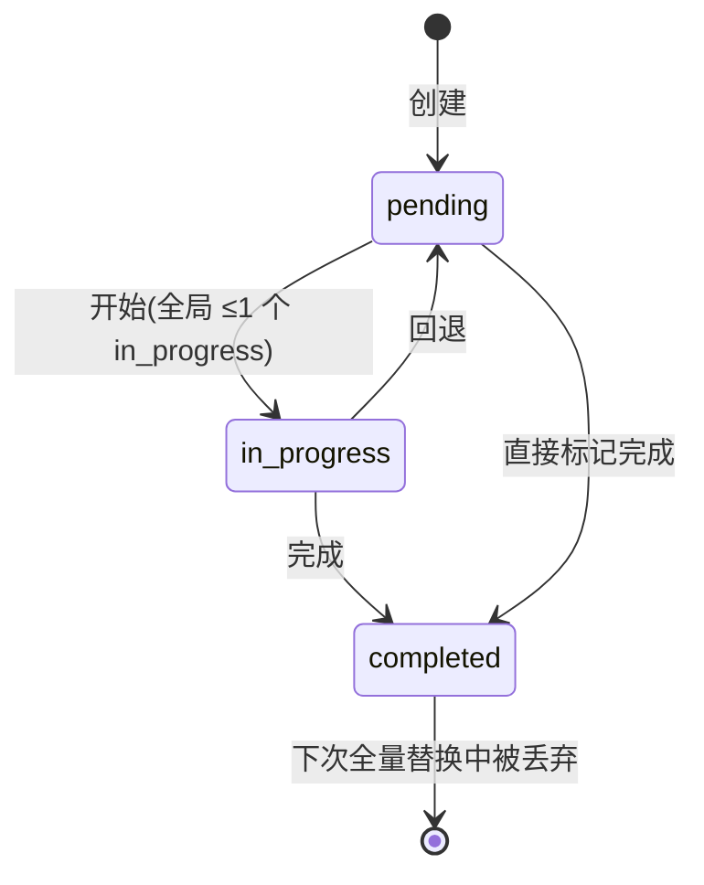

# tools 领域规格(spec)

> WHAT / WHY。技术实现(HOW)见 [design.md](design.md);实体字段见 [models.md](models.md);量化安全约束见 [../../../non-functional/security.md](../../../non-functional/security.md);术语见 [../../../glossary.md](../../../glossary.md)。

## Overview

tools 领域决定 **每个代理实际能调用哪些工具,以及这些调用被约束在什么边界内**。vv 不自实现工具实体——所有工具来自 vage 的 `tool/*` 子包;本领域的业务价值在三件事:

1. **能力分级(ToolProfile)**:用四档预设把"代理能用哪些能力"声明化,代理代码不再硬编码工具名单。
2. **装饰链装配**:为每个代理的工具注册表统一叠加权限拦截、长度截断、调试记录,顺序固定。
3. **安全护栏**:在工具构造期一次性写入工作区隔离、bash 风险分级、工具结果注入扫描、MCP 凭据过滤四道独立防线。

安全是 vv 的最高价值(`constitution.md` § 1)。本领域是该价值在工具调用面上的落地点。

## Core entities

> 完整属性表见 [models.md](models.md)。此处仅给业务定位。

| 实体 | 业务定位 |
|------|---------|
| **Tool / ToolDef** | 注册到工具注册表的一个可调用能力,带 `name`、`description`、JSON Schema `parameters`、`source`、`read_only`。`read_only` 决定其在 plan 模式下是否可用。 |
| **ToolProfile** | 一组具名能力(Capabilities ⊆ {read, write, execute, search})。四档预设:Full / Review / ReadOnly / None。代理通过持有一个 profile 间接获得工具集。 |
| **PathGuard / PathGuardian** | 工作区隔离的两个执行件:`PathGuard` 约束文件类工具(read/write/edit/glob/grep);`PathGuardian` 约束 bash 路径参数并做硬阻断。 |
| **注入 Guard(ToolResultGuard)** | 间接提示注入防御件,扫描工具返回文本,产出注入扫描结果(命中规则 + 严重度 + 动作)。 |
| **凭据 Scanner(credscrub)** | MCP I/O 边界的凭据/敏感字段扫描件,产出凭据扫描结果(掩码预览 + 类型 + 动作)。 |
| **Todo 列表项** | `todo_write` 维护的会话级检查清单项,状态 pending / in_progress / completed。 |

## Business rules

> 规则用稳定 ID,供 feature spec 与测试引用。具体规则全清单(20 条注入规则、bash 分类正则、凭据规则)由 `../../../non-functional/security.md` 与代码承载,此处只立 **不变量与意图**。

- **TOOLS-R1(read_only 语义)** — 每个工具声明 `read_only` 布尔属性。`read_only=true` 的工具(read/glob/grep/web_fetch/web_search/ask_user/todo_write)在 **plan 权限模式** 下放行;`read_only=false` 的工具(bash/write/edit)在 plan 模式下 **全部拒绝**。这是 plan 模式"只探查不改动"语义的唯一判据。

- **TOOLS-R2(能力 → 工具映射的声明式不变量)** — 代理工具集 **仅由其 ToolProfile 的 Capabilities 决定**,代理代码不直接列举工具名。新增工具归入 read/write/execute/search 之一后,所有包含该 Capability 的 profile 自动获得它,无需改代理代码。web_fetch / web_search 归 **Read**(语义上是"获取外部信息"),不归 Search。

- **TOOLS-R3(工作区隔离不变量)** — 安全包络在 **工具构造期一次性写入** 构造选项,所有代理共享同一约束,**不随代理选择或权限模式改变**。文件类工具经 `os.Root` 边界(TOCTOU 安全);glob/grep 在 spawn 前校验目录并拒 symlink 逃逸;bash 检测 `cd`/绝对路径/`..`/命令替换逃逸,并硬阻断 `/proc`、`/sys`、`/dev`。量化见 security.md § 工作区隔离。

- **TOOLS-R4(bash 风险分级处理)** — 每条 bash **子命令**(按 `;`、`&&`、`||`、`$(...)`/反引号拆解后)分四档;整体取最大档。**Blocked 在 BashTool 内部硬拒绝,不可绕过,即使 `auto` 模式**;Dangerous 在 HTTP 模式拒绝、CLI 模式逐次确认(无"永久允许");Caution/Safe 放行。多规则命中取 **最高** 档——默认 Blocked 不能被用户 `safe` 覆盖。

- **TOOLS-R5(注入扫描时机与 High 升级)** — 每个工具返回在其文本 **追加到模型上下文之前** 被扫描一次(`Run` 与 `RunStream` 两条路径,**memory replay 不重扫**)。仅扫 `text` 部分;`IsError` 结果与 image/file 直接放行。配置动作 log/rewrite/block;但任一命中规则达到 `block_on_severity`(默认 high)时 **无条件升为 block**,不论配置动作。

- **TOOLS-R6(凭据明文不外泄)** — MCP 凭据过滤在 4 个 I/O 边界扫描;事件载荷与日志 **只带掩码预览(前 4 字符 + `****`),绝不带明文**。`redact` 动作以 `[REDACTED:<type>]` 替换并保留 JSON 结构。这是凭据扫描的硬不变量。

- **TOOLS-R7(装饰链顺序约束)** — 每个代理的工具注册表按固定顺序装饰:原始工具集 → 注入 ask_user/todo_write → 权限拦截(仅 CLI) → 长度截断 → 调试(最外层)。两条硬约束:**① 权限在内**(需看到原始工具名做策略匹配);**② 截断在权限之外**(截断不得影响权限决策,只影响代理可见回值长度)。调试在最外层,记录代理"实际看到"的(已截断)结果。

- **TOOLS-R8(todo_write 会话级不变量)** — `todo_write` 工具级 `read_only=true`(不碰工作区文件系统)但 **会话级有状态**:按 `sessionID` 隔离、全量替换、`in_progress` ≤ 1、单次 ≤ 100 项、版本号严格单调。违反不变量返回 `IsError=true` 且 **不改动快照**,Go `error` 恒为 nil 以便下一轮重试。

## States & transitions

唯一带状态的实体是 Todo 列表项:

bash 命令的风险档(Safe/Caution/Dangerous/Blocked)是 **分类结果而非状态机**——每次调用即时分类,无转移。

## Domain events

| 事件 | 触发时机 | 消费者 |
|------|---------|--------|
| **EventGuardCheck** | 注入扫描或凭据扫描产生 **实质结果**(log/rewrite/block/redact)时;静默放行不发 | 可观测(trace/debug)、slog.Warn |
| **EventMCPCredentialDetected** | MCP 凭据 Scanner 命中规则时,载荷带掩码预览(无明文) | 可观测、运维告警 |
| **EventTodoUpdate** | `todo_write` 成功后,载荷带完整快照(`version`、`items[]`) | CLI 渲染勾选清单;HTTP SSE 转 `event: todo_update` |

> 事件作为 **旁路订阅** 挂载;未启用对应子系统 → 不构造 → 不挂事件(零成本默认路径)。

## Interactions

| 对端领域 | 契约 |
|---------|------|
| [configuration](../configuration/) | 装配中心按 ToolProfile 调 `BuildRegistry`,注入 bash 超时/工作目录、allow-list、PathGuard/PathGuardian、注入 Guard、凭据 Scanner、web_search provider。工具领域不读 YAML,只接收已解析的构造选项。 |
| [agents](../agents/) | 代理 **按 profile 消费** 工具集:每个 AgentDescriptor 持有一个 ToolProfile,装配阶段翻译为具体注册表后交工厂构造代理。 |
| [orchestration](../orchestration/) | 动态代理按 `tool_access`(full/read_only/review/none)字符串解析到 ToolProfile 临时构造工具集。 |
| [mcp](../mcp/) | MCP 模式在 4 个 I/O 边界挂凭据 Scanner;原始工具 **不** 作为顶层 MCP 工具暴露。 |
| [cli](../cli/) | 仅 CLI 模式挂权限拦截装饰;确认动作 allow/allow_always/deny。HTTP/MCP 无终端,权限链不挂,安全改由 R3/R4 底层护栏承担。 |

## Non-goals

- **不** 自实现工具实体——工具内部逻辑属于 vage,本领域不复述也不重写。
- **不** 暴露原始工具(bash/read/write/edit/glob/grep)为顶层 MCP 工具(见 security.md § 负空间)。
- **不** 在 HTTP/MCP 模式提供交互式权限确认(无终端);这两种模式的安全完全依赖 R3/R4 的底层护栏。
- **不** 对 trace JSONL 载荷做独立 PII/密钥脱敏(上游 guard/credscrub 已擦边界,但穿过代理的 PII 仍可能落盘)。
- **不** 为 `todo_write` 提供跨进程持久化——它是会话级、重启即清的检查清单。

## Anti-scenarios(必须永不发生)

- **工具访问工作区外路径** — 任何文件类工具或 bash 命令读写 allow-list 之外的路径(尤其 `/proc`、`/sys`、`/dev`、绝对路径逃逸、symlink 逃逸)必须被硬拒绝,**即使在 `auto` 权限模式**。allow-list 由装配期一次性确定,代理无法扩大它。
- **High 严重度注入静默放行** — 命中 High 严重度结构性攻击(ChatML 标记、Unicode tag、bidi override、exfil command+URL)的工具结果,绝不可因配置为 `log` 而原样进入模型上下文。
- **明文凭据落入事件/日志** — 凭据扫描的任何事件载荷或日志行携带未掩码明文凭据。
- **两个 in_progress** — `todo_write` 快照中同时存在 ≥2 个 `in_progress` 项被接受写入。

## Data dictionary

> 仅本领域内部术语;跨领域术语(ToolProfile、read_only、allow-list、Bash 风险分级、工具结果注入扫描、MCP 凭据过滤、权限模式)见 [../../../glossary.md](../../../glossary.md) § 工具与安全。

| 术语 | 定义 |
|------|------|
| **Capability(能力)** | ToolProfile 的最小单元:read / write / execute / search。能力在装配期翻译为具体工具集。 |
| **装饰链(Decorator chain)** | 套在原始工具注册表外的固定顺序装饰:注入协作工具 → 权限拦截 → 长度截断 → 调试。 |
| **PathGuard / PathGuardian** | 工作区隔离的两个执行件;前者管文件类工具,后者管 bash 路径参数。 |
| **credscrub** | MCP I/O 边界的凭据扫描件名,4 个扫描点。 |
| **block_on_severity** | 注入扫描的硬升级阈值(默认 high);命中该严重度即无条件 block。 |
| **session_allowed_tools** | CLI 会话内选过"永久允许"的工具集合,后续不再确认,会话结束或换权限模式即清。 |
