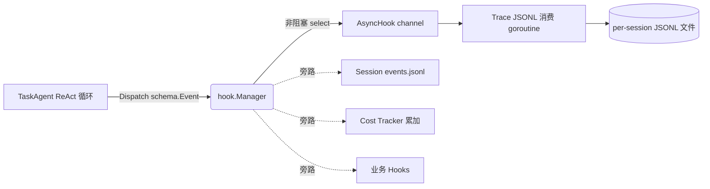
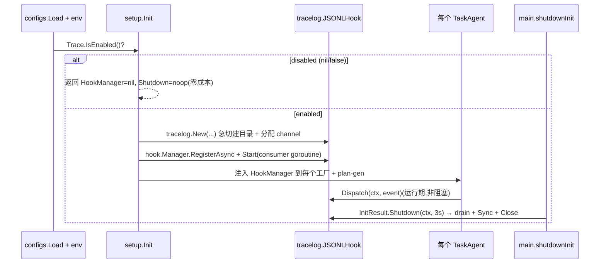

# trace 领域设计(design)

> HOW。业务行为见 [spec.md](spec.md),实体字段见 [models.md](models.md)。涵盖 Debug / Trace / Hooks / 事件总线的设计(Budget 部分由 [../budget/](../budget/) 领域保留)。

## 1. 四子系统共享事件总线

vv 的可观测性由四个**正交、按需挂载**的子系统组成,共享 vage 的同一条事件总线:

| 子系统 | 用途 | 默认 | 归属 |
|--------|------|------|------|
| Debug | 单次 LLM/工具 I/O 的逐次记录 | 关 | 本领域 |
| Trace | 结构化事件流 JSONL 落盘 | 关 | 本领域 |
| Hooks | 业务侧扩展(自定义计数、注入、转发) | 按需 | 本领域 |
| Budget | session/daily 维度的硬上限与告警 | 按需 | [../budget/](../budget/) |

四者互不依赖,可任意组合。所有组件遵循"**未启用 → 不构造 → 零开销**"(TRACE-R1)。

vage 的事件总线是统一基础:代理执行时发出标准 `schema.Event`(请求开始/结束、LLM 调用开始/结束、工具调用开始/结束、阶段进出等),订阅者各自决定如何处理,互不感知。vv 把以下旁路订阅者注册到同一条总线:

- 持久化 Session 的 `events.jsonl` 写入(session 领域)。
- Trace 的 JSONL 落盘(本领域)。
- Session Tree 的 auto-enable 计数(session 领域)。
- Cost Tracker 的逐次 token/成本累加(cost-tracking 领域,经 LLM 中间件同源)。

**设计取舍 —— 共用一条总线**:避免维护多套订阅模型。代价是所有订阅者必须容忍彼此延迟;异步 hook(AsyncHook)缓解了这一点 —— 慢订阅者只拖慢自己的 channel,不阻塞主路径,也不阻塞其他订阅者。

这种"**事件优先 + 旁路订阅**"架构让新增观测维度变得简单 —— 再加一个订阅者即可,不需要改主路径。

## 2. Trace:异步落盘 / 缓冲 / 分目录 / 轮转

当 `trace.enabled=true` 时,`tracelog.JSONLHook` 作为**进程级**资源由 `setup.Init` 构造一次,被每个 agent 与每种 run 模式(CLI / -p / -eval / HTTP / MCP)共享。所有 session 的事件经一条 channel 进一个消费 goroutine,再路由到各自的 JSONL 文件。

设计要点:

- **异步落盘**:主请求路径不等待磁盘 I/O。`Dispatch` 非阻塞送 channel(TRACE-R2)。
- **缓冲队列**:`buffer_size`(默认 1024)的 channel 在突发流量下短期缓存到内存;满则丢弃 + `slog.Warn`(TRACE-R3),宁丢观测不阻塞用户。
- **按项目分目录**:`<dir>/<project-hash>/`(TRACE-R4),多项目不混淆,同 cwd 跨重启同桶累积。project hash 算法见 [spec.md](spec.md) 数据字典 / `vv/traces/tracelog/projecthash.go`。
- **大小轮转**:`max_file_bytes>0` 时越限轮转 `<sid>.N.jsonl`,`=0` 单文件(TRACE-R5)。

懒打开 / 重开播种 / 轮转记账等可由 `vv/traces/tracelog/tracelog.go` 恢复的细节不复述。

### 已知默认坑

YAML 未设 `max_file_bytes` 序列化为 Go 零值 0,实现视为"不轮转"。要 bounded 文件须显式设正值(如 `67108864`)。MVP 按现状记录;P1-6 SQLite 迁移时随 JSONL 退役一并解决。

## 3. Trace vs Session 对比

二者都订阅同一总线、都写 JSONL,但目的与生命周期不同,可独立开关:

| 维度 | Trace | Session |
|------|-------|---------|
| 用途 | 离线分析、复盘、未来 replay/SFT | 用户可见的会话历史 |
| 形态 | 平铺 JSONL(全量 firehose) | 元数据 + 事件流 + 状态 |
| 生命周期 | 长期保留 + 大小轮转 | 跟随会话删除 |
| 用户可见 | 无 UI 入口(API exposure: false) | CLI/HTTP 都能查 |
| 分目录键 | project-hash + session-id | 会话目录根 |

## 4. Debug:多模式 sink + 最外层位置

Debug 是开发期工具:`--debug` 开启时,每次 LLM 请求与每次工具调用的入参/回值被**完整记录(不截断、不脱敏)**(TRACE-R9)。

不同模式输出位置不同(源码 `vv/debugs/sink.go`):

| 模式 | sink | 理由 |
|------|------|------|
| 交互式 CLI | 磁盘文件 | 避免污染 TUI 渲染 |
| 单提示模式(-p) | stderr | 与 stdout 的最终答案分流 |
| HTTP / MCP | 结构化日志 | 融入服务端日志体系 |

**位置 —— 中间件链最外层**:Debug 装饰位于工具与 LLM 中间件链的最外层,看到的是组件实际收到的(已截断、已权限拦截后的)参数与已包装的结果。这对调试"为什么模型看到了这个内容"特别有用 —— 它捕获的是组件真实视野,而非业务代码以为传入的值。

## 5. Hooks:业务侧扩展点

vv 暴露一组 hook 接口供业务侧扩展(源码 `vv/hooks/hooks.go`):

- 在每次代理 Run 前 / 后被调用。
- 可做:自定义日志、metrics 上报、入参转换、错误重试逻辑、事件转发。

vv 自挂一个**最小 logging hook** 作为示例与默认;其他 hook 由用户自行注册。Hooks 与 Trace 的区别:Trace 是固定的 JSONL 落盘订阅者;Hooks 是开放的代码扩展点,业务方自定义行为。

## 6. 三种成本视图(概览)

可观测性最常被问"花了多少钱"。vv 提供三种粒度(细节归 cost-tracking / budget 领域):

| 视图 | 范围 | 实时性 | 归属 |
|------|------|-------|------|
| 当前 turn 累计 token | 进行中的一轮 | 流式实时 | cost-tracking |
| Cost tracker | 进程生命周期内总和 | 实时 | cost-tracking |
| Budget tracker | 配额维度(session/daily) | 实时 + 告警 | [../budget/](../budget/) |

三种视图基于同一份 LLM 中间件统计数据,差别只在累加边界。CLI 屏幕底部实时显示前两种;HTTP 经 `/v1/budget` 暴露第三种;trace 与 session 事件流让事后也能算出。此处仅作子系统全景,本领域不展开成本/预算计算。

## 7. 装配与生命周期

急切建目录:`tracelog.New` 在构造时即创建项目目录,让配置错误在启动暴露,而非首个事件时。`Shutdown` 用独立 3s 上下文(主 ctx 通常已取消),由 `sync.Once` 守护幂等。

## 8. 技术取舍

| 取舍 | 决策 | 理由 |
|------|------|------|
| 落盘格式 | JSONL,`schema.Event` 逐字 | 简单、可 append、可流式解析;无 schema 翻译层。P1-6 迁 SQLite + FTS5。 |
| 过滤策略 | 不过滤(full-firehose) | 下游(resume / SFT / replay)自行重建视图,避免提前丢信息。 |
| 脱敏 | trace 层不做(TRACE-R7) | 全量留痕优先;脱敏属下游导出关注点(P3-5)。缓解靠 disabled 默认 + 0o600。 |
| 背压 | 满则丢 + warn,不阻塞 | 观测让位于主路径可用性(TRACE-R3)。 |
| 跨进程 | 不协调 | 单进程单会话足够覆盖当前场景;协调复杂度留给 SQLite。 |
| 共用总线 | 一条总线多订阅者 | 避免多套订阅模型;异步 hook 隔离慢订阅者。 |

## 关联 ADR

- **ADR 0005 事件总线旁路订阅 + 零成本默认** —— 本领域全部三子系统的架构根基。见 [../../../architecture/adr/adr.md](../../../architecture/adr/adr.md)(候选,待批准)。
