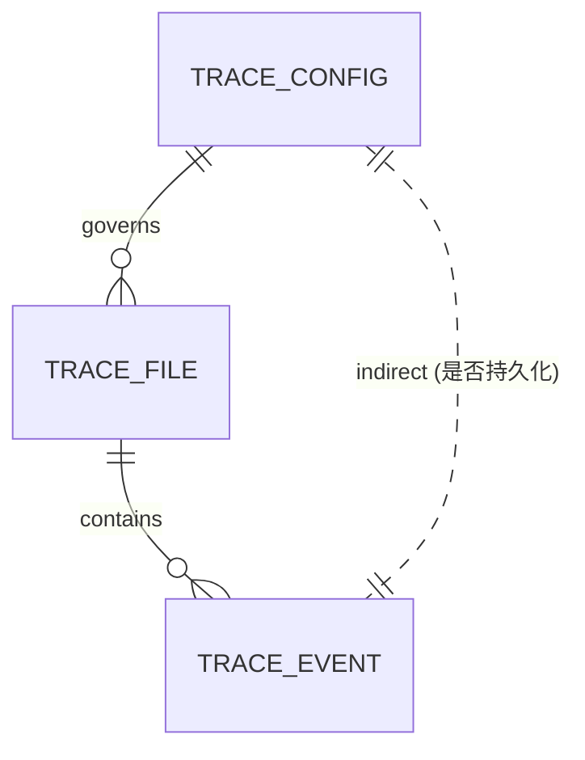

# trace 领域实体模型(models)

> 业务语义类型(text / number / bool / octal / enum / reference)。**此处只保留领域读者需要的实体语义与关系。**

本领域三个核心实体:**Trace Config**(控制是否/在哪落盘)、**Trace Event**(一行)、**Trace File**(一个文件)。Debug sink 与 Hook 是行为型扩展点而非数据实体,语义见 [design.md](design.md)。

---

## Trace Config

**用途**:`vv.yaml` 中 `trace:` 块的声明式投影,叠加 `VV_TRACE_*` 环境覆盖。`enabled` 是整条管线的主开关 —— nil/false 走零成本路径(TRACE-R1)。

| 属性 | 语义 | 类型 | 必填 | 备注 |
|------|------|------|------|------|
| enabled | 主开关 | bool(指针) | 否 | nil/false ⇒ 零成本(不建 manager/文件);仅显式 `true` 开启。env `VV_TRACE_ENABLED` |
| dir | trace 文件根目录 | text | 否 | 默认 `~/.vv/traces`(home 不可用退 `./.vv/traces`)。env `VV_TRACE_DIR` |
| max_file_bytes | 触发轮转的大小阈值 | number(int64) | 否 | 正 ⇒ 越限轮转;0 ⇒ 单文件不轮转;负 ⇒ 强制 64 MiB 默认。**已知默认坑见 [design.md](design.md) §2** |
| buffer_size | AsyncHook channel 容量 | number(int) | 否 | 默认 1024;≤0 取默认。满则丢弃 + warn(TRACE-R3) |

**关系**:Extends [configuration](../configuration/configuration-overview.md)(`trace:` 是其顶层块);Governs Trace File(`dir` + project-hash 定目录,`max_file_bytes` 定轮转);与 Trace Event 间接相关(只决定是否/在哪持久化,不定义事件形状)。

---

## Trace Event

**用途**:trace 文件的一行 = `json.Marshal(schema.Event)`,vage 的规范代理生命周期事件类型。vv 在 trace 层**不**包装、不改名、不过滤字段;消费者直接 `json.Unmarshal` 回 `schema.Event`(`Data` 是 sealed `EventData` 接口,解码者按 `type` 分派)。

| 属性 | 语义 | 类型 | 必填 | 备注 |
|------|------|------|------|------|
| type | 事件种类 | enum | 是 | `schema.Event*` 常量之一;**全清单属 vage schema,见下方回链** |
| agent_id | 发出事件的代理 id | text | 否 | 中间件等代理外来源为空 |
| session_id | 所属会话 | text | 否 | 路由到文件;空 ⇒ `default` |
| timestamp | 事件墙钟时间 | date(RFC3339 纳秒) | 是 | `schema.NewEvent` 调用点的 `time.Now()` |
| data | 该事件种类的类型化载荷 | object | 否 | 形状随 `type` 变;如 `llm_call_end` 携 `prompt_tokens` 等 |
| parent_id | 嵌套上下文的父事件 id | text | 否 | 预留,TaskAgent 当前未用 |

**关系**:Appears in Trace File(每个事件是一行);Governed by Trace Config(是否持久化);与 Session Memory 经 `session_id` 关联(P2-14 resume 可回放);携带与 Cost Tracker 同源的 token 维度(`llm_call_end.data`)。

**有序性 / 丢失场景**及事件类型全清单不在此复述,见 `vage/schema/event.go`。

---

## Trace File

**用途**:本地磁盘上承载单会话事件流的 JSONL 文件。该 session id 首个事件时由消费 goroutine append-only 懒打开;`InitResult.Shutdown` 时 `Sync` + `Close`。

| 属性 | 语义 | 类型 | 必填 | 备注 |
|------|------|------|------|------|
| path | 文件绝对路径 | text | 是 | `<dir>/<project-hash>/<sanitized-sid>.jsonl`(轮转后 `<sid>.<N>.jsonl`) |
| project_hash | 工作目录派生的桶键 | text | 是 | base32 小写无填充 SHA-256(abs cwd)[0:12];算法见 [spec.md](spec.md) 数据字典 |
| session_id | 运行期会话标识 | text | 是 | 来自 `RunRequest.SessionID`;净化规则见 TRACE-R8 |
| part | 轮转索引 | number | 是 | 0 为首文件;每越 `max_file_bytes` +1 |
| file_mode | 文件 POSIX 权限 | octal | 是 | `0o600`(TRACE-R6) |
| dir_mode | 桶目录 POSIX 权限 | octal | 是 | `0o700`(TRACE-R6) |
| open_flags | 打开方式 | enum | 是 | `O_CREATE \| O_WRONLY \| O_APPEND` |
| lifecycle | 打开/flush/关闭时机 | — | 是 | 懒打开;Shutdown 时 drain + Sync + Close |

**内容**:每行一个 `schema.Event` JSON(= Trace Event),换行分隔,append-only,永不改写。重开时从 `Stat().Size()` 播种 `written`,轮转记账不重复计入。

**关系**:Configured by Trace Config(位置 + 轮转策略);Contains Trace Event(每行一个);与 [cli](../cli/cli-overview.md) / HTTP 的会话 id 关联;[session](../session/session-overview.md)(P2-14)与 SFT 导出(P3-5)是未来消费者。

轮转算法 / 并发与所有权细节见 `vv/traces/tracelog/tracelog.go`。
