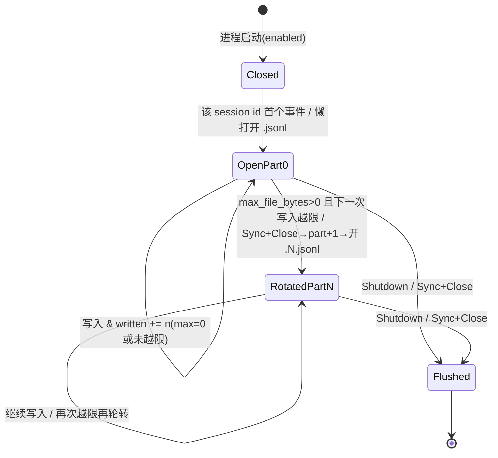

# trace 领域规格(spec)

> WHAT / WHY。技术实现见 [design.md](design.md),实体字段见 [models.md](models.md)。

## Overview

trace 领域回答一个问题:**代理跑过哪些事,如何在不拖慢主路径的前提下把它留痕,以及如何让开发者与业务方旁路观测这些事**。

它由四个**正交、零成本默认**的子系统组成,共享 vage 的同一条事件总线:

| 子系统 | 用途 | 默认 |
|--------|------|------|
| **Trace** | 结构化 `schema.Event` 全量流以 JSONL 落盘,按项目散列 + 会话 id 分目录 | 关 |
| **Debug** | 开发期单次 LLM/工具 I/O 的完整逐次记录(不截断、不脱敏) | 关 |
| **Hooks** | 业务侧扩展接口(每次代理 Run 前/后) | 按需 |
| Budget | session/daily 维度的硬上限与告警 | 按需(**独立领域**,见 [../budget/](../budget/),本领域不展开) |

边界:本领域只管"把事件旁路出去并落地/上报",**不**产生事件(事件源是 orchestration),**不**做配额决策(budget),**不**做会话状态管理(session)。

## Core entities

| 实体 | 职责 | 详见 |
|------|------|------|
| **Trace Config** | `trace:` 配置块的声明式投影;`enabled` 是整条管线的主开关 | [models.md](models.md) |
| **Trace Event** | 一行 trace = 一个 `json.Marshal(schema.Event)`;全量、不改写字段 | [models.md](models.md);事件类型全清单属 vage schema,见 [../../../../vv-prd/models/core/trace/model-trace-event.md](../../../../vv-prd/models/core/trace/model-trace-event.md) |
| **Trace File** | 单会话的 JSONL 文件,append-only,支持大小轮转 | [models.md](models.md) |
| **事件总线** | vage 的统一事件分发基础(术语见 [../../../glossary.md](../../../glossary.md));trace / session / cost 等作为旁路订阅者挂载 | [design.md](design.md) |
| **Debug sink** | 按运行模式分流的逐次 I/O 记录目标(磁盘 / stderr / 结构化日志) | [design.md](design.md) |
| **Hook** | 进程内注册的扩展点;vv 自挂一个最小 logging hook 作为示例与默认 | [design.md](design.md) |

## Business rules

| ID | 规则 | 理由 |
|----|------|------|
| **TRACE-R1** | **零成本默认**。`trace.enabled` 为 nil / false 时,`setup.Init` 不构造 `hook.Manager`、不起消费 goroutine、不建目录、不分配 channel。`Dispatch` 在 manager 为 nil 时直接返回。 | disabled 必须是"物理上不存在",而非"存在但跳过"。 |
| **TRACE-R2** | **异步不阻塞主路径**。事件经 vage AsyncHook 旁路落盘;TaskAgent 的 `Dispatch` 是非阻塞 `select` 送入 channel,磁盘 I/O 在独立消费 goroutine。 | 观测绝不能拖慢代理推理。 |
| **TRACE-R3** | **满通道丢弃不阻塞**。channel 满时事件被丢弃并 `slog.Warn`,主路径继续。 | 突发流量下宁可丢观测数据,也不阻塞用户请求。 |
| **TRACE-R4** | **按项目散列分目录**。文件落于 `<dir>/<project-hash>/<session-id>.jsonl`;project hash = SHA-256(abs cwd)[0:12] 的 base32 小写无填充(~20 字符),确定性 —— 同 cwd 跨重启同桶。 | 多项目场景 trace 不混淆;同项目跨 run 累积。 |
| **TRACE-R5** | **大小轮转**。`max_file_bytes > 0` 时,下一次写入将越限则轮转 `<sid>.jsonl` → `<sid>.1.jsonl` → …;`= 0` 单文件不轮转。 | 避免单文件 unbounded 增长。 |
| **TRACE-R6** | **文件权限 0o600 / 目录 0o700**。仅创建用户可读写。 | trace 含敏感载荷(见 R7),最小化暴露面。 |
| **TRACE-R7** | **JSONL 不独立脱敏**。trace 载荷是 `schema.Event` 逐字写入;上游 `guard` + `credscrub` 只擦工具边界,`agent_end.message`/`text_delta.delta`/`tool_call_start.arguments` 等仍以原文落盘。**缓解:处理敏感数据时保持 `trace.enabled=false` 直到 P3-5 导出管线引入脱敏阶段。** | 全量 firehose 是有意取舍(支持复盘/replay);脱敏属下游导出关注点。安全负空间见 [../../../non-functional/security.md](../../../non-functional/security.md)。 |
| **TRACE-R8** | **会话 id 净化**。`[^A-Za-z0-9._-]` → `_`;空 → `default`;上限 128 字符;路径分隔符被剥离 —— 路径穿越结构上不可能。 | 会话 id 来自不可信输入(HTTP 请求),直接做文件名有穿越风险。 |
| **TRACE-R9** | **Debug 不截断、不脱敏,位于中间件链最外层**。`--debug` 开启时每次 LLM/工具 I/O 完整记录;装饰位于工具与 LLM 中间件链最外层,看到的是组件实际收到的(已截断、已权限拦截后的)参数与已包装的结果。 | 用于回答"为什么模型看到了这个内容";脱敏会破坏调试价值。 |
| **TRACE-R10** | **全模式 Shutdown flush**。CLI / -p / -eval / HTTP / MCP 五种入口在 `os.Exit` 前均经 `InitResult.Shutdown(ctx)`(独立 3s 上下文)drain channel、`Sync` + `Close` 每个打开文件。 | 优雅退出不丢已入队事件。 |

> 注:事件的**有序性 / 丢失场景 / 跨进程并发**等可由代码恢复的细节不在此复述,见 [model-trace-event.md](../../../../vv-prd/models/core/trace/model-trace-event.md) 与 [model-trace-file.md](../../../../vv-prd/models/core/trace/model-trace-file.md)。

## States & transitions(Trace File 轮转)

- 懒打开:文件在该 session id 出现首个事件时才创建。
- 重开会从 `os.Stat().Size()` 重新播种 `written` 计数器,轮转记账不会重复计入既有内容。

## Domain events(订阅哪些)

本领域**不产生**领域事件,只**订阅**事件总线上由 orchestration 发出的 `schema.Event` 全量流(`Filter()` 返回 nil = 订阅全部)。涵盖:`agent_start` / `agent_end`、`iteration_start`、`tool_call_start` / `tool_call_end`、`tool_result`、`text_delta`、`llm_call_start` / `llm_call_end` / `llm_call_error`、`guard_check`、`skill_*`、`budget_*`、`mcp_credential_detected`、`pending_interaction`、`phase_*`、`sub_agent_*`、`error` 等。

完整事件类型清单属 vage schema(`vage/schema/event.go`),不在此复述,见 [model-trace-event.md](../../../../vv-prd/models/core/trace/model-trace-event.md)。

## Interactions

| 交互方 | 契约 |
|--------|------|
| orchestration(事件源) | TaskAgent 在生命周期点调 `hookManager.Dispatch(ctx, event)`;trace 旁路消费,不回写、不阻塞代理。 |
| configuration(装配) | `setup.Init` 据 `Trace.IsEnabled()` 决定构造与否;注入每个 TaskAgent 工厂与 plan-gen summarizer;接出 `InitResult.Shutdown`。 |
| session(共用总线) | trace JSONL 落盘与 session 的 `events.jsonl` 持久化是同一条事件总线上的两个独立旁路订阅者,互不感知;两者可独立开关。 |
| cost-tracking | 与本领域同源于 LLM 中间件/事件;`llm_call_end.data` 携带的 token 维度与 Cost Tracker 同源,本领域只落盘不累加。 |

## Non-goals

- **无 PII / 密钥脱敏**(TRACE-R7):trace 层不做独立脱敏,留待 P3-5 导出管线。
- **无 age-based 清理 / TTL**:trace 文件长期保留,本领域不做按时间删除或归档。
- **无 OTel / Langfuse 导出**:不映射 GenAI 语义约定 span,不对接外部 APM(P3-9 才引入 OpenTelemetry 导出)。
- **无从 trace 恢复会话**:本领域只负责"写";读取 trace 重建工作记忆是 session 领域 P2-14 的职责。
- **无跨进程协调**:同 session id 的两个并发进程会 `O_APPEND` 到同一文件,轮转记账会分叉;单进程单会话是受支持模型(直到 P1-6 SQLite)。
- **不展开 Budget 细节**:Budget 是独立领域,见 [../budget/](../budget/)。

## Anti-scenario(必须永不发生)

- **disabled 时不得构造任何 goroutine / 目录 / channel / 文件**。`trace.enabled` 为 nil/false 时,若发现进程起了消费 goroutine、或在 `<dir>/` 下建了 `<project-hash>/` 目录、或分配了事件 channel —— 即违反 TRACE-R1。disabled 路径必须零分配、零 I/O、零并发原语(违反此点意味着"零成本默认"的承诺破产)。
- 主路径**绝不**因 trace channel 满、磁盘满、或文件打开失败而阻塞或报错退出(违反 TRACE-R2 / R3):这些一律 `slog.Warn` + 丢弃 + 继续。

## Data dictionary

| 术语 | 定义 |
|------|------|
| **project hash** | `strings.ToLower(base32.NoPadding(SHA-256(filepath.Abs(cwd))[0:12]))`(~20 小写 base32 字符);空 cwd → `default`。确定性目录桶键。 |
| **full-firehose** | trace 不做事件过滤,`Filter()` 返回 nil,全量事件落盘;下游消费者自行重建所需视图。 |
| **part / 轮转索引** | Trace File 的轮转序号;0 为首文件,每次越 `max_file_bytes` +1,文件名 `<sid>.<part>.jsonl`。 |
| **session id 净化** | `[^A-Za-z0-9._-]` → `_`、空 → `default`、上限 128 的文件名安全变换。 |
| **最外层装饰** | Debug 位于工具/LLM 中间件链最外层,记录组件实际收到的入参与包装后的回值。 |

通用术语(**vage** / **事件总线** / **Trace** / **Debug** / **schema.Event** / **AsyncHook**)见 [../../../glossary.md](../../../glossary.md),不在此重复。
